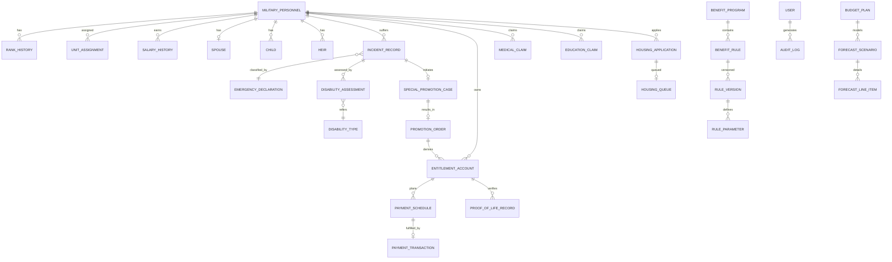

# เอกสารออกแบบฐานข้อมูล SQL Server
## ระบบประมาณสิทธิและสวัสดิการกำลังพลกองทัพบก (ABWES)

| รายการ | รายละเอียด |
|---|---|
| เอกสาร | Database Design Specification |
| ฐานข้อมูล | Microsoft SQL Server |
| Collation | Thai_CI_AS |
| รูปแบบการออกแบบ | Third Normal Form (3NF) |
| ผู้ออกแบบ | Senior Database Architect |

---

## 1. หลักการออกแบบ

### 1.1 Third Normal Form (3NF)
- **1NF**: ทุกตารางมี Primary Key ชัดเจน ไม่มี Repeating Groups (แยกรายการย่อยออกเป็นตาราง Detail)
- **2NF**: ทุก Non-Key Attribute ขึ้นกับ Primary Key ทั้งชุด (ไม่มี Partial Dependency)
- **3NF**: ไม่มี Transitive Dependency (เช่น ชื่อยศไม่ขึ้นกับกำลังพล แต่ขึ้นกับ RankId แล้วอ้างอิงตารางยศ)

### 1.2 หลักการเฉพาะระบบ
- **Temporal Integrity**: ยศ หน่วย เงินเดือน เก็บเป็นประวัติช่วงเวลา (`EffectiveFrom` - `EffectiveTo`) พร้อม Trigger ป้องกันช่วงซ้อนทับ
- **Financial Precision**: ทุกคอลัมน์เงินใช้ `DECIMAL(15,2)` หรือ `DECIMAL(18,2)` ห้ามใช้ Float
- **Auditability**: AuditLog แบบ Append-Only + Hash Chain (SHA-256) ตรวจจับการแก้ไขย้อนหลัง
- **Security**: ข้อมูลลับ (เลขบัตร ปชช. บัญชีธนาคาร เงินเดือน) เข้ารหัสที่ Application Layer แต่ฐานข้อมูลรองรับความยาวและ Masking
- **Rule as Data**: กฎการคำนวณสิทธิเป็น Data มี Version และ Effective Date

---

## 2. โครงสร้าง Schema

แบ่งเป็น 7 Schemas เพื่อจัดกลุ่มตาม Domain:

| Schema | กลุ่มตาราง | ตัวอย่าง |
|---|---|---|
| `ref` | Master/Reference Data | ยศ, เหล่า, หน่วย, ตำแหน่ง, ประเภทความพิการ |
| `core` | ตารางหลัก | กำลังพล, ครอบครัว, ทายาท, เหตุการณ์, คำสั่ง, เอกสาร |
| `hist` | ตารางประวัติแบบ Temporal | RankHistory, UnitAssignment, SalaryHistory |
| `ent` | ตารางสิทธิ | BenefitProgram, BenefitRule, RuleVersion, EntitlementAccount, PaymentSchedule, PaymentTransaction |
| `wfl` | ตารางสวัสดิการ 4 ด้าน | MedicalClaim, EducationClaim, HousingApplication, AllowanceEntitlement |
| `bud` | ตารางงบประมาณ | BudgetPlan, ForecastScenario, ForecastLineItem |
| `aud` | ตาราง Audit | AuditEventCatalog, AuditLog |

---

## 3. แผนภาพ ER Diagram



---

## 4. รายละเอียดตาราง

### 4.1 ตารางอ้างอิง / Reference Tables

#### ref.MilitaryBranch
| คอลัมน์ | ประเภท | คำอธิบาย |
|---|---|---|
| BranchId | BIGINT PK IDENTITY | รหัสทะเบียนเหล่าทัพ |
| BranchCode | VARCHAR(20) UK | รหัสมาตรฐาน เช่น RTA, RTN |
| BranchNameTh | NVARCHAR(100) | ชื่อภาษาไทย |
| BranchNameEn | NVARCHAR(100) | ชื่อภาษาอังกฤษ |
| IsActive | BIT | สถานะใช้งาน |

**Index**: `IX_MilitaryBranch_IsActive`

#### ref.MilitaryRank
| คอลัมน์ | ประเภท | คำอธิบาย |
|---|---|---|
| RankId | BIGINT PK IDENTITY | รหัสทะเบียนยศ |
| RankCode | VARCHAR(20) UK | รหัสยศมาตรฐาน |
| RankNameTh | NVARCHAR(100) | ชื่อยศภาษาไทย |
| RankGroup | NVARCHAR(50) | OFFICER / NCO / ENLISTED / VOLUNTEER |
| RankOrder | INT | ลำดับยศสำหรับเปรียบเทียบ |

**Constraint**: `CK_MilitaryRank_Group`
**Index**: `IX_MilitaryRank_Group`

#### ref.Corps
| คอลัมน์ | ประเภท | คำอธิบาย |
|---|---|---|
| CorpsId | BIGINT PK IDENTITY | รหัสเหล่า |
| CorpsCode | VARCHAR(20) UK | รหัสเหล่า เช่น ร., ม., ป. |
| CorpsNameTh | NVARCHAR(100) | ชื่อเหล่า |

#### ref.PersonnelType
| คอลัมน์ | ประเภท | คำอธิบาย |
|---|---|---|
| PersonnelTypeId | BIGINT PK IDENTITY | รหัสประเภทกำลังพล |
| TypeCode | VARCHAR(20) UK | COMMISSIONED / NON_COMMISSIONED / CONSCRIPT / VOLUNTEER / GOVERNMENT_EMP / CONTRACT / CIVILIAN |
| TypeNameTh | NVARCHAR(100) | ชื่อประเภท |

#### ref.Unit
| คอลัมน์ | ประเภท | คำอธิบาย |
|---|---|---|
| UnitId | BIGINT PK IDENTITY | รหัสหน่วย |
| UnitCode | VARCHAR(20) UK | รหัสหน่วยมาตรฐาน |
| UnitNameTh | NVARCHAR(200) | ชื่อหน่วย |
| ParentUnitId | BIGINT FK | หน่วยแม่ (Self-referencing) |
| UnitLevel | INT | ระดับลำดับชั้น 1=กองทัพบก, 2=กองทัพภาค, 3=กรม, 4=กองพัน |
| BranchId | BIGINT FK | สังกัดเหล่าทัพ |

**Index**: `IX_Unit_Parent`, `IX_Unit_Level`

#### ref.Position
| คอลัมน์ | ประเภท | คำอธิบาย |
|---|---|---|
| PositionId | BIGINT PK IDENTITY | รหัสตำแหน่ง |
| PositionCode | VARCHAR(20) UK | รหัสอัตราตำแหน่ง |
| PositionNameTh | NVARCHAR(200) | ชื่อตำแหน่ง |
| PositionCategory | NVARCHAR(100) | COMMAND / STAFF / TECHNICAL / FIELD |

#### ref.DisabilityType
| คอลัมน์ | ประเภท | คำอธิบาย |
|---|---|---|
| DisabilityTypeId | BIGINT PK IDENTITY | รหัสประเภทความพิการ |
| TypeCode | VARCHAR(10) UK | DIS-01..DIS-99 |
| TypeNameTh | NVARCHAR(200) | ชื่อประเภท |
| SeverityLevel | NVARCHAR(50) | CRITICAL / SEVERE / MODERATE / MILD |
| SuggestedPromotionStepsMin | INT | ชั้นปูนขั้นต่ำที่แนะนำ |
| SuggestedPromotionStepsMax | INT | ชั้นปูนขั้นสูงที่แนะนำ |

**Constraint**: `CK_DisabilityType_Severity`, `CK_DisabilityType_Steps`

#### ref.EmergencyDeclaration
| คอลัมน์ | ประเภท | คำอธิบาย |
|---|---|---|
| DeclarationId | BIGINT PK IDENTITY | รหัสประกาศ |
| DeclarationNo | NVARCHAR(100) UK | เลขที่ประกาศ |
| DeclarationName | NVARCHAR(500) | ชื่อประกาศ |
| AreaCoverage | NVARCHAR(500) | พื้นที่ครอบคลุม |
| StartDate | DATE | วันเริ่ม |
| EndDate | DATE | วันสิ้นสุด |
| LegalReference | NVARCHAR(500) | อ้างอิงกฎหมาย |

**Constraint**: `CK_EmergencyDeclaration_Date`
**Index**: `IX_EmergencyDeclaration_Date`

#### ref.BenefitCategoryRef
| คอลัมน์ | ประเภท | คำอธิบาย |
|---|---|---|
| CategoryId | BIGINT PK IDENTITY | รหัสหมวดสวัสดิการ |
| CategoryCode | VARCHAR(50) UK | MEDICAL / EDUCATION / HOUSING / ALLOWANCE / PENSION / LUMP_SUM / SCHOLARSHIP / COMPENSATION |
| CategoryNameTh | NVARCHAR(200) | ชื่อหมวด |
| CategoryType | NVARCHAR(50) | ประเภทหมวด |
| LegalReference | NVARCHAR(500) | อ้างอิงกฎหมาย |

#### ref.RelationshipType
| คอลัมน์ | ประเภท | คำอธิบาย |
|---|---|---|
| RelationshipTypeId | BIGINT PK IDENTITY | รหัสความสัมพันธ์ |
| TypeCode | VARCHAR(50) UK | SPOUSE_LEGAL / CHILD_LEGITIMATE / FATHER / MOTHER / OTHER_HEIR |
| TypeNameTh | NVARCHAR(100) | ชื่อความสัมพันธ์ |

#### ref.Province / ref.District / ref.Subdistrict
ทะเบียนที่อยู่มาตรฐาน ใช้อ้างอิงจากตารางหลักเพื่อลดข้อมูลซ้ำซ้อน

---

### 4.2 ตารางหลัก / Core Tables

#### core.[User]
| คอลัมน์ | ประเภท | คำอธิบาย |
|---|---|---|
| UserId | BIGINT PK IDENTITY | รหัสผู้ใช้ |
| Username | NVARCHAR(100) UK | ชื่อผู้ใช้ |
| Email | NVARCHAR(255) UK | อีเมล |
| PasswordHash | NVARCHAR(500) | รหัสผ่านแฮช |
| RoleCode | NVARCHAR(50) | SUPERADMIN / ADMIN / HQ_OFFICER / UNIT_OFFICER / MEDICAL_BOARD / FINANCE_OFFICER / AUDITOR / BENEFICIARY |
| UnitId | BIGINT FK | หน่วยที่สังกัด |
| IsActive | BIT | สถานะใช้งาน |

**Constraint**: `CK_User_Role`
**Index**: `IX_User_Role`, `IX_User_Unit`

#### core.RolePermission
| คอลัมน์ | ประเภท | คำอธิบาย |
|---|---|---|
| RolePermissionId | BIGINT PK IDENTITY | รหัสสิทธิ์ |
| RoleCode | NVARCHAR(50) | บทบาท |
| ResourceType | NVARCHAR(100) | ประเภททรัพยากร |
| PermissionCode | NVARCHAR(100) | CREATE / READ / UPDATE / DELETE / APPROVE / EXPORT |
| CanCreate-Read-Update-Delete-Approve-Export | BIT | สิทธิ์แต่ละ action |
| DataScope | NVARCHAR(50) | OWN / UNIT / SUBTREE / ALL / NONE |

**Index**: `IX_RolePermission_Role`

#### core.Citizen
| คอลัมน์ | ประเภท | คำอธิบาย |
|---|---|---|
| CitizenId | BIGINT PK IDENTITY | รหัสบุคคล |
| NationalId | VARCHAR(13) UK | เลขบัตรประชาชน (เข้ารหัสที่ App) |
| TitleTh | NVARCHAR(50) | คำนำหน้า |
| FirstNameTh | NVARCHAR(100) | ชื่อ |
| LastNameTh | NVARCHAR(100) | สกุล |
| BirthDate | DATE | วันเกิด |
| Gender | NVARCHAR(10) | เพศ |
| ProvinceId | BIGINT FK | จังหวัด |

**Index**: `IX_Citizen_Name`, `IX_Citizen_Province`

#### core.MilitaryPersonnel
| คอลัมน์ | ประเภท | คำอธิบาย |
|---|---|---|
| PersonnelId | BIGINT PK IDENTITY | รหัสกำลังพล |
| MilitaryId | VARCHAR(10) UK | เลขประจำตัวกำลังพล 10 หลัก |
| CitizenId | BIGINT FK UK | อ้างอิงทะเบียนบุคคล |
| CurrentRankId | BIGINT FK | ยศปัจจุบัน |
| CurrentCorpsId | BIGINT FK | เหล่าปัจจุบัน |
| CurrentUnitId | BIGINT FK | หน่วยปัจจุบัน |
| CurrentPositionId | BIGINT FK | ตำแหน่งปัจจุบัน |
| PersonnelTypeId | BIGINT FK | ประเภทกำลังพล |
| AppointmentDate | DATE | วันที่บรรจุ |
| ServiceStatus | NVARCHAR(50) | ACTIVE / DISCHARGED_DISABILITY / DECEASED / RETIRED / SUSPENDED |
| BankAccountNumber | NVARCHAR(50) | เลขบัญชีธนาคาร (เข้ารหัส) |

**Constraint**: `CK_MilitaryPersonnel_MilitaryId`, `CK_MilitaryPersonnel_Status`
**Index**: `IX_MilitaryPersonnel_Unit`, `IX_MilitaryPersonnel_Rank`, `IX_MilitaryPersonnel_Type`, `IX_MilitaryPersonnel_Appointment`

#### core.Spouse / core.Child / core.Heir
ตารางครอบครัวและทายาท แยกออกจากกำลังพลเพื่อลดข้อมูลซ้ำซ้อนและรองรับหลายสถานะ มี FK ไป `core.Citizen` และ `core.MilitaryPersonnel`

#### core.IncidentRecord
| คอลัมน์ | ประเภท | คำอธิบาย |
|---|---|---|
| IncidentId | BIGINT PK IDENTITY | รหัสเหตุการณ์ |
| PersonnelId | BIGINT FK | กำลังพลที่เกิดเหตุ |
| IncidentDate | DATETIME2 | วันเวลาเกิดเหตุ |
| MissionType | NVARCHAR(100) | ประเภทภารกิจ |
| IncidentType | NVARCHAR(100) | ประเภทเหตุ |
| LossType | NVARCHAR(50) | DEATH / TOTAL_PERMANENT_DISABILITY / PARTIAL_DISABILITY / ... |
| PeriodClass | NVARCHAR(20) | EMERGENCY / NORMAL |
| DeclarationId | BIGINT FK | อ้างอิงประกาศเหตุฉุกเฉิน |
| ReportedByUserId | BIGINT FK | ผู้บันทึก |

**Index**: `IX_IncidentRecord_Personnel`, `IX_IncidentRecord_Date`, `IX_IncidentRecord_Period`

#### core.DisabilityAssessment
| คอลัมน์ | ประเภท | คำอธิบาย |
|---|---|---|
| AssessmentId | BIGINT PK IDENTITY | รหัสผลประเมิน |
| IncidentId | BIGINT FK UK | อ้างอิงเหตุการณ์ |
| DisabilityTypeId | BIGINT FK | ประเภทความพิการ |
| MedicalBoardRef | NVARCHAR(100) | เลขที่อ้างอิงคณะกรรมการแพทย์ |
| AssessedDate | DATE | วันประเมิน |
| IsPermanentTotal | BIT | ทุพพลภาพถาวรสมบูรณ์ |
| AssessedByUserId | BIGINT FK | แพทย์ผู้ประเมิน |

#### core.SpecialPromotionCase
| คอลัมน์ | ประเภท | คำอธิบาย |
|---|---|---|
| CaseId | BIGINT PK IDENTITY | รหัสสำนวน |
| CaseNumber | NVARCHAR(100) UK | เลขที่สำนวน |
| IncidentId | BIGINT FK | อ้างอิงเหตุการณ์ |
| PeriodClass | NVARCHAR(20) | EMERGENCY / NORMAL |
| ProposedSteps | INT | ชั้นปูนที่เสนอ |
| ApprovedSteps | INT | ชั้นปูนที่อนุมัติ |
| Status | NVARCHAR(50) | DRAFT / UNIT_REVIEW / HQ_REVIEW / APPROVED / REJECTED |
| RuleVersionId | BIGINT FK | เวอร์ชันกฎที่ใช้ |
| SubmittedByUserId | BIGINT FK | ผู้เสนอ |
| ReviewedByUserId | BIGINT FK | ผู้ตรวจทาน |
| ApprovedByUserId | BIGINT FK | ผู้อนุมัติ |

**Constraint**: `CK_SpecialPromotionCase_Steps`, `CK_SpecialPromotionCase_Status`

#### core.PromotionOrder
| คอลัมน์ | ประเภท | คำอธิบาย |
|---|---|---|
| OrderId | BIGINT PK IDENTITY | รหัสคำสั่ง |
| OrderNumber | NVARCHAR(100) UK | เลขที่คำสั่ง |
| CaseId | BIGINT FK | อ้างอิงสำนวน (NULL ได้สำหรับเลื่อนยศปกติ) |
| PersonnelId | BIGINT FK | กำลังพล |
| OrderType | NVARCHAR(50) | SPECIAL_PROMOTION / REGULAR_PROMOTION |
| GrantedSteps | INT | จำนวนชั้นที่ได้ |
| NewRankId | BIGINT FK | ยศใหม่ |
| NewSalary | DECIMAL(15,2) | เงินเดือนใหม่ |
| EffectiveDate | DATE | วันที่มีผล |
| IssuedByUserId | BIGINT FK | ผู้ออกคำสั่ง |

---

### 4.3 ตารางประวัติ / History Tables

#### hist.RankHistory
| คอลัมน์ | ประเภท | คำอธิบาย |
|---|---|---|
| RankHistoryId | BIGINT PK IDENTITY | รหัสประวัติยศ |
| PersonnelId | BIGINT FK | กำลังพล |
| RankId | BIGINT FK | ยศ |
| PromotionType | NVARCHAR(50) | REGULAR / SPECIAL |
| OrderReference | NVARCHAR(100) | เลขที่คำสั่ง |
| EffectiveFrom | DATE | วันเริ่ม |
| EffectiveTo | DATE NULL | วันสิ้นสุด |

**Trigger**: `trg_RankHistory_NoOverlap` ป้องกันช่วงเวลาซ้อนทับ
**Index**: `IX_RankHistory_Personnel`, `IX_RankHistory_Rank`

#### hist.UnitAssignment
| คอลัมน์ | ประเภท | คำอธิบาย |
|---|---|---|
| AssignmentId | BIGINT PK IDENTITY | รหัสประวัติสังกัด |
| PersonnelId | BIGINT FK | กำลังพล |
| UnitId | BIGINT FK | หน่วย |
| PositionId | BIGINT FK | ตำแหน่ง |
| EffectiveFrom | DATE | วันเริ่ม |
| EffectiveTo | DATE NULL | วันสิ้นสุด |

**Trigger**: `trg_UnitAssignment_NoOverlap`

#### hist.SalaryHistory
| คอลัมน์ | ประเภท | คำอธิบาย |
|---|---|---|
| SalaryHistoryId | BIGINT PK IDENTITY | รหัสประวัติเงินเดือน |
| PersonnelId | BIGINT FK | กำลังพล |
| SalaryLevel | NVARCHAR(20) | ระดับ |
| SalaryStep | INT | ขั้น |
| SalaryAmount | DECIMAL(15,2) | จำนวนเงินเดือน |
| EffectiveFrom | DATE | วันเริ่ม |
| EffectiveTo | DATE NULL | วันสิ้นสุด |

**Trigger**: `trg_SalaryHistory_NoOverlap`

---

### 4.4 ตารางสิทธิ / Entitlement Tables

#### ent.BenefitProgram
| คอลัมน์ | ประเภท | คำอธิบาย |
|---|---|---|
| ProgramId | BIGINT PK IDENTITY | รหัสโครงการ |
| CategoryId | BIGINT FK | หมวดสวัสดิการ |
| ProgramCode | VARCHAR(50) UK | รหัสโครงการ |
| ProgramNameTh | NVARCHAR(200) | ชื่อโครงการ |
| PaymentFrequency | NVARCHAR(50) | MONTHLY / ANNUAL / ONE_TIME / AS_NEEDED |
| BaseAmount | DECIMAL(15,2) | อัตราฐาน |
| MaxAmount | DECIMAL(15,2) | เพดาน |
| TotalBudgetYear | DECIMAL(18,2) | งบประมาณรวมปี |
| LegalBasis | NVARCHAR(MAX) | อ้างอิงกฎหมาย |

#### ent.BenefitRule
| คอลัมน์ | ประเภท | คำอธิบาย |
|---|---|---|
| RuleId | BIGINT PK IDENTITY | รหัสกฎ |
| ProgramId | BIGINT FK | โครงการ |
| RuleCode | VARCHAR(50) UK | รหัสกฎ |
| RuleNameTh | NVARCHAR(200) | ชื่อกฎ |
| ApplicableLossType | NVARCHAR(50) | ประเภทการสูญเสีย |
| ApplicableMissionType | NVARCHAR(100) | ประเภทภารกิจ |
| FormulaType | NVARCHAR(50) | สูตรคำนวณ |

#### ent.RuleVersion
| คอลัมน์ | ประเภท | คำอธิบาย |
|---|---|---|
| RuleVersionId | BIGINT PK IDENTITY | รหัสเวอร์ชัน |
| RuleId | BIGINT FK | กฎ |
| VersionNumber | INT | หมายเลขเวอร์ชัน |
| EffectiveFrom | DATE | วันที่มีผล |
| EffectiveTo | DATE NULL | วันสิ้นสุด |
| ConditionsJson | NVARCHAR(MAX) | เงื่อนไข JSON |
| FormulaParameters | NVARCHAR(MAX) | พารามิเตอร์สูตร JSON |
| ApprovedByUserId | BIGINT FK | ผู้อนุมัติ |
| PublishedAt | DATETIME2 | วันเผยแพร่ |

**Index**: `IX_RuleVersion_Rule`

#### ent.RuleParameter
| คอลัมน์ | ประเภท | คำอธิบาย |
|---|---|---|
| ParameterId | BIGINT PK IDENTITY | รหัสพารามิเตอร์ |
| RuleVersionId | BIGINT FK | เวอร์ชันกฎ |
| ParameterName | VARCHAR(100) | ชื่อพารามิเตอร์ |
| ParameterValue | DECIMAL(15,2) | ค่า |
| ParameterType | NVARCHAR(50) | AMOUNT / PERCENTAGE / YEARS / STEPS / COUNT / RATE |

#### ent.EntitlementAccount
| คอลัมน์ | ประเภท | คำอธิบาย |
|---|---|---|
| AccountId | BIGINT PK IDENTITY | รหัสบัญชีสิทธิ |
| AccountNumber | NVARCHAR(100) UK | เลขที่บัญชี |
| PersonnelId | BIGINT FK | กำลังพล |
| ProgramId | BIGINT FK | โครงการ |
| RuleVersionId | BIGINT FK | เวอร์ชันกฎที่ใช้คำนวณ |
| EntitlementType | NVARCHAR(50) | MA2000 / SPECIAL_PENSION / CHILD_SCHOLARSHIP / ... |
| AmountPerPeriod | DECIMAL(15,2) | จำนวนต่องวด |
| Frequency | NVARCHAR(50) | MONTHLY / ANNUAL / ONE_TIME |
| Status | NVARCHAR(50) | ELIGIBLE / ACTIVE / SUSPENDED / TERMINATED |
| StartDate | DATE | วันเริ่ม |
| EndDate | DATE NULL | วันสิ้นสุด |
| PayeeName | NVARCHAR(200) | ชื่อผู้รับเงิน |

#### ent.PaymentSchedule
| คอลัมน์ | ประเภท | คำอธิบาย |
|---|---|---|
| ScheduleId | BIGINT PK IDENTITY | รหัสงวด |
| AccountId | BIGINT FK | บัญชีสิทธิ |
| FiscalYear | NVARCHAR(10) | ปีงบประมาณ |
| PeriodNo | INT | งวดที่ |
| PeriodDate | DATE | วันจ่าย |
| Amount | DECIMAL(15,2) | จำนวน |
| Status | NVARCHAR(50) | PLANNED / PAID / SKIPPED / SUSPENDED |

#### ent.PaymentTransaction
| คอลัมน์ | ประเภท | คำอธิบาย |
|---|---|---|
| TransactionId | BIGINT PK IDENTITY | รหัสธุรกรรม |
| ScheduleId | BIGINT FK | งวด |
| TransactionDate | DATETIME2 | วันจ่ายจริง |
| PaidAmount | DECIMAL(15,2) | จำนวนจ่าย |
| BankRef | NVARCHAR(100) | เลขอ้างอิงธนาคาร |
| ApprovedByUserId | BIGINT FK | ผู้อนุมัติ |
| ReconciliationStatus | NVARCHAR(50) | PENDING / RECONCILED / DISCREPANCY |

#### ent.ProofOfLifeRecord
| คอลัมน์ | ประเภท | คำอธิบาย |
|---|---|---|
| RecordId | BIGINT PK IDENTITY | รหัสการตรวจ |
| AccountId | BIGINT FK | บัญชีสิทธิ |
| VerificationDate | DATE | วันตรวจ |
| VerificationMethod | NVARCHAR(50) | CIVIL_REGISTRY / REPORT_IN_PERSON / OFFICER_CONFIRM / DOCUMENTARY |
| VerificationResult | NVARCHAR(50) | VERIFIED / FAILED / PENDING |
| NextDueDate | DATE | วันตรวจครั้งถัดไป |

---

### 4.5 ตารางสวัสดิการ 4 ด้าน / Welfare Tables

#### wfl.MedicalClaim + wfl.MedicalClaimDetail
- คำขอเบิกค่ารักษาพยาบาล แยกรายการย่อยออกมาเป็นตาราง Detail เพื่อ 3NF
- PatientType: SELF / SPOUSE / CHILD / FATHER / MOTHER

#### wfl.EducationClaim + wfl.EducationClaimDetail
- คำขอทุน/ค่าเล่าเรียนบุตร
- อ้างอิง `core.Child` เพื่อตรวจสถานะการศึกษาและอายุ

#### wfl.HousingApplication + wfl.HousingQueue
- คำขอบ้านพัก / ค่าเช่าบ้าน
- ระบบคะแนนและบัญชีรอ

#### wfl.AllowanceEntitlement
- เงินเพิ่มพิเศษ เช่น พ.ช.ท., พ.ส.ร., ค่าเสี่ยงภัย
- ผูกกับตำแหน่ง/หน่วย/ช่วงเวลา

---

### 4.6 ตารางงบประมาณ / Budget Tables

#### bud.BudgetPlan
| คอลัมน์ | ประเภท | คำอธิบาย |
|---|---|---|
| PlanId | BIGINT PK IDENTITY | รหัสแผน |
| PlanNumber | NVARCHAR(100) UK | เลขที่แผน |
| FiscalYear | NVARCHAR(10) UK | ปีงบประมาณ |
| PlanNameTh | NVARCHAR(200) | ชื่อแผน |
| Status | NVARCHAR(50) | DRAFT / SUBMITTED / APPROVED / REJECTED |
| TotalRequested | DECIMAL(18,2) | ยอดขอ |
| TotalApproved | DECIMAL(18,2) | ยอดอนุมัติ |

#### bud.ForecastScenario
| คอลัมน์ | ประเภท | คำอธิบาย |
|---|---|---|
| ScenarioId | BIGINT PK IDENTITY | รหัสสถานการณ์ |
| PlanId | BIGINT FK | แผน |
| ScenarioName | NVARCHAR(100) | ชื่อสถานการณ์ |
| ScenarioType | NVARCHAR(50) | BASE / HIGH / LOW |
| Assumptions | NVARCHAR(MAX) | สมมติฐาน |
| TotalEstimated | DECIMAL(18,2) | ยอดประมาณการ |

#### bud.ForecastLineItem
| คอลัมน์ | ประเภท | คำอธิบาย |
|---|---|---|
| LineItemId | BIGINT PK IDENTITY | รหัสรายการ |
| ScenarioId | BIGINT FK | สถานการณ์ |
| ProgramId | BIGINT FK | โครงการ |
| UnitId | BIGINT FK NULL | หน่วย |
| EstimatedAmount | DECIMAL(18,2) | ประมาณการ |
| PreviousActualAmount | DECIMAL(18,2) | ยอดจริงปีก่อน |
| GrowthRate | DECIMAL(5,2) | อัตราการเติบโต |

---

### 4.7 ตาราง Audit

#### aud.AuditEventCatalog
| คอลัมน์ | ประเภท | คำอธิบาย |
|---|---|---|
| EventId | BIGINT PK IDENTITY | รหัสเหตุการณ์ |
| EventCode | VARCHAR(100) UK | รหัสเหตุการณ์ |
| EventCategory | NVARCHAR(100) | หมวด |
| EventNameTh | NVARCHAR(200) | ชื่อเหตุการณ์ |
| SeverityLevel | NVARCHAR(20) | INFO / WARNING / CRITICAL |
| RequiresReason | BIT | บังคับระบุเหตุผล |

#### aud.AuditLog
| คอลัมน์ | ประเภท | คำอธิบาย |
|---|---|---|
| AuditId | BIGINT PK IDENTITY | รหัสรายการ |
| Timestamp | DATETIME2 | เวลาเหตุการณ์ |
| ActorUserId | BIGINT FK | ผู้กระทำ |
| ActorName | NVARCHAR(200) | ชื่อผู้กระทำ |
| ActorRole | NVARCHAR(50) | บทบาท |
| ActorUnitId | BIGINT FK | หน่วย |
| ActionCode | VARCHAR(100) FK | รหัสเหตุการณ์ |
| EntityType | NVARCHAR(100) | ประเภทข้อมูล |
| EntityId | BIGINT | รหัสข้อมูล |
| EntityKey | NVARCHAR(100) | คีย์ธุรกรรม |
| BeforeStateJson | NVARCHAR(MAX) | สถานะก่อน |
| AfterStateJson | NVARCHAR(MAX) | สถานะหลัง |
| Reason | NVARCHAR(MAX) | เหตุผล |
| RuleVersionId | BIGINT FK | เวอร์ชันกฎ |
| IpAddress | VARCHAR(50) | IP |
| UserAgent | NVARCHAR(500) | User Agent |
| SessionId | NVARCHAR(100) | รหัส Session |
| PrevHash | VARBINARY(32) | แฮชรายการก่อน |
| RecordHash | VARBINARY(32) | แฮชรายการนี้ |

**Trigger**: `trg_AuditLog_HashChain` คำนวณ Hash อัตโนมัติก่อนบันทึก

---

## 5. SQL Script สร้าง Schema ทั้งหมด

```sql
-- ==============================================================================
-- ABWES - Army Personnel Benefit & Welfare Estimation System
-- SQL Server Database Schema
-- ฐานข้อมูลระบบประมาณสิทธิและสวัสดิการกำลังพลกองทัพบก
-- ==============================================================================
-- Design Principles:
--   - Third Normal Form (3NF): No repeating groups, no partial dependencies,
--     no transitive dependencies.
--   - Temporal Integrity: Rank/Unit/Salary history stored with effective dates.
--   - Financial Precision: All monetary columns use DECIMAL(15,2) or DECIMAL(18,2).
--   - Auditability: Append-only AuditLog with hash chain.
--   - Security: Sensitive PII columns marked for application-level encryption.
-- ==============================================================================

USE master;
GO

IF DB_ID('ABWES') IS NOT NULL
    DROP DATABASE ABWES;
GO

CREATE DATABASE ABWES
    COLLATE Thai_CI_AS;
GO

USE ABWES;
GO

-- ==============================================================================
-- Schemas
-- ==============================================================================
CREATE SCHEMA ref;
GO
CREATE SCHEMA core;
GO
CREATE SCHEMA hist;
GO
CREATE SCHEMA ent;
GO
CREATE SCHEMA wfl;
GO
CREATE SCHEMA bud;
GO
CREATE SCHEMA aud;
GO

-- ==============================================================================
-- 1. Reference / Master Data Tables
-- ==============================================================================

CREATE TABLE ref.MilitaryBranch (
    BranchId        BIGINT          IDENTITY(1,1) NOT NULL,
    BranchCode      VARCHAR(20)     NOT NULL,
    BranchNameTh    NVARCHAR(100)   NOT NULL,
    BranchNameEn    NVARCHAR(100)   NULL,
    IsActive        BIT             NOT NULL DEFAULT 1,
    CreatedAt       DATETIME2(0)    NOT NULL DEFAULT GETDATE(),
    UpdatedAt       DATETIME2(0)    NOT NULL DEFAULT GETDATE(),
    CONSTRAINT PK_MilitaryBranch PRIMARY KEY CLUSTERED (BranchId),
    CONSTRAINT UQ_MilitaryBranch_Code UNIQUE (BranchCode)
);
GO

CREATE INDEX IX_MilitaryBranch_IsActive ON ref.MilitaryBranch (IsActive);
GO

CREATE TABLE ref.MilitaryRank (
    RankId          BIGINT          IDENTITY(1,1) NOT NULL,
    RankCode        VARCHAR(20)     NOT NULL,
    RankNameTh      NVARCHAR(100)   NOT NULL,
    RankNameEn      NVARCHAR(100)   NULL,
    RankGroup       NVARCHAR(50)    NOT NULL,
    RankOrder       INT             NOT NULL,
    IsActive        BIT             NOT NULL DEFAULT 1,
    CreatedAt       DATETIME2(0)    NOT NULL DEFAULT GETDATE(),
    UpdatedAt       DATETIME2(0)    NOT NULL DEFAULT GETDATE(),
    CONSTRAINT PK_MilitaryRank PRIMARY KEY CLUSTERED (RankId),
    CONSTRAINT UQ_MilitaryRank_Code UNIQUE (RankCode),
    CONSTRAINT CK_MilitaryRank_Group CHECK (RankGroup IN ('OFFICER','NCO','ENLISTED','VOLUNTEER','CIVILIAN'))
);
GO

CREATE INDEX IX_MilitaryRank_Group ON ref.MilitaryRank (RankGroup, RankOrder);
GO

CREATE TABLE ref.Corps (
    CorpsId         BIGINT          IDENTITY(1,1) NOT NULL,
    CorpsCode       VARCHAR(20)     NOT NULL,
    CorpsNameTh     NVARCHAR(100)   NOT NULL,
    CorpsNameEn     NVARCHAR(100)   NULL,
    IsActive        BIT             NOT NULL DEFAULT 1,
    CreatedAt       DATETIME2(0)    NOT NULL DEFAULT GETDATE(),
    UpdatedAt       DATETIME2(0)    NOT NULL DEFAULT GETDATE(),
    CONSTRAINT PK_Corps PRIMARY KEY CLUSTERED (CorpsId),
    CONSTRAINT UQ_Corps_Code UNIQUE (CorpsCode)
);
GO

CREATE TABLE ref.PersonnelType (
    PersonnelTypeId BIGINT          IDENTITY(1,1) NOT NULL,
    TypeCode        VARCHAR(20)     NOT NULL,
    TypeNameTh      NVARCHAR(100)   NOT NULL,
    TypeNameEn      NVARCHAR(100)   NULL,
    IsActive        BIT             NOT NULL DEFAULT 1,
    CreatedAt       DATETIME2(0)    NOT NULL DEFAULT GETDATE(),
    UpdatedAt       DATETIME2(0)    NOT NULL DEFAULT GETDATE(),
    CONSTRAINT PK_PersonnelType PRIMARY KEY CLUSTERED (PersonnelTypeId),
    CONSTRAINT UQ_PersonnelType_Code UNIQUE (TypeCode),
    CONSTRAINT CK_PersonnelType_Code CHECK (TypeCode IN (
        'COMMISSIONED','NON_COMMISSIONED','CONSCRIPT','VOLUNTEER','GOVERNMENT_EMP','CONTRACT','CIVILIAN'
    ))
);
GO

CREATE TABLE ref.Unit (
    UnitId          BIGINT          IDENTITY(1,1) NOT NULL,
    UnitCode        VARCHAR(20)     NOT NULL,
    UnitNameTh      NVARCHAR(200)   NOT NULL,
    UnitNameEn      NVARCHAR(200)   NULL,
    ParentUnitId    BIGINT          NULL,
    UnitLevel       INT             NOT NULL,
    BranchId        BIGINT          NULL,
    IsActive        BIT             NOT NULL DEFAULT 1,
    CreatedAt       DATETIME2(0)    NOT NULL DEFAULT GETDATE(),
    UpdatedAt       DATETIME2(0)    NOT NULL DEFAULT GETDATE(),
    CONSTRAINT PK_Unit PRIMARY KEY CLUSTERED (UnitId),
    CONSTRAINT UQ_Unit_Code UNIQUE (UnitCode),
    CONSTRAINT FK_Unit_Parent FOREIGN KEY (ParentUnitId) REFERENCES ref.Unit (UnitId),
    CONSTRAINT FK_Unit_Branch FOREIGN KEY (BranchId) REFERENCES ref.MilitaryBranch (BranchId),
    CONSTRAINT CK_Unit_Level CHECK (UnitLevel >= 1)
);
GO

CREATE INDEX IX_Unit_Parent ON ref.Unit (ParentUnitId);
CREATE INDEX IX_Unit_Level ON ref.Unit (UnitLevel, IsActive);
GO

CREATE TABLE ref.Position (
    PositionId      BIGINT          IDENTITY(1,1) NOT NULL,
    PositionCode    VARCHAR(20)     NOT NULL,
    PositionNameTh  NVARCHAR(200)   NOT NULL,
    PositionNameEn  NVARCHAR(200)   NULL,
    PositionCategory NVARCHAR(100)  NOT NULL,
    IsActive        BIT             NOT NULL DEFAULT 1,
    CreatedAt       DATETIME2(0)    NOT NULL DEFAULT GETDATE(),
    UpdatedAt       DATETIME2(0)    NOT NULL DEFAULT GETDATE(),
    CONSTRAINT PK_Position PRIMARY KEY CLUSTERED (PositionId),
    CONSTRAINT UQ_Position_Code UNIQUE (PositionCode)
);
GO

CREATE TABLE ref.DisabilityType (
    DisabilityTypeId        BIGINT          IDENTITY(1,1) NOT NULL,
    TypeCode                VARCHAR(10)     NOT NULL,
    TypeNameTh              NVARCHAR(200)   NOT NULL,
    TypeNameEn              NVARCHAR(200)   NULL,
    SeverityLevel           NVARCHAR(50)    NOT NULL,
    SuggestedPromotionStepsMin INT          NOT NULL DEFAULT 1,
    SuggestedPromotionStepsMax INT          NOT NULL DEFAULT 8,
    Description             NVARCHAR(MAX)   NULL,
    IsActive                BIT             NOT NULL DEFAULT 1,
    CreatedAt               DATETIME2(0)    NOT NULL DEFAULT GETDATE(),
    UpdatedAt               DATETIME2(0)    NOT NULL DEFAULT GETDATE(),
    CONSTRAINT PK_DisabilityType PRIMARY KEY CLUSTERED (DisabilityTypeId),
    CONSTRAINT UQ_DisabilityType_Code UNIQUE (TypeCode),
    CONSTRAINT CK_DisabilityType_Severity CHECK (SeverityLevel IN ('CRITICAL','SEVERE','MODERATE','MILD')),
    CONSTRAINT CK_DisabilityType_Steps CHECK (SuggestedPromotionStepsMin <= SuggestedPromotionStepsMax)
);
GO

CREATE TABLE ref.EmergencyDeclaration (
    DeclarationId   BIGINT          IDENTITY(1,1) NOT NULL,
    DeclarationNo   NVARCHAR(100)   NOT NULL,
    DeclarationName NVARCHAR(500)   NOT NULL,
    AreaCoverage    NVARCHAR(500)   NOT NULL,
    StartDate       DATE            NOT NULL,
    EndDate         DATE            NULL,
    LegalReference  NVARCHAR(500)   NOT NULL,
    IsActive        BIT             NOT NULL DEFAULT 1,
    CreatedAt       DATETIME2(0)    NOT NULL DEFAULT GETDATE(),
    UpdatedAt       DATETIME2(0)    NOT NULL DEFAULT GETDATE(),
    CONSTRAINT PK_EmergencyDeclaration PRIMARY KEY CLUSTERED (DeclarationId),
    CONSTRAINT UQ_EmergencyDeclaration_No UNIQUE (DeclarationNo),
    CONSTRAINT CK_EmergencyDeclaration_Date CHECK (EndDate IS NULL OR EndDate >= StartDate)
);
GO

CREATE INDEX IX_EmergencyDeclaration_Date ON ref.EmergencyDeclaration (StartDate, EndDate);
GO

CREATE TABLE ref.BenefitCategoryRef (
    CategoryId      BIGINT          IDENTITY(1,1) NOT NULL,
    CategoryCode    VARCHAR(50)     NOT NULL,
    CategoryNameTh  NVARCHAR(200)   NOT NULL,
    CategoryNameEn  NVARCHAR(200)   NULL,
    CategoryType    NVARCHAR(50)    NOT NULL,
    Description     NVARCHAR(MAX)   NULL,
    LegalReference  NVARCHAR(500)   NULL,
    IsActive        BIT             NOT NULL DEFAULT 1,
    CreatedAt       DATETIME2(0)    NOT NULL DEFAULT GETDATE(),
    UpdatedAt       DATETIME2(0)    NOT NULL DEFAULT GETDATE(),
    CONSTRAINT PK_BenefitCategoryRef PRIMARY KEY CLUSTERED (CategoryId),
    CONSTRAINT UQ_BenefitCategoryRef_Code UNIQUE (CategoryCode),
    CONSTRAINT CK_BenefitCategoryRef_Type CHECK (CategoryType IN (
        'MEDICAL','EDUCATION','HOUSING','ALLOWANCE','PENSION','LUMP_SUM','SCHOLARSHIP','COMPENSATION'
    ))
);
GO

CREATE TABLE ref.RelationshipType (
    RelationshipTypeId  BIGINT          IDENTITY(1,1) NOT NULL,
    TypeCode              VARCHAR(50)     NOT NULL,
    TypeNameTh            NVARCHAR(100)   NOT NULL,
    IsActive              BIT             NOT NULL DEFAULT 1,
    CreatedAt             DATETIME2(0)    NOT NULL DEFAULT GETDATE(),
    CONSTRAINT PK_RelationshipType PRIMARY KEY CLUSTERED (RelationshipTypeId),
    CONSTRAINT UQ_RelationshipType_Code UNIQUE (TypeCode)
);
GO

CREATE TABLE ref.Province (
    ProvinceId      BIGINT          IDENTITY(1,1) NOT NULL,
    ProvinceCode    VARCHAR(10)     NOT NULL,
    ProvinceNameTh  NVARCHAR(100)   NOT NULL,
    ProvinceNameEn  NVARCHAR(100)   NULL,
    CONSTRAINT PK_Province PRIMARY KEY CLUSTERED (ProvinceId),
    CONSTRAINT UQ_Province_Code UNIQUE (ProvinceCode)
);
GO

CREATE TABLE ref.District (
    DistrictId      BIGINT          IDENTITY(1,1) NOT NULL,
    ProvinceId      BIGINT          NOT NULL,
    DistrictCode    VARCHAR(10)     NOT NULL,
    DistrictNameTh  NVARCHAR(100)   NOT NULL,
    CONSTRAINT PK_District PRIMARY KEY CLUSTERED (DistrictId),
    CONSTRAINT UQ_District_Code UNIQUE (DistrictCode),
    CONSTRAINT FK_District_Province FOREIGN KEY (ProvinceId) REFERENCES ref.Province (ProvinceId)
);
GO

CREATE INDEX IX_District_Province ON ref.District (ProvinceId);
GO

CREATE TABLE ref.Subdistrict (
    SubdistrictId       BIGINT          IDENTITY(1,1) NOT NULL,
    DistrictId          BIGINT          NOT NULL,
    SubdistrictCode   VARCHAR(10)     NOT NULL,
    SubdistrictNameTh NVARCHAR(100)   NOT NULL,
    PostalCode        VARCHAR(10)     NULL,
    CONSTRAINT PK_Subdistrict PRIMARY KEY CLUSTERED (SubdistrictId),
    CONSTRAINT UQ_Subdistrict_Code UNIQUE (SubdistrictCode),
    CONSTRAINT FK_Subdistrict_District FOREIGN KEY (DistrictId) REFERENCES ref.District (DistrictId)
);
GO

CREATE INDEX IX_Subdistrict_District ON ref.Subdistrict (DistrictId);
GO

-- ==============================================================================
-- 2. Core / Main Tables
-- ==============================================================================

CREATE TABLE core.[User] (
    UserId          BIGINT          IDENTITY(1,1) NOT NULL,
    Username        NVARCHAR(100)   NOT NULL,
    Email           NVARCHAR(255)   NOT NULL,
    PasswordHash    NVARCHAR(500)   NOT NULL,
    RoleCode        NVARCHAR(50)    NOT NULL,
    TitleTh         NVARCHAR(50)    NULL,
    FirstNameTh     NVARCHAR(100)   NOT NULL,
    LastNameTh      NVARCHAR(100)   NOT NULL,
    Phone           NVARCHAR(20)    NULL,
    UnitId          BIGINT          NULL,
    IsActive        BIT             NOT NULL DEFAULT 1,
    LastLoginAt     DATETIME2(0)   NULL,
    CreatedAt       DATETIME2(0)    NOT NULL DEFAULT GETDATE(),
    UpdatedAt       DATETIME2(0)    NOT NULL DEFAULT GETDATE(),
    CONSTRAINT PK_User PRIMARY KEY CLUSTERED (UserId),
    CONSTRAINT UQ_User_Username UNIQUE (Username),
    CONSTRAINT UQ_User_Email UNIQUE (Email),
    CONSTRAINT FK_User_Unit FOREIGN KEY (UnitId) REFERENCES ref.Unit (UnitId),
    CONSTRAINT CK_User_Role CHECK (RoleCode IN (
        'SUPERADMIN','ADMIN','HQ_OFFICER','UNIT_OFFICER','MEDICAL_BOARD','FINANCE_OFFICER','AUDITOR','BENEFICIARY'
    ))
);
GO

CREATE INDEX IX_User_Role ON core.[User] (RoleCode, IsActive);
CREATE INDEX IX_User_Unit ON core.[User] (UnitId);
GO

CREATE TABLE core.RolePermission (
    RolePermissionId    BIGINT          IDENTITY(1,1) NOT NULL,
    RoleCode            NVARCHAR(50)    NOT NULL,
    ResourceType        NVARCHAR(100)   NOT NULL,
    PermissionCode      NVARCHAR(100)   NOT NULL,
    CanCreate           BIT             NOT NULL DEFAULT 0,
    CanRead             BIT             NOT NULL DEFAULT 0,
    CanUpdate           BIT             NOT NULL DEFAULT 0,
    CanDelete           BIT             NOT NULL DEFAULT 0,
    CanApprove          BIT             NOT NULL DEFAULT 0,
    CanExport           BIT             NOT NULL DEFAULT 0,
    DataScope           NVARCHAR(50)    NOT NULL DEFAULT 'OWN',
    CreatedAt           DATETIME2(0)    NOT NULL DEFAULT GETDATE(),
    UpdatedAt           DATETIME2(0)    NOT NULL DEFAULT GETDATE(),
    CONSTRAINT PK_RolePermission PRIMARY KEY CLUSTERED (RolePermissionId),
    CONSTRAINT UQ_RolePermission UNIQUE (RoleCode, ResourceType, PermissionCode),
    CONSTRAINT CK_RolePermission_Scope CHECK (DataScope IN ('OWN','UNIT','SUBTREE','ALL','NONE'))
);
GO

CREATE INDEX IX_RolePermission_Role ON core.RolePermission (RoleCode);
GO

CREATE TABLE core.Citizen (
    CitizenId       BIGINT          IDENTITY(1,1) NOT NULL,
    NationalId      VARCHAR(13)     NOT NULL,
    TitleTh         NVARCHAR(50)    NOT NULL,
    FirstNameTh     NVARCHAR(100)   NOT NULL,
    LastNameTh      NVARCHAR(100)   NOT NULL,
    TitleEn         NVARCHAR(50)    NULL,
    FirstNameEn     NVARCHAR(100)   NULL,
    LastNameEn      NVARCHAR(100)   NULL,
    BirthDate       DATE            NULL,
    Gender          NVARCHAR(10)    NULL,
    Phone           NVARCHAR(20)    NULL,
    Email           NVARCHAR(255)   NULL,
    AddressLine     NVARCHAR(500)   NULL,
    SubdistrictId   BIGINT          NULL,
    DistrictId      BIGINT          NULL,
    ProvinceId      BIGINT          NULL,
    PostalCode      VARCHAR(10)     NULL,
    IsActive        BIT             NOT NULL DEFAULT 1,
    CreatedAt       DATETIME2(0)    NOT NULL DEFAULT GETDATE(),
    UpdatedAt       DATETIME2(0)    NOT NULL DEFAULT GETDATE(),
    CONSTRAINT PK_Citizen PRIMARY KEY CLUSTERED (CitizenId),
    CONSTRAINT UQ_Citizen_NationalId UNIQUE (NationalId),
    CONSTRAINT FK_Citizen_Subdistrict FOREIGN KEY (SubdistrictId) REFERENCES ref.Subdistrict (SubdistrictId),
    CONSTRAINT FK_Citizen_District FOREIGN KEY (DistrictId) REFERENCES ref.District (DistrictId),
    CONSTRAINT FK_Citizen_Province FOREIGN KEY (ProvinceId) REFERENCES ref.Province (ProvinceId),
    CONSTRAINT CK_Citizen_Gender CHECK (Gender IS NULL OR Gender IN ('MALE','FEMALE','OTHER'))
);
GO

CREATE INDEX IX_Citizen_Name ON core.Citizen (FirstNameTh, LastNameTh);
CREATE INDEX IX_Citizen_Province ON core.Citizen (ProvinceId);
GO

CREATE TABLE core.MilitaryPersonnel (
    PersonnelId         BIGINT          IDENTITY(1,1) NOT NULL,
    MilitaryId          VARCHAR(10)     NOT NULL,
    CitizenId           BIGINT          NOT NULL,
    CurrentRankId       BIGINT          NOT NULL,
    CurrentCorpsId      BIGINT          NULL,
    CurrentUnitId       BIGINT          NOT NULL,
    CurrentPositionId   BIGINT          NOT NULL,
    PersonnelTypeId     BIGINT          NOT NULL,
    AppointmentDate     DATE            NOT NULL,
    ServiceStatus       NVARCHAR(50)    NOT NULL DEFAULT 'ACTIVE',
    BankName            NVARCHAR(100)   NULL,
    BankAccountNumber   NVARCHAR(50)    NULL,
    IsActive            BIT             NOT NULL DEFAULT 1,
    CreatedAt           DATETIME2(0)    NOT NULL DEFAULT GETDATE(),
    UpdatedAt           DATETIME2(0)    NOT NULL DEFAULT GETDATE(),
    CreatedByUserId     BIGINT          NULL,
    UpdatedByUserId     BIGINT          NULL,
    CONSTRAINT PK_MilitaryPersonnel PRIMARY KEY CLUSTERED (PersonnelId),
    CONSTRAINT UQ_MilitaryPersonnel_MilitaryId UNIQUE (MilitaryId),
    CONSTRAINT UQ_MilitaryPersonnel_CitizenId UNIQUE (CitizenId),
    CONSTRAINT FK_MilitaryPersonnel_Citizen FOREIGN KEY (CitizenId) REFERENCES core.Citizen (CitizenId),
    CONSTRAINT FK_MilitaryPersonnel_Rank FOREIGN KEY (CurrentRankId) REFERENCES ref.MilitaryRank (RankId),
    CONSTRAINT FK_MilitaryPersonnel_Corps FOREIGN KEY (CurrentCorpsId) REFERENCES ref.Corps (CorpsId),
    CONSTRAINT FK_MilitaryPersonnel_Unit FOREIGN KEY (CurrentUnitId) REFERENCES ref.Unit (UnitId),
    CONSTRAINT FK_MilitaryPersonnel_Position FOREIGN KEY (CurrentPositionId) REFERENCES ref.Position (PositionId),
    CONSTRAINT FK_MilitaryPersonnel_Type FOREIGN KEY (PersonnelTypeId) REFERENCES ref.PersonnelType (PersonnelTypeId),
    CONSTRAINT FK_MilitaryPersonnel_CreatedBy FOREIGN KEY (CreatedByUserId) REFERENCES core.[User] (UserId),
    CONSTRAINT FK_MilitaryPersonnel_UpdatedBy FOREIGN KEY (UpdatedByUserId) REFERENCES core.[User] (UserId),
    CONSTRAINT CK_MilitaryPersonnel_MilitaryId CHECK (MilitaryId LIKE '[0-9][0-9][0-9][0-9][0-9][0-9][0-9][0-9][0-9][0-9]'),
    CONSTRAINT CK_MilitaryPersonnel_Status CHECK (ServiceStatus IN ('ACTIVE','DISCHARGED_DISABILITY','DECEASED','RETIRED','SUSPENDED'))
);
GO

CREATE INDEX IX_MilitaryPersonnel_Unit ON core.MilitaryPersonnel (CurrentUnitId);
CREATE INDEX IX_MilitaryPersonnel_Rank ON core.MilitaryPersonnel (CurrentRankId);
CREATE INDEX IX_MilitaryPersonnel_Type ON core.MilitaryPersonnel (PersonnelTypeId, ServiceStatus);
CREATE INDEX IX_MilitaryPersonnel_Appointment ON core.MilitaryPersonnel (AppointmentDate);
GO

CREATE TABLE core.Spouse (
    SpouseId                BIGINT          IDENTITY(1,1) NOT NULL,
    PersonnelId             BIGINT          NOT NULL,
    CitizenId               BIGINT          NOT NULL,
    MarriageCertNumber      NVARCHAR(100)   NULL,
    IsLegallyMarried        BIT             NOT NULL DEFAULT 1,
    HasPensionRights        BIT             NOT NULL DEFAULT 1,
    AllocationPercentage    DECIMAL(5,2)    NOT NULL DEFAULT 50.00,
    BankName                NVARCHAR(100)   NULL,
    BankAccountNumber       NVARCHAR(50)    NULL,
    IsActive                BIT             NOT NULL DEFAULT 1,
    CreatedAt               DATETIME2(0)    NOT NULL DEFAULT GETDATE(),
    UpdatedAt               DATETIME2(0)    NOT NULL DEFAULT GETDATE(),
    CONSTRAINT PK_Spouse PRIMARY KEY CLUSTERED (SpouseId),
    CONSTRAINT UQ_Spouse_PersonnelId UNIQUE (PersonnelId),
    CONSTRAINT FK_Spouse_Personnel FOREIGN KEY (PersonnelId) REFERENCES core.MilitaryPersonnel (PersonnelId),
    CONSTRAINT FK_Spouse_Citizen FOREIGN KEY (CitizenId) REFERENCES core.Citizen (CitizenId),
    CONSTRAINT CK_Spouse_Allocation CHECK (AllocationPercentage >= 0 AND AllocationPercentage <= 100)
);
GO

CREATE INDEX IX_Spouse_Citizen ON core.Spouse (CitizenId);
GO

CREATE TABLE core.Child (
    ChildId                 BIGINT          IDENTITY(1,1) NOT NULL,
    PersonnelId             BIGINT          NOT NULL,
    CitizenId               BIGINT          NOT NULL,
    IsStudying              BIT             NOT NULL DEFAULT 1,
    EducationLevel          NVARCHAR(100)   NULL,
    ScholarshipEligible     BIT             NOT NULL DEFAULT 1,
    HasSuccessorRight       BIT             NOT NULL DEFAULT 0,
    AllocationPercentage    DECIMAL(5,2)    NOT NULL DEFAULT 25.00,
    IsActive                BIT             NOT NULL DEFAULT 1,
    CreatedAt               DATETIME2(0)    NOT NULL DEFAULT GETDATE(),
    UpdatedAt               DATETIME2(0)    NOT NULL DEFAULT GETDATE(),
    CONSTRAINT PK_Child PRIMARY KEY CLUSTERED (ChildId),
    CONSTRAINT FK_Child_Personnel FOREIGN KEY (PersonnelId) REFERENCES core.MilitaryPersonnel (PersonnelId),
    CONSTRAINT FK_Child_Citizen FOREIGN KEY (CitizenId) REFERENCES core.Citizen (CitizenId),
    CONSTRAINT CK_Child_Allocation CHECK (AllocationPercentage >= 0 AND AllocationPercentage <= 100)
);
GO

CREATE INDEX IX_Child_Personnel ON core.Child (PersonnelId);
CREATE INDEX IX_Child_Citizen ON core.Child (CitizenId);
GO

CREATE TABLE core.Heir (
    HeirId                  BIGINT          IDENTITY(1,1) NOT NULL,
    PersonnelId             BIGINT          NOT NULL,
    CitizenId               BIGINT          NOT NULL,
    RelationshipTypeId      BIGINT          NOT NULL,
    Phone                   NVARCHAR(20)    NULL,
    AddressLine             NVARCHAR(500)   NULL,
    BankName                NVARCHAR(100)   NULL,
    BankAccountNumber       NVARCHAR(50)    NULL,
    AllocationPercentage    DECIMAL(5,2)    NOT NULL DEFAULT 0.00,
    IsDesignatedSuccessor   BIT             NOT NULL DEFAULT 0,
    DocumentsVerified       BIT             NOT NULL DEFAULT 0,
    IsActive                BIT             NOT NULL DEFAULT 1,
    CreatedAt               DATETIME2(0)    NOT NULL DEFAULT GETDATE(),
    UpdatedAt               DATETIME2(0)    NOT NULL DEFAULT GETDATE(),
    CONSTRAINT PK_Heir PRIMARY KEY CLUSTERED (HeirId),
    CONSTRAINT FK_Heir_Personnel FOREIGN KEY (PersonnelId) REFERENCES core.MilitaryPersonnel (PersonnelId),
    CONSTRAINT FK_Heir_Citizen FOREIGN KEY (CitizenId) REFERENCES core.Citizen (CitizenId),
    CONSTRAINT FK_Heir_Relationship FOREIGN KEY (RelationshipTypeId) REFERENCES ref.RelationshipType (RelationshipTypeId),
    CONSTRAINT CK_Heir_Allocation CHECK (AllocationPercentage >= 0 AND AllocationPercentage <= 100)
);
GO

CREATE INDEX IX_Heir_Personnel ON core.Heir (PersonnelId);
CREATE INDEX IX_Heir_Citizen ON core.Heir (CitizenId);
GO

CREATE TABLE core.IncidentRecord (
    IncidentId          BIGINT          IDENTITY(1,1) NOT NULL,
    PersonnelId         BIGINT          NOT NULL,
    IncidentDate        DATETIME2(0)    NOT NULL,
    IncidentLocation    NVARCHAR(500)   NULL,
    MissionType         NVARCHAR(100)   NOT NULL,
    IncidentType        NVARCHAR(100)   NOT NULL,
    LossType            NVARCHAR(50)    NOT NULL,
    PeriodClass         NVARCHAR(20)    NOT NULL,
    DeclarationId       BIGINT          NULL,
    IncidentDescription NVARCHAR(MAX)   NULL,
    ReportedByUserId    BIGINT          NOT NULL,
    ReportedAt          DATETIME2(0)    NOT NULL DEFAULT GETDATE(),
    IsActive            BIT             NOT NULL DEFAULT 1,
    CreatedAt           DATETIME2(0)    NOT NULL DEFAULT GETDATE(),
    UpdatedAt           DATETIME2(0)    NOT NULL DEFAULT GETDATE(),
    CONSTRAINT PK_IncidentRecord PRIMARY KEY CLUSTERED (IncidentId),
    CONSTRAINT FK_IncidentRecord_Personnel FOREIGN KEY (PersonnelId) REFERENCES core.MilitaryPersonnel (PersonnelId),
    CONSTRAINT FK_IncidentRecord_Declaration FOREIGN KEY (DeclarationId) REFERENCES ref.EmergencyDeclaration (DeclarationId),
    CONSTRAINT FK_IncidentRecord_ReportedBy FOREIGN KEY (ReportedByUserId) REFERENCES core.[User] (UserId),
    CONSTRAINT CK_IncidentRecord_PeriodClass CHECK (PeriodClass IN ('EMERGENCY','NORMAL')),
    CONSTRAINT CK_IncidentRecord_LossType CHECK (LossType IN (
        'KIA_COMBAT_DEATH','DUTY_DEATH','TOTAL_PERMANENT_DISABILITY','PARTIAL_DISABILITY',
        'SEVERE_WOUND_WIA','MODERATE_INJURY','MINOR_INJURY'
    ))
);
GO

CREATE INDEX IX_IncidentRecord_Personnel ON core.IncidentRecord (PersonnelId);
CREATE INDEX IX_IncidentRecord_Date ON core.IncidentRecord (IncidentDate);
CREATE INDEX IX_IncidentRecord_Period ON core.IncidentRecord (PeriodClass, LossType);
GO

CREATE TABLE core.DisabilityAssessment (
    AssessmentId        BIGINT          IDENTITY(1,1) NOT NULL,
    IncidentId          BIGINT          NOT NULL,
    DisabilityTypeId    BIGINT          NOT NULL,
    MedicalBoardRef     NVARCHAR(100)   NOT NULL,
    AssessedDate        DATE            NOT NULL,
    AssessmentResult    NVARCHAR(MAX)   NULL,
    IsPermanentTotal    BIT             NOT NULL DEFAULT 0,
    AssessedByUserId    BIGINT          NOT NULL,
    IsActive            BIT             NOT NULL DEFAULT 1,
    CreatedAt           DATETIME2(0)    NOT NULL DEFAULT GETDATE(),
    UpdatedAt           DATETIME2(0)    NOT NULL DEFAULT GETDATE(),
    CONSTRAINT PK_DisabilityAssessment PRIMARY KEY CLUSTERED (AssessmentId),
    CONSTRAINT UQ_DisabilityAssessment_Incident UNIQUE (IncidentId),
    CONSTRAINT FK_DisabilityAssessment_Incident FOREIGN KEY (IncidentId) REFERENCES core.IncidentRecord (IncidentId),
    CONSTRAINT FK_DisabilityAssessment_Type FOREIGN KEY (DisabilityTypeId) REFERENCES ref.DisabilityType (DisabilityTypeId),
    CONSTRAINT FK_DisabilityAssessment_AssessedBy FOREIGN KEY (AssessedByUserId) REFERENCES core.[User] (UserId)
);
GO

CREATE INDEX IX_DisabilityAssessment_Type ON core.DisabilityAssessment (DisabilityTypeId);
GO

CREATE TABLE core.SpecialPromotionCase (
    CaseId              BIGINT          IDENTITY(1,1) NOT NULL,
    CaseNumber          NVARCHAR(100)   NOT NULL,
    IncidentId          BIGINT          NOT NULL,
    PeriodClass         NVARCHAR(20)    NOT NULL,
    ProposedSteps       INT             NOT NULL,
    ApprovedSteps       INT             NULL,
    Status              NVARCHAR(50)    NOT NULL DEFAULT 'DRAFT',
    RuleVersionId       BIGINT          NULL,
    SubmittedByUserId   BIGINT          NULL,
    SubmittedAt         DATETIME2(0)   NULL,
    ReviewedByUserId    BIGINT          NULL,
    ReviewedAt          DATETIME2(0)   NULL,
    ApprovedByUserId    BIGINT          NULL,
    ApprovedAt          DATETIME2(0)   NULL,
    RejectionReason     NVARCHAR(MAX)   NULL,
    IsActive            BIT             NOT NULL DEFAULT 1,
    CreatedAt           DATETIME2(0)    NOT NULL DEFAULT GETDATE(),
    UpdatedAt           DATETIME2(0)    NOT NULL DEFAULT GETDATE(),
    CONSTRAINT PK_SpecialPromotionCase PRIMARY KEY CLUSTERED (CaseId),
    CONSTRAINT UQ_SpecialPromotionCase_Number UNIQUE (CaseNumber),
    CONSTRAINT FK_SpecialPromotionCase_Incident FOREIGN KEY (IncidentId) REFERENCES core.IncidentRecord (IncidentId),
    CONSTRAINT FK_SpecialPromotionCase_RuleVersion FOREIGN KEY (RuleVersionId) REFERENCES ent.RuleVersion (RuleVersionId),
    CONSTRAINT FK_SpecialPromotionCase_SubmittedBy FOREIGN KEY (SubmittedByUserId) REFERENCES core.[User] (UserId),
    CONSTRAINT FK_SpecialPromotionCase_ReviewedBy FOREIGN KEY (ReviewedByUserId) REFERENCES core.[User] (UserId),
    CONSTRAINT FK_SpecialPromotionCase_ApprovedBy FOREIGN KEY (ApprovedByUserId) REFERENCES core.[User] (UserId),
    CONSTRAINT CK_SpecialPromotionCase_PeriodClass CHECK (PeriodClass IN ('EMERGENCY','NORMAL')),
    CONSTRAINT CK_SpecialPromotionCase_Steps CHECK (ProposedSteps > 0 AND ProposedSteps <= 8),
    CONSTRAINT CK_SpecialPromotionCase_Status CHECK (Status IN ('DRAFT','UNIT_REVIEW','HQ_REVIEW','APPROVED','REJECTED'))
);
GO

CREATE INDEX IX_SpecialPromotionCase_Incident ON core.SpecialPromotionCase (IncidentId);
CREATE INDEX IX_SpecialPromotionCase_Status ON core.SpecialPromotionCase (Status, PeriodClass);
GO

CREATE TABLE core.PromotionOrder (
    OrderId             BIGINT          IDENTITY(1,1) NOT NULL,
    OrderNumber         NVARCHAR(100)   NOT NULL,
    CaseId              BIGINT          NULL,
    PersonnelId         BIGINT          NOT NULL,
    OrderType           NVARCHAR(50)    NOT NULL,
    GrantedSteps        INT             NOT NULL,
    NewRankId           BIGINT          NOT NULL,
    NewSalary           DECIMAL(15,2)   NULL,
    EffectiveDate       DATE            NOT NULL,
    OrderDocumentUrl    NVARCHAR(500)   NULL,
    IssuedByUserId      BIGINT          NOT NULL,
    IssuedAt            DATETIME2(0)    NOT NULL DEFAULT GETDATE(),
    IsActive            BIT             NOT NULL DEFAULT 1,
    CreatedAt           DATETIME2(0)    NOT NULL DEFAULT GETDATE(),
    UpdatedAt           DATETIME2(0)    NOT NULL DEFAULT GETDATE(),
    CONSTRAINT PK_PromotionOrder PRIMARY KEY CLUSTERED (OrderId),
    CONSTRAINT UQ_PromotionOrder_Number UNIQUE (OrderNumber),
    CONSTRAINT FK_PromotionOrder_Case FOREIGN KEY (CaseId) REFERENCES core.SpecialPromotionCase (CaseId),
    CONSTRAINT FK_PromotionOrder_Personnel FOREIGN KEY (PersonnelId) REFERENCES core.MilitaryPersonnel (PersonnelId),
    CONSTRAINT FK_PromotionOrder_Rank FOREIGN KEY (NewRankId) REFERENCES ref.MilitaryRank (RankId),
    CONSTRAINT FK_PromotionOrder_IssuedBy FOREIGN KEY (IssuedByUserId) REFERENCES core.[User] (UserId),
    CONSTRAINT CK_PromotionOrder_Type CHECK (OrderType IN ('SPECIAL_PROMOTION','REGULAR_PROMOTION')),
    CONSTRAINT CK_PromotionOrder_Steps CHECK (GrantedSteps > 0 AND GrantedSteps <= 8)
);
GO

CREATE INDEX IX_PromotionOrder_Personnel ON core.PromotionOrder (PersonnelId);
CREATE INDEX IX_PromotionOrder_Effective ON core.PromotionOrder (EffectiveDate);
GO

-- ==============================================================================
-- 3. History / Temporal Tables
-- ==============================================================================

CREATE TABLE hist.RankHistory (
    RankHistoryId   BIGINT          IDENTITY(1,1) NOT NULL,
    PersonnelId     BIGINT          NOT NULL,
    RankId          BIGINT          NOT NULL,
    PromotionType   NVARCHAR(50)    NOT NULL,
    OrderReference  NVARCHAR(100)   NULL,
    EffectiveFrom   DATE            NOT NULL,
    EffectiveTo     DATE            NULL,
    IsActive        BIT             NOT NULL DEFAULT 1,
    CreatedAt       DATETIME2(0)    NOT NULL DEFAULT GETDATE(),
    UpdatedAt       DATETIME2(0)    NOT NULL DEFAULT GETDATE(),
    CONSTRAINT PK_RankHistory PRIMARY KEY CLUSTERED (RankHistoryId),
    CONSTRAINT FK_RankHistory_Personnel FOREIGN KEY (PersonnelId) REFERENCES core.MilitaryPersonnel (PersonnelId),
    CONSTRAINT FK_RankHistory_Rank FOREIGN KEY (RankId) REFERENCES ref.MilitaryRank (RankId),
    CONSTRAINT CK_RankHistory_Type CHECK (PromotionType IN ('REGULAR','SPECIAL')),
    CONSTRAINT CK_RankHistory_Date CHECK (EffectiveTo IS NULL OR EffectiveTo >= EffectiveFrom)
);
GO

CREATE INDEX IX_RankHistory_Personnel ON hist.RankHistory (PersonnelId, EffectiveFrom, EffectiveTo);
CREATE INDEX IX_RankHistory_Rank ON hist.RankHistory (RankId);
GO

CREATE TRIGGER trg_RankHistory_NoOverlap
ON hist.RankHistory
AFTER INSERT, UPDATE
AS
BEGIN
    SET NOCOUNT ON;
    IF EXISTS (
        SELECT 1
        FROM hist.RankHistory r1
        INNER JOIN inserted i ON r1.PersonnelId = i.PersonnelId
        WHERE r1.RankHistoryId <> i.RankHistoryId
          AND r1.IsActive = 1 AND i.IsActive = 1
          AND r1.EffectiveFrom < ISNULL(i.EffectiveTo, '9999-12-31')
          AND ISNULL(r1.EffectiveTo, '9999-12-31') > i.EffectiveFrom
    )
    BEGIN
        RAISERROR ('Rank history periods cannot overlap for the same personnel.', 16, 1);
        ROLLBACK TRANSACTION;
    END
END;
GO

CREATE TABLE hist.UnitAssignment (
    AssignmentId    BIGINT          IDENTITY(1,1) NOT NULL,
    PersonnelId     BIGINT          NOT NULL,
    UnitId          BIGINT          NOT NULL,
    PositionId      BIGINT          NOT NULL,
    OrderReference  NVARCHAR(100)   NULL,
    EffectiveFrom   DATE            NOT NULL,
    EffectiveTo     DATE            NULL,
    IsActive        BIT             NOT NULL DEFAULT 1,
    CreatedAt       DATETIME2(0)    NOT NULL DEFAULT GETDATE(),
    UpdatedAt       DATETIME2(0)    NOT NULL DEFAULT GETDATE(),
    CONSTRAINT PK_UnitAssignment PRIMARY KEY CLUSTERED (AssignmentId),
    CONSTRAINT FK_UnitAssignment_Personnel FOREIGN KEY (PersonnelId) REFERENCES core.MilitaryPersonnel (PersonnelId),
    CONSTRAINT FK_UnitAssignment_Unit FOREIGN KEY (UnitId) REFERENCES ref.Unit (UnitId),
    CONSTRAINT FK_UnitAssignment_Position FOREIGN KEY (PositionId) REFERENCES ref.Position (PositionId),
    CONSTRAINT CK_UnitAssignment_Date CHECK (EffectiveTo IS NULL OR EffectiveTo >= EffectiveFrom)
);
GO

CREATE INDEX IX_UnitAssignment_Personnel ON hist.UnitAssignment (PersonnelId, EffectiveFrom, EffectiveTo);
CREATE INDEX IX_UnitAssignment_Unit ON hist.UnitAssignment (UnitId);
GO

CREATE TRIGGER trg_UnitAssignment_NoOverlap
ON hist.UnitAssignment
AFTER INSERT, UPDATE
AS
BEGIN
    SET NOCOUNT ON;
    IF EXISTS (
        SELECT 1
        FROM hist.UnitAssignment u1
        INNER JOIN inserted i ON u1.PersonnelId = i.PersonnelId
        WHERE u1.AssignmentId <> i.AssignmentId
          AND u1.IsActive = 1 AND i.IsActive = 1
          AND u1.EffectiveFrom < ISNULL(i.EffectiveTo, '9999-12-31')
          AND ISNULL(u1.EffectiveTo, '9999-12-31') > i.EffectiveFrom
    )
    BEGIN
        RAISERROR ('Unit assignment periods cannot overlap for the same personnel.', 16, 1);
        ROLLBACK TRANSACTION;
    END
END;
GO

CREATE TABLE hist.SalaryHistory (
    SalaryHistoryId BIGINT          IDENTITY(1,1) NOT NULL,
    PersonnelId     BIGINT          NOT NULL,
    SalaryLevel     NVARCHAR(20)    NOT NULL,
    SalaryStep      INT             NOT NULL,
    SalaryAmount    DECIMAL(15,2)   NOT NULL,
    OrderReference  NVARCHAR(100)   NULL,
    EffectiveFrom   DATE            NOT NULL,
    EffectiveTo     DATE            NULL,
    IsActive        BIT             NOT NULL DEFAULT 1,
    CreatedAt       DATETIME2(0)    NOT NULL DEFAULT GETDATE(),
    UpdatedAt       DATETIME2(0)    NOT NULL DEFAULT GETDATE(),
    CONSTRAINT PK_SalaryHistory PRIMARY KEY CLUSTERED (SalaryHistoryId),
    CONSTRAINT FK_SalaryHistory_Personnel FOREIGN KEY (PersonnelId) REFERENCES core.MilitaryPersonnel (PersonnelId),
    CONSTRAINT CK_SalaryHistory_Amount CHECK (SalaryAmount > 0),
    CONSTRAINT CK_SalaryHistory_Date CHECK (EffectiveTo IS NULL OR EffectiveTo >= EffectiveFrom)
);
GO

CREATE INDEX IX_SalaryHistory_Personnel ON hist.SalaryHistory (PersonnelId, EffectiveFrom, EffectiveTo);
GO

CREATE TRIGGER trg_SalaryHistory_NoOverlap
ON hist.SalaryHistory
AFTER INSERT, UPDATE
AS
BEGIN
    SET NOCOUNT ON;
    IF EXISTS (
        SELECT 1
        FROM hist.SalaryHistory s1
        INNER JOIN inserted i ON s1.PersonnelId = i.PersonnelId
        WHERE s1.SalaryHistoryId <> i.SalaryHistoryId
          AND s1.IsActive = 1 AND i.IsActive = 1
          AND s1.EffectiveFrom < ISNULL(i.EffectiveTo, '9999-12-31')
          AND ISNULL(s1.EffectiveTo, '9999-12-31') > i.EffectiveFrom
    )
    BEGIN
        RAISERROR ('Salary history periods cannot overlap for the same personnel.', 16, 1);
        ROLLBACK TRANSACTION;
    END
END;
GO

-- ==============================================================================
-- 4. Entitlement / Rights Tables
-- ==============================================================================

CREATE TABLE ent.BenefitProgram (
    ProgramId           BIGINT          IDENTITY(1,1) NOT NULL,
    CategoryId          BIGINT          NOT NULL,
    ProgramCode         VARCHAR(50)     NOT NULL,
    ProgramNameTh       NVARCHAR(200)   NOT NULL,
    ProgramNameEn       NVARCHAR(200)   NULL,
    TargetGroup         NVARCHAR(200)   NULL,
    Description         NVARCHAR(MAX)   NULL,
    PaymentFrequency    NVARCHAR(50)    NOT NULL,
    BaseAmount          DECIMAL(15,2)   NOT NULL DEFAULT 0,
    MaxAmount           DECIMAL(15,2)   NOT NULL DEFAULT 0,
    TotalBudgetYear     DECIMAL(18,2)   NOT NULL DEFAULT 0,
    AllocatedBudget     DECIMAL(18,2)   NOT NULL DEFAULT 0,
    BudgetDisbursed     DECIMAL(18,2)   NOT NULL DEFAULT 0,
    FundingSource       NVARCHAR(200)   NULL,
    LegalBasis          NVARCHAR(MAX)   NULL,
    IsActive            BIT             NOT NULL DEFAULT 1,
    CreatedAt           DATETIME2(0)    NOT NULL DEFAULT GETDATE(),
    UpdatedAt           DATETIME2(0)    NOT NULL DEFAULT GETDATE(),
    CONSTRAINT PK_BenefitProgram PRIMARY KEY CLUSTERED (ProgramId),
    CONSTRAINT UQ_BenefitProgram_Code UNIQUE (ProgramCode),
    CONSTRAINT FK_BenefitProgram_Category FOREIGN KEY (CategoryId) REFERENCES ref.BenefitCategoryRef (CategoryId),
    CONSTRAINT CK_BenefitProgram_Frequency CHECK (PaymentFrequency IN ('MONTHLY','ANNUAL','ONE_TIME','AS_NEEDED','LOAN_DISBURSEMENT')),
    CONSTRAINT CK_BenefitProgram_Amount CHECK (BaseAmount >= 0 AND MaxAmount >= 0)
);
GO

CREATE INDEX IX_BenefitProgram_Category ON ent.BenefitProgram (CategoryId);
CREATE INDEX IX_BenefitProgram_Frequency ON ent.BenefitProgram (PaymentFrequency, IsActive);
GO

CREATE TABLE ent.BenefitRule (
    RuleId                  BIGINT          IDENTITY(1,1) NOT NULL,
    ProgramId               BIGINT          NOT NULL,
    RuleCode                VARCHAR(50)     NOT NULL,
    RuleNameTh              NVARCHAR(200)   NOT NULL,
    RuleNameEn              NVARCHAR(200)   NULL,
    ApplicableLossType      NVARCHAR(50)   NULL,
    ApplicableMissionType   NVARCHAR(100)  NULL,
    ApplicablePersonnelType BIGINT          NULL,
    FormulaType             NVARCHAR(50)    NOT NULL DEFAULT 'MILITARY_FORMULA',
    IsActive                BIT             NOT NULL DEFAULT 1,
    CreatedAt               DATETIME2(0)    NOT NULL DEFAULT GETDATE(),
    UpdatedAt               DATETIME2(0)    NOT NULL DEFAULT GETDATE(),
    CONSTRAINT PK_BenefitRule PRIMARY KEY CLUSTERED (RuleId),
    CONSTRAINT UQ_BenefitRule_Code UNIQUE (RuleCode),
    CONSTRAINT FK_BenefitRule_Program FOREIGN KEY (ProgramId) REFERENCES ent.BenefitProgram (ProgramId),
    CONSTRAINT FK_BenefitRule_PersonnelType FOREIGN KEY (ApplicablePersonnelType) REFERENCES ref.PersonnelType (PersonnelTypeId)
);
GO

CREATE INDEX IX_BenefitRule_Program ON ent.BenefitRule (ProgramId);
GO

CREATE TABLE ent.RuleVersion (
    RuleVersionId       BIGINT          IDENTITY(1,1) NOT NULL,
    RuleId              BIGINT          NOT NULL,
    VersionNumber       INT             NOT NULL,
    EffectiveFrom       DATE            NOT NULL,
    EffectiveTo         DATE            NULL,
    ConditionsJson      NVARCHAR(MAX)   NULL,
    FormulaParameters   NVARCHAR(MAX)   NULL,
    ApprovedByUserId    BIGINT          NULL,
    PublishedAt         DATETIME2(0)   NULL,
    IsActive            BIT             NOT NULL DEFAULT 1,
    CreatedAt           DATETIME2(0)    NOT NULL DEFAULT GETDATE(),
    UpdatedAt           DATETIME2(0)    NOT NULL DEFAULT GETDATE(),
    CONSTRAINT PK_RuleVersion PRIMARY KEY CLUSTERED (RuleVersionId),
    CONSTRAINT UQ_RuleVersion UNIQUE (RuleId, VersionNumber),
    CONSTRAINT FK_RuleVersion_Rule FOREIGN KEY (RuleId) REFERENCES ent.BenefitRule (RuleId),
    CONSTRAINT FK_RuleVersion_ApprovedBy FOREIGN KEY (ApprovedByUserId) REFERENCES core.[User] (UserId),
    CONSTRAINT CK_RuleVersion_Date CHECK (EffectiveTo IS NULL OR EffectiveTo >= EffectiveFrom)
);
GO

CREATE INDEX IX_RuleVersion_Rule ON ent.RuleVersion (RuleId, EffectiveFrom, EffectiveTo);
GO

CREATE TABLE ent.RuleParameter (
    ParameterId     BIGINT          IDENTITY(1,1) NOT NULL,
    RuleVersionId   BIGINT          NOT NULL,
    ParameterName   VARCHAR(100)    NOT NULL,
    ParameterValue  DECIMAL(15,2)   NOT NULL,
    ParameterType   NVARCHAR(50)    NOT NULL,
    Description     NVARCHAR(500)   NULL,
    IsActive        BIT             NOT NULL DEFAULT 1,
    CreatedAt       DATETIME2(0)    NOT NULL DEFAULT GETDATE(),
    CONSTRAINT PK_RuleParameter PRIMARY KEY CLUSTERED (ParameterId),
    CONSTRAINT FK_RuleParameter_Version FOREIGN KEY (RuleVersionId) REFERENCES ent.RuleVersion (RuleVersionId),
    CONSTRAINT UQ_RuleParameter_Name UNIQUE (RuleVersionId, ParameterName),
    CONSTRAINT CK_RuleParameter_Type CHECK (ParameterType IN ('AMOUNT','PERCENTAGE','YEARS','STEPS','COUNT','RATE'))
);
GO

CREATE INDEX IX_RuleParameter_Version ON ent.RuleParameter (RuleVersionId);
GO

CREATE TABLE ent.EntitlementAccount (
    AccountId           BIGINT          IDENTITY(1,1) NOT NULL,
    AccountNumber       NVARCHAR(100)   NOT NULL,
    PersonnelId         BIGINT          NOT NULL,
    ProgramId           BIGINT          NOT NULL,
    RuleVersionId       BIGINT          NULL,
    EntitlementType     NVARCHAR(50)    NOT NULL,
    AmountPerPeriod     DECIMAL(15,2)   NOT NULL,
    Frequency           NVARCHAR(50)    NOT NULL,
    Status              NVARCHAR(50)    NOT NULL DEFAULT 'ELIGIBLE',
    StartDate           DATE            NOT NULL,
    EndDate             DATE            NULL,
    BankAccountNumber   NVARCHAR(50)    NULL,
    PayeeName           NVARCHAR(200)   NULL,
    CreatedByUserId     BIGINT          NOT NULL,
    CreatedAt           DATETIME2(0)    NOT NULL DEFAULT GETDATE(),
    UpdatedAt           DATETIME2(0)    NOT NULL DEFAULT GETDATE(),
    CONSTRAINT PK_EntitlementAccount PRIMARY KEY CLUSTERED (AccountId),
    CONSTRAINT UQ_EntitlementAccount_Number UNIQUE (AccountNumber),
    CONSTRAINT FK_EntitlementAccount_Personnel FOREIGN KEY (PersonnelId) REFERENCES core.MilitaryPersonnel (PersonnelId),
    CONSTRAINT FK_EntitlementAccount_Program FOREIGN KEY (ProgramId) REFERENCES ent.BenefitProgram (ProgramId),
    CONSTRAINT FK_EntitlementAccount_RuleVersion FOREIGN KEY (RuleVersionId) REFERENCES ent.RuleVersion (RuleVersionId),
    CONSTRAINT FK_EntitlementAccount_CreatedBy FOREIGN KEY (CreatedByUserId) REFERENCES core.[User] (UserId),
    CONSTRAINT CK_EntitlementAccount_Frequency CHECK (Frequency IN ('MONTHLY','ANNUAL','ONE_TIME')),
    CONSTRAINT CK_EntitlementAccount_Status CHECK (Status IN ('ELIGIBLE','ACTIVE','SUSPENDED','TERMINATED')),
    CONSTRAINT CK_EntitlementAccount_Amount CHECK (AmountPerPeriod >= 0),
    CONSTRAINT CK_EntitlementAccount_Date CHECK (EndDate IS NULL OR EndDate >= StartDate)
);
GO

CREATE INDEX IX_EntitlementAccount_Personnel ON ent.EntitlementAccount (PersonnelId);
CREATE INDEX IX_EntitlementAccount_Status ON ent.EntitlementAccount (Status, Frequency);
CREATE INDEX IX_EntitlementAccount_Program ON ent.EntitlementAccount (ProgramId);
GO

CREATE TABLE ent.PaymentSchedule (
    ScheduleId      BIGINT          IDENTITY(1,1) NOT NULL,
    AccountId       BIGINT          NOT NULL,
    FiscalYear      NVARCHAR(10)    NOT NULL,
    PeriodNo        INT             NOT NULL,
    PeriodDate      DATE            NOT NULL,
    Amount          DECIMAL(15,2)   NOT NULL,
    Status          NVARCHAR(50)    NOT NULL DEFAULT 'PLANNED',
    CreatedAt       DATETIME2(0)    NOT NULL DEFAULT GETDATE(),
    UpdatedAt       DATETIME2(0)    NOT NULL DEFAULT GETDATE(),
    CONSTRAINT PK_PaymentSchedule PRIMARY KEY CLUSTERED (ScheduleId),
    CONSTRAINT FK_PaymentSchedule_Account FOREIGN KEY (AccountId) REFERENCES ent.EntitlementAccount (AccountId),
    CONSTRAINT UQ_PaymentSchedule UNIQUE (AccountId, FiscalYear, PeriodNo),
    CONSTRAINT CK_PaymentSchedule_Status CHECK (Status IN ('PLANNED','PAID','SKIPPED','SUSPENDED')),
    CONSTRAINT CK_PaymentSchedule_Amount CHECK (Amount >= 0)
);
GO

CREATE INDEX IX_PaymentSchedule_FiscalYear ON ent.PaymentSchedule (FiscalYear, Status);
CREATE INDEX IX_PaymentSchedule_PeriodDate ON ent.PaymentSchedule (PeriodDate);
GO

CREATE TABLE ent.PaymentTransaction (
    TransactionId           BIGINT          IDENTITY(1,1) NOT NULL,
    ScheduleId              BIGINT          NOT NULL,
    TransactionDate         DATETIME2(0)    NOT NULL DEFAULT GETDATE(),
    PaidAmount              DECIMAL(15,2)   NOT NULL,
    BankRef                 NVARCHAR(100)   NULL,
    ApprovedByUserId        BIGINT          NOT NULL,
    ReconciliationStatus    NVARCHAR(50)    NOT NULL DEFAULT 'PENDING',
    ReconciliationDate      DATE            NULL,
    Notes                   NVARCHAR(MAX)   NULL,
    CreatedAt               DATETIME2(0)    NOT NULL DEFAULT GETDATE(),
    CONSTRAINT PK_PaymentTransaction PRIMARY KEY CLUSTERED (TransactionId),
    CONSTRAINT FK_PaymentTransaction_Schedule FOREIGN KEY (ScheduleId) REFERENCES ent.PaymentSchedule (ScheduleId),
    CONSTRAINT FK_PaymentTransaction_ApprovedBy FOREIGN KEY (ApprovedByUserId) REFERENCES core.[User] (UserId),
    CONSTRAINT CK_PaymentTransaction_Amount CHECK (PaidAmount >= 0),
    CONSTRAINT CK_PaymentTransaction_Status CHECK (ReconciliationStatus IN ('PENDING','RECONCILED','DISCREPANCY'))
);
GO

CREATE INDEX IX_PaymentTransaction_Schedule ON ent.PaymentTransaction (ScheduleId);
CREATE INDEX IX_PaymentTransaction_Date ON ent.PaymentTransaction (TransactionDate);
GO

CREATE TABLE ent.ProofOfLifeRecord (
    RecordId            BIGINT          IDENTITY(1,1) NOT NULL,
    AccountId           BIGINT          NOT NULL,
    VerificationDate    DATE            NOT NULL,
    VerificationMethod  NVARCHAR(50)    NOT NULL,
    VerificationResult  NVARCHAR(50)    NOT NULL,
    NextDueDate         DATE            NOT NULL,
    Notes               NVARCHAR(MAX)   NULL,
    VerifiedByUserId    BIGINT          NOT NULL,
    CreatedAt           DATETIME2(0)    NOT NULL DEFAULT GETDATE(),
    CONSTRAINT PK_ProofOfLifeRecord PRIMARY KEY CLUSTERED (RecordId),
    CONSTRAINT FK_ProofOfLifeRecord_Account FOREIGN KEY (AccountId) REFERENCES ent.EntitlementAccount (AccountId),
    CONSTRAINT FK_ProofOfLifeRecord_VerifiedBy FOREIGN KEY (VerifiedByUserId) REFERENCES core.[User] (UserId),
    CONSTRAINT CK_ProofOfLife_Method CHECK (VerificationMethod IN ('CIVIL_REGISTRY','REPORT_IN_PERSON','OFFICER_CONFIRM','DOCUMENTARY')),
    CONSTRAINT CK_ProofOfLife_Result CHECK (VerificationResult IN ('VERIFIED','FAILED','PENDING'))
);
GO

CREATE INDEX IX_ProofOfLife_Account ON ent.ProofOfLifeRecord (AccountId, VerificationDate);
CREATE INDEX IX_ProofOfLife_NextDue ON ent.ProofOfLifeRecord (NextDueDate);
GO

-- ==============================================================================
-- 5. Welfare Tables
-- ==============================================================================

CREATE TABLE wfl.MedicalClaim (
    ClaimId             BIGINT          IDENTITY(1,1) NOT NULL,
    ClaimNumber         NVARCHAR(100)   NOT NULL,
    PersonnelId         BIGINT          NOT NULL,
    ClaimDate           DATE            NOT NULL,
    PatientType         NVARCHAR(50)    NOT NULL,
    PatientName         NVARCHAR(200)   NOT NULL,
    HospitalName        NVARCHAR(200)   NULL,
    HospitalType        NVARCHAR(50)    NULL,
    TotalAmount         DECIMAL(15,2)   NOT NULL DEFAULT 0,
    ApprovedAmount      DECIMAL(15,2)   NULL,
    Status              NVARCHAR(50)    NOT NULL DEFAULT 'SUBMITTED',
    FiscalYear          NVARCHAR(10)    NOT NULL,
    CreatedByUserId     BIGINT          NOT NULL,
    CreatedAt           DATETIME2(0)    NOT NULL DEFAULT GETDATE(),
    UpdatedAt           DATETIME2(0)    NOT NULL DEFAULT GETDATE(),
    CONSTRAINT PK_MedicalClaim PRIMARY KEY CLUSTERED (ClaimId),
    CONSTRAINT UQ_MedicalClaim_Number UNIQUE (ClaimNumber),
    CONSTRAINT FK_MedicalClaim_Personnel FOREIGN KEY (PersonnelId) REFERENCES core.MilitaryPersonnel (PersonnelId),
    CONSTRAINT FK_MedicalClaim_CreatedBy FOREIGN KEY (CreatedByUserId) REFERENCES core.[User] (UserId),
    CONSTRAINT CK_MedicalClaim_PatientType CHECK (PatientType IN ('SELF','SPOUSE','CHILD','FATHER','MOTHER')),
    CONSTRAINT CK_MedicalClaim_HospitalType CHECK (HospitalType IS NULL OR HospitalType IN ('GOVERNMENT','PRIVATE')),
    CONSTRAINT CK_MedicalClaim_Status CHECK (Status IN ('SUBMITTED','UNDER_REVIEW','DOCUMENT_VERIFIED','APPROVED','REJECTED','DISBURSED')),
    CONSTRAINT CK_MedicalClaim_Amount CHECK (TotalAmount >= 0 AND (ApprovedAmount IS NULL OR ApprovedAmount >= 0))
);
GO

CREATE INDEX IX_MedicalClaim_Personnel ON wfl.MedicalClaim (PersonnelId);
CREATE INDEX IX_MedicalClaim_Status ON wfl.MedicalClaim (Status, FiscalYear);
GO

CREATE TABLE wfl.MedicalClaimDetail (
    DetailId            BIGINT          IDENTITY(1,1) NOT NULL,
    ClaimId             BIGINT          NOT NULL,
    ItemDescription     NVARCHAR(500)   NOT NULL,
    Amount              DECIMAL(15,2)   NOT NULL,
    ReceiptNumber       NVARCHAR(100)   NULL,
    ReceiptDate         DATE            NULL,
    CONSTRAINT PK_MedicalClaimDetail PRIMARY KEY CLUSTERED (DetailId),
    CONSTRAINT FK_MedicalClaimDetail_Claim FOREIGN KEY (ClaimId) REFERENCES wfl.MedicalClaim (ClaimId),
    CONSTRAINT CK_MedicalClaimDetail_Amount CHECK (Amount >= 0)
);
GO

CREATE INDEX IX_MedicalClaimDetail_Claim ON wfl.MedicalClaimDetail (ClaimId);
GO

CREATE TABLE wfl.EducationClaim (
    ClaimId             BIGINT          IDENTITY(1,1) NOT NULL,
    ClaimNumber         NVARCHAR(100)   NOT NULL,
    PersonnelId         BIGINT          NOT NULL,
    ChildId             BIGINT          NULL,
    ClaimYear           INT             NOT NULL,
    ClaimDate           DATE            NOT NULL,
    EducationLevel      NVARCHAR(100)   NOT NULL,
    SchoolName          NVARCHAR(200)   NULL,
    TotalAmount         DECIMAL(15,2)   NOT NULL DEFAULT 0,
    ApprovedAmount      DECIMAL(15,2)   NULL,
    Status              NVARCHAR(50)    NOT NULL DEFAULT 'SUBMITTED',
    IsSpecialRate       BIT             NOT NULL DEFAULT 0,
    CreatedByUserId     BIGINT          NOT NULL,
    CreatedAt           DATETIME2(0)    NOT NULL DEFAULT GETDATE(),
    UpdatedAt           DATETIME2(0)    NOT NULL DEFAULT GETDATE(),
    CONSTRAINT PK_EducationClaim PRIMARY KEY CLUSTERED (ClaimId),
    CONSTRAINT UQ_EducationClaim_Number UNIQUE (ClaimNumber),
    CONSTRAINT FK_EducationClaim_Personnel FOREIGN KEY (PersonnelId) REFERENCES core.MilitaryPersonnel (PersonnelId),
    CONSTRAINT FK_EducationClaim_Child FOREIGN KEY (ChildId) REFERENCES core.Child (ChildId),
    CONSTRAINT FK_EducationClaim_CreatedBy FOREIGN KEY (CreatedByUserId) REFERENCES core.[User] (UserId),
    CONSTRAINT CK_EducationClaim_Status CHECK (Status IN ('SUBMITTED','UNDER_REVIEW','DOCUMENT_VERIFIED','APPROVED','REJECTED','DISBURSED')),
    CONSTRAINT CK_EducationClaim_Amount CHECK (TotalAmount >= 0 AND (ApprovedAmount IS NULL OR ApprovedAmount >= 0))
);
GO

CREATE INDEX IX_EducationClaim_Personnel ON wfl.EducationClaim (PersonnelId);
CREATE INDEX IX_EducationClaim_Child ON wfl.EducationClaim (ChildId);
CREATE INDEX IX_EducationClaim_Status ON wfl.EducationClaim (Status, ClaimYear);
GO

CREATE TABLE wfl.EducationClaimDetail (
    DetailId            BIGINT          IDENTITY(1,1) NOT NULL,
    ClaimId             BIGINT          NOT NULL,
    ItemType            NVARCHAR(50)    NOT NULL,
    Amount              DECIMAL(15,2)   NOT NULL,
    ReceiptNumber       NVARCHAR(100)   NULL,
    CONSTRAINT PK_EducationClaimDetail PRIMARY KEY CLUSTERED (DetailId),
    CONSTRAINT FK_EducationClaimDetail_Claim FOREIGN KEY (ClaimId) REFERENCES wfl.EducationClaim (ClaimId),
    CONSTRAINT CK_EducationClaimDetail_Type CHECK (ItemType IN ('TUITION','UNIFORM','BOOK','TRANSPORT','OTHER')),
    CONSTRAINT CK_EducationClaimDetail_Amount CHECK (Amount >= 0)
);
GO

CREATE INDEX IX_EducationClaimDetail_Claim ON wfl.EducationClaimDetail (ClaimId);
GO

CREATE TABLE wfl.HousingApplication (
    ApplicationId       BIGINT          IDENTITY(1,1) NOT NULL,
    ApplicationNumber   NVARCHAR(100)   NOT NULL,
    PersonnelId         BIGINT          NOT NULL,
    ApplicationType     NVARCHAR(50)    NOT NULL,
    ApplicationDate     DATE            NOT NULL,
    Score               DECIMAL(10,2)   NULL,
    Status              NVARCHAR(50)    NOT NULL DEFAULT 'SUBMITTED',
    RequestedUnitId     BIGINT          NULL,
    ApprovedUnitId      BIGINT          NULL,
    MonthlyRent         DECIMAL(15,2)   NULL,
    CreatedByUserId     BIGINT          NOT NULL,
    CreatedAt           DATETIME2(0)    NOT NULL DEFAULT GETDATE(),
    UpdatedAt           DATETIME2(0)    NOT NULL DEFAULT GETDATE(),
    CONSTRAINT PK_HousingApplication PRIMARY KEY CLUSTERED (ApplicationId),
    CONSTRAINT UQ_HousingApplication_Number UNIQUE (ApplicationNumber),
    CONSTRAINT FK_HousingApplication_Personnel FOREIGN KEY (PersonnelId) REFERENCES core.MilitaryPersonnel (PersonnelId),
    CONSTRAINT FK_HousingApplication_RequestedUnit FOREIGN KEY (RequestedUnitId) REFERENCES ref.Unit (UnitId),
    CONSTRAINT FK_HousingApplication_ApprovedUnit FOREIGN KEY (ApprovedUnitId) REFERENCES ref.Unit (UnitId),
    CONSTRAINT FK_HousingApplication_CreatedBy FOREIGN KEY (CreatedByUserId) REFERENCES core.[User] (UserId),
    CONSTRAINT CK_HousingApplication_Type CHECK (ApplicationType IN ('HOUSE','RENTAL')),
    CONSTRAINT CK_HousingApplication_Status CHECK (Status IN ('SUBMITTED','QUEUED','ALLOCATED','REJECTED','CANCELLED')),
    CONSTRAINT CK_HousingApplication_Rent CHECK (MonthlyRent IS NULL OR MonthlyRent >= 0)
);
GO

CREATE INDEX IX_HousingApplication_Personnel ON wfl.HousingApplication (PersonnelId);
CREATE INDEX IX_HousingApplication_Status ON wfl.HousingApplication (Status, ApplicationDate);
GO

CREATE TABLE wfl.HousingQueue (
    QueueId             BIGINT          IDENTITY(1,1) NOT NULL,
    ApplicationId       BIGINT          NOT NULL,
    QueueDate           DATE            NOT NULL,
    QueuePosition       INT             NOT NULL,
    Score               DECIMAL(10,2)   NOT NULL,
    Status              NVARCHAR(50)    NOT NULL DEFAULT 'WAITING',
    AllocatedDate       DATE            NULL,
    AllocatedByUserId   BIGINT          NULL,
    CreatedAt           DATETIME2(0)    NOT NULL DEFAULT GETDATE(),
    UpdatedAt           DATETIME2(0)    NOT NULL DEFAULT GETDATE(),
    CONSTRAINT PK_HousingQueue PRIMARY KEY CLUSTERED (QueueId),
    CONSTRAINT FK_HousingQueue_Application FOREIGN KEY (ApplicationId) REFERENCES wfl.HousingApplication (ApplicationId),
    CONSTRAINT FK_HousingQueue_AllocatedBy FOREIGN KEY (AllocatedByUserId) REFERENCES core.[User] (UserId),
    CONSTRAINT CK_HousingQueue_Status CHECK (Status IN ('WAITING','ALLOCATED','CANCELLED')),
    CONSTRAINT CK_HousingQueue_Score CHECK (Score >= 0)
);
GO

CREATE INDEX IX_HousingQueue_Status ON wfl.HousingQueue (Status, QueuePosition);
CREATE INDEX IX_HousingQueue_Score ON wfl.HousingQueue (Score DESC);
GO

CREATE TABLE wfl.AllowanceEntitlement (
    EntitlementId       BIGINT          IDENTITY(1,1) NOT NULL,
    PersonnelId         BIGINT          NOT NULL,
    AllowanceCode       VARCHAR(50)     NOT NULL,
    AllowanceNameTh     NVARCHAR(200)   NOT NULL,
    PositionId          BIGINT          NULL,
    UnitId              BIGINT          NULL,
    Amount              DECIMAL(15,2)   NOT NULL,
    EffectiveFrom       DATE            NOT NULL,
    EffectiveTo         DATE            NULL,
    ApprovedByUserId    BIGINT          NOT NULL,
    IsActive            BIT             NOT NULL DEFAULT 1,
    CreatedAt           DATETIME2(0)    NOT NULL DEFAULT GETDATE(),
    UpdatedAt           DATETIME2(0)    NOT NULL DEFAULT GETDATE(),
    CONSTRAINT PK_AllowanceEntitlement PRIMARY KEY CLUSTERED (EntitlementId),
    CONSTRAINT FK_AllowanceEntitlement_Personnel FOREIGN KEY (PersonnelId) REFERENCES core.MilitaryPersonnel (PersonnelId),
    CONSTRAINT FK_AllowanceEntitlement_Position FOREIGN KEY (PositionId) REFERENCES ref.Position (PositionId),
    CONSTRAINT FK_AllowanceEntitlement_Unit FOREIGN KEY (UnitId) REFERENCES ref.Unit (UnitId),
    CONSTRAINT FK_AllowanceEntitlement_ApprovedBy FOREIGN KEY (ApprovedByUserId) REFERENCES core.[User] (UserId),
    CONSTRAINT CK_AllowanceEntitlement_Amount CHECK (Amount >= 0),
    CONSTRAINT CK_AllowanceEntitlement_Date CHECK (EffectiveTo IS NULL OR EffectiveTo >= EffectiveFrom)
);
GO

CREATE INDEX IX_AllowanceEntitlement_Personnel ON wfl.AllowanceEntitlement (PersonnelId, EffectiveFrom, EffectiveTo);
CREATE INDEX IX_AllowanceEntitlement_Code ON wfl.AllowanceEntitlement (AllowanceCode);
GO

-- ==============================================================================
-- 6. Budget / Forecast Tables
-- ==============================================================================

CREATE TABLE bud.BudgetPlan (
    PlanId              BIGINT          IDENTITY(1,1) NOT NULL,
    PlanNumber          NVARCHAR(100)   NOT NULL,
    FiscalYear          NVARCHAR(10)    NOT NULL,
    PlanNameTh          NVARCHAR(200)   NOT NULL,
    Status              NVARCHAR(50)    NOT NULL DEFAULT 'DRAFT',
    TotalRequested      DECIMAL(18,2)   NOT NULL DEFAULT 0,
    TotalApproved       DECIMAL(18,2)   NULL,
    CreatedByUserId     BIGINT          NOT NULL,
    CreatedAt           DATETIME2(0)    NOT NULL DEFAULT GETDATE(),
    ApprovedAt          DATETIME2(0)   NULL,
    CONSTRAINT PK_BudgetPlan PRIMARY KEY CLUSTERED (PlanId),
    CONSTRAINT UQ_BudgetPlan_FiscalYear UNIQUE (FiscalYear),
    CONSTRAINT UQ_BudgetPlan_Number UNIQUE (PlanNumber),
    CONSTRAINT FK_BudgetPlan_CreatedBy FOREIGN KEY (CreatedByUserId) REFERENCES core.[User] (UserId),
    CONSTRAINT CK_BudgetPlan_Status CHECK (Status IN ('DRAFT','SUBMITTED','APPROVED','REJECTED'))
);
GO

CREATE INDEX IX_BudgetPlan_Status ON bud.BudgetPlan (Status, FiscalYear);
GO

CREATE TABLE bud.ForecastScenario (
    ScenarioId      BIGINT          IDENTITY(1,1) NOT NULL,
    PlanId          BIGINT          NOT NULL,
    ScenarioName    NVARCHAR(100)   NOT NULL,
    ScenarioType    NVARCHAR(50)    NOT NULL,
    Assumptions     NVARCHAR(MAX)   NULL,
    TotalEstimated  DECIMAL(18,2)   NOT NULL DEFAULT 0,
    CreatedAt       DATETIME2(0)    NOT NULL DEFAULT GETDATE(),
    UpdatedAt       DATETIME2(0)    NOT NULL DEFAULT GETDATE(),
    CONSTRAINT PK_ForecastScenario PRIMARY KEY CLUSTERED (ScenarioId),
    CONSTRAINT UQ_ForecastScenario UNIQUE (PlanId, ScenarioType),
    CONSTRAINT FK_ForecastScenario_Plan FOREIGN KEY (PlanId) REFERENCES bud.BudgetPlan (PlanId),
    CONSTRAINT CK_ForecastScenario_Type CHECK (ScenarioType IN ('BASE','HIGH','LOW'))
);
GO

CREATE INDEX IX_ForecastScenario_Plan ON bud.ForecastScenario (PlanId);
GO

CREATE TABLE bud.ForecastLineItem (
    LineItemId              BIGINT          IDENTITY(1,1) NOT NULL,
    ScenarioId              BIGINT          NOT NULL,
    ProgramId               BIGINT          NOT NULL,
    UnitId                  BIGINT          NULL,
    EstimatedAmount         DECIMAL(18,2)   NOT NULL DEFAULT 0,
    PreviousActualAmount    DECIMAL(18,2)   NULL,
    GrowthRate              DECIMAL(5,2)    NULL,
    Remarks                 NVARCHAR(MAX)   NULL,
    CreatedAt               DATETIME2(0)    NOT NULL DEFAULT GETDATE(),
    UpdatedAt               DATETIME2(0)    NOT NULL DEFAULT GETDATE(),
    CONSTRAINT PK_ForecastLineItem PRIMARY KEY CLUSTERED (LineItemId),
    CONSTRAINT FK_ForecastLineItem_Scenario FOREIGN KEY (ScenarioId) REFERENCES bud.ForecastScenario (ScenarioId),
    CONSTRAINT FK_ForecastLineItem_Program FOREIGN KEY (ProgramId) REFERENCES ent.BenefitProgram (ProgramId),
    CONSTRAINT FK_ForecastLineItem_Unit FOREIGN KEY (UnitId) REFERENCES ref.Unit (UnitId),
    CONSTRAINT UQ_ForecastLineItem UNIQUE (ScenarioId, ProgramId, UnitId)
);
GO

CREATE INDEX IX_ForecastLineItem_Program ON bud.ForecastLineItem (ProgramId);
CREATE INDEX IX_ForecastLineItem_Unit ON bud.ForecastLineItem (UnitId);
GO

-- ==============================================================================
-- 7. Document Table
-- ==============================================================================

CREATE TABLE core.IssuedDocument (
    DocumentId          BIGINT          IDENTITY(1,1) NOT NULL,
    DocumentNumber      NVARCHAR(100)   NOT NULL,
    DocumentType        NVARCHAR(50)    NOT NULL,
    TemplateCode        NVARCHAR(50)    NULL,
    PersonnelId         BIGINT          NULL,
    AccountId           BIGINT          NULL,
    CaseId              BIGINT          NULL,
    ContentJson         NVARCHAR(MAX)   NULL,
    QrCodeVerifyToken   NVARCHAR(255)   NULL,
    FileUrl             NVARCHAR(500)   NULL,
    IssuedByUserId      BIGINT          NOT NULL,
    IssuedAt            DATETIME2(0)    NOT NULL DEFAULT GETDATE(),
    IsRevoked           BIT             NOT NULL DEFAULT 0,
    RevokedAt           DATETIME2(0)   NULL,
    RevokeReason        NVARCHAR(MAX)   NULL,
    CONSTRAINT PK_IssuedDocument PRIMARY KEY CLUSTERED (DocumentId),
    CONSTRAINT UQ_IssuedDocument_Number UNIQUE (DocumentNumber),
    CONSTRAINT FK_IssuedDocument_Personnel FOREIGN KEY (PersonnelId) REFERENCES core.MilitaryPersonnel (PersonnelId),
    CONSTRAINT FK_IssuedDocument_Account FOREIGN KEY (AccountId) REFERENCES ent.EntitlementAccount (AccountId),
    CONSTRAINT FK_IssuedDocument_Case FOREIGN KEY (CaseId) REFERENCES core.SpecialPromotionCase (CaseId),
    CONSTRAINT FK_IssuedDocument_IssuedBy FOREIGN KEY (IssuedByUserId) REFERENCES core.[User] (UserId),
    CONSTRAINT CK_IssuedDocument_Type CHECK (DocumentType IN ('CERTIFICATE','ORDER','REPORT','MEMO'))
);
GO

CREATE INDEX IX_IssuedDocument_Personnel ON core.IssuedDocument (PersonnelId);
CREATE INDEX IX_IssuedDocument_Token ON core.IssuedDocument (QrCodeVerifyToken);
GO

-- ==============================================================================
-- 8. Audit Tables
-- ==============================================================================

CREATE TABLE aud.AuditEventCatalog (
    EventId             BIGINT          IDENTITY(1,1) NOT NULL,
    EventCode           VARCHAR(100)    NOT NULL,
    EventCategory       NVARCHAR(100)   NOT NULL,
    EventNameTh         NVARCHAR(200)   NOT NULL,
    SeverityLevel       NVARCHAR(20)    NOT NULL,
    RequiresReason      BIT             NOT NULL DEFAULT 0,
    IsActive            BIT             NOT NULL DEFAULT 1,
    CreatedAt           DATETIME2(0)    NOT NULL DEFAULT GETDATE(),
    CONSTRAINT PK_AuditEventCatalog PRIMARY KEY CLUSTERED (EventId),
    CONSTRAINT UQ_AuditEventCatalog_Code UNIQUE (EventCode),
    CONSTRAINT CK_AuditEventCatalog_Severity CHECK (SeverityLevel IN ('INFO','WARNING','CRITICAL'))
);
GO

CREATE INDEX IX_AuditEventCatalog_Category ON aud.AuditEventCatalog (EventCategory);
GO

CREATE TABLE aud.AuditLog (
    AuditId             BIGINT          IDENTITY(1,1) NOT NULL,
    [Timestamp]         DATETIME2(0)    NOT NULL DEFAULT GETDATE(),
    ActorUserId         BIGINT          NULL,
    ActorName           NVARCHAR(200)   NULL,
    ActorRole           NVARCHAR(50)    NULL,
    ActorUnitId         BIGINT          NULL,
    ActionCode          VARCHAR(100)    NOT NULL,
    EntityType          NVARCHAR(100)   NOT NULL,
    EntityId            BIGINT          NULL,
    EntityKey           NVARCHAR(100)   NULL,
    BeforeStateJson     NVARCHAR(MAX)   NULL,
    AfterStateJson      NVARCHAR(MAX)   NULL,
    Reason              NVARCHAR(MAX)   NULL,
    RuleVersionId       BIGINT          NULL,
    IpAddress           VARCHAR(50)     NULL,
    UserAgent           NVARCHAR(500)   NULL,
    SessionId           NVARCHAR(100)   NULL,
    PrevHash            VARBINARY(32)   NULL,
    RecordHash          VARBINARY(32)   NOT NULL,
    CreatedAt           DATETIME2(0)    NOT NULL DEFAULT GETDATE(),
    CONSTRAINT PK_AuditLog PRIMARY KEY CLUSTERED (AuditId),
    CONSTRAINT FK_AuditLog_ActorUser FOREIGN KEY (ActorUserId) REFERENCES core.[User] (UserId),
    CONSTRAINT FK_AuditLog_ActorUnit FOREIGN KEY (ActorUnitId) REFERENCES ref.Unit (UnitId),
    CONSTRAINT FK_AuditLog_RuleVersion FOREIGN KEY (RuleVersionId) REFERENCES ent.RuleVersion (RuleVersionId),
    CONSTRAINT FK_AuditLog_EventCode FOREIGN KEY (ActionCode) REFERENCES aud.AuditEventCatalog (EventCode)
);
GO

CREATE INDEX IX_AuditLog_Timestamp ON aud.AuditLog ([Timestamp]);
CREATE INDEX IX_AuditLog_Actor ON aud.AuditLog (ActorUserId, [Timestamp]);
CREATE INDEX IX_AuditLog_Action ON aud.AuditLog (ActionCode, [Timestamp]);
CREATE INDEX IX_AuditLog_Entity ON aud.AuditLog (EntityType, EntityId, [Timestamp]);
GO

CREATE TRIGGER trg_AuditLog_HashChain
ON aud.AuditLog
INSTEAD OF INSERT
AS
BEGIN
    SET NOCOUNT ON;

    DECLARE @LastHash VARBINARY(32);
    SELECT TOP 1 @LastHash = RecordHash FROM aud.AuditLog ORDER BY AuditId DESC;

    INSERT INTO aud.AuditLog (
        [Timestamp], ActorUserId, ActorName, ActorRole, ActorUnitId,
        ActionCode, EntityType, EntityId, EntityKey,
        BeforeStateJson, AfterStateJson, Reason, RuleVersionId,
        IpAddress, UserAgent, SessionId, PrevHash, RecordHash, CreatedAt
    )
    SELECT
        i.[Timestamp],
        i.ActorUserId,
        i.ActorName,
        i.ActorRole,
        i.ActorUnitId,
        i.ActionCode,
        i.EntityType,
        i.EntityId,
        i.EntityKey,
        i.BeforeStateJson,
        i.AfterStateJson,
        i.Reason,
        i.RuleVersionId,
        i.IpAddress,
        i.UserAgent,
        i.SessionId,
        @LastHash,
        HASHBYTES('SHA2_256',
            CONVERT(VARCHAR(50), i.[Timestamp]) + '|' +
            ISNULL(CONVERT(VARCHAR(20), i.ActorUserId), '') + '|' +
            i.ActionCode + '|' +
            i.EntityType + '|' +
            ISNULL(CONVERT(VARCHAR(20), i.EntityId), '') + '|' +
            ISNULL(i.EntityKey, '') + '|' +
            ISNULL(i.BeforeStateJson, '') + '|' +
            ISNULL(i.AfterStateJson, '') + '|' +
            ISNULL(CONVERT(VARCHAR(32), @LastHash, 2), '')
        ),
        i.CreatedAt
    FROM inserted i;
END;
GO

-- ==============================================================================
-- 9. Helper Views
-- ==============================================================================

CREATE VIEW core.vw_PersonnelProfileAsOf
AS
SELECT
    mp.PersonnelId,
    mp.MilitaryId,
    c.NationalId,
    c.TitleTh + c.FirstNameTh + ' ' + c.LastNameTh AS FullNameTh,
    mp.AppointmentDate,
    mp.ServiceStatus,
    r.RankNameTh AS RankAsOf,
    u.UnitNameTh AS UnitAsOf,
    p.PositionNameTh AS PositionAsOf,
    sh.SalaryAmount AS SalaryAsOf
FROM core.MilitaryPersonnel mp
INNER JOIN core.Citizen c ON mp.CitizenId = c.CitizenId
LEFT JOIN ref.MilitaryRank r ON r.RankId = mp.CurrentRankId
LEFT JOIN ref.Unit u ON u.UnitId = mp.CurrentUnitId
LEFT JOIN ref.Position p ON p.PositionId = mp.CurrentPositionId
LEFT JOIN hist.SalaryHistory sh ON sh.PersonnelId = mp.PersonnelId
    AND sh.EffectiveFrom <= CAST(GETDATE() AS DATE)
    AND (sh.EffectiveTo IS NULL OR sh.EffectiveTo >= CAST(GETDATE() AS DATE));
GO

-- ==============================================================================
-- 10. Seed Reference Data
-- ==============================================================================

INSERT INTO ref.MilitaryBranch (BranchCode, BranchNameTh, BranchNameEn) VALUES
('RTA', N'กองทัพบก', 'Royal Thai Army'),
('RTN', N'กองทัพเรือ', 'Royal Thai Navy'),
('RTAF', N'กองทัพอากาศ', 'Royal Thai Air Force'),
('RTARF', N'กองบัญชาการกองทัพไทย', 'Royal Thai Armed Forces HQ'),
('OPS', N'สำนักงานปลัดกระทรวงกลาโหม', 'Office of Permanent Secretary');
GO

INSERT INTO ref.PersonnelType (TypeCode, TypeNameTh, TypeNameEn) VALUES
('COMMISSIONED', N'นายทหารสัญญาบัตร', 'Commissioned Officer'),
('NON_COMMISSIONED', N'นายทหารประทวน', 'Non-Commissioned Officer'),
('CONSCRIPT', N'พลทหารกองประจำการ', 'Conscript'),
('VOLUNTEER', N'อส.ทพ.', 'Volunteer Ranger'),
('GOVERNMENT_EMP', N'พนักงานราชการ', 'Government Employee'),
('CONTRACT', N'ลูกจ้าง', 'Contract Employee'),
('CIVILIAN', N'พลเรือน', 'Civilian');
GO

INSERT INTO ref.RelationshipType (TypeCode, TypeNameTh) VALUES
('SPOUSE_LEGAL', N'คู่สมรสจดทะเบียน'),
('SPOUSE_DE_FACTO', N'คู่สมรสไม่จดทะเบียน'),
('CHILD_LEGITIMATE', N'บุตรแท้'),
('CHILD_ADOPTED', N'บุตรบุญธรรม'),
('FATHER', N'บิดา'),
('MOTHER', N'มารดา'),
('OTHER_HEIR', N'ทายาทอื่น');
GO

INSERT INTO ref.BenefitCategoryRef (CategoryCode, CategoryNameTh, CategoryType) VALUES
('MEDICAL', N'ค่ารักษาพยาบาล', 'MEDICAL'),
('EDUCATION', N'การศึกษาบุตร', 'EDUCATION'),
('HOUSING', N'ที่พักอาศัย', 'HOUSING'),
('ALLOWANCE', N'เงินเพิ่มพิเศษ', 'ALLOWANCE'),
('PENSION', N'บำนาญพิเศษ', 'PENSION'),
('LUMP_SUM', N'เงินช่วยเหลือครั้งเดียว', 'LUMP_SUM'),
('SCHOLARSHIP', N'ทุนการศึกษา', 'SCHOLARSHIP'),
('COMPENSATION', N'ค่าชดเชย', 'COMPENSATION');
GO

INSERT INTO aud.AuditEventCatalog (EventCode, EventCategory, EventNameTh, SeverityLevel, RequiresReason) VALUES
('LOGIN_SUCCESS', 'IDENTITY', N'เข้าสู่ระบบสำเร็จ', 'INFO', 0),
('LOGIN_FAILED', 'IDENTITY', N'เข้าสู่ระบบล้มเหลว', 'WARNING', 0),
('PERSONNEL_CREATED', 'PERSONNEL', N'สร้างทะเบียนกำลังพล', 'INFO', 0),
('PERSONNEL_UPDATED', 'PERSONNEL', N'แก้ไขทะเบียนกำลังพล', 'INFO', 0),
('PROMOTION_CASE_SUBMITTED', 'PROMOTION', N'เสนอสำนวนปูนบำเหน็จ', 'INFO', 0),
('PROMOTION_CASE_APPROVED', 'PROMOTION', N'อนุมัติสำนวนปูนบำเหน็จ', 'CRITICAL', 1),
('PROMOTION_ORDER_ISSUED', 'PROMOTION', N'ออกคำสั่งปูนบำเหน็จ', 'CRITICAL', 1),
('MA2000_ACTIVATED', 'ENTITLEMENT', N'เปิดสิทธิเงินช่วยเหลือรายเดือน 2,000 บาท', 'CRITICAL', 0),
('ENTITLEMENT_SUSPENDED', 'ENTITLEMENT', N'ระงับสิทธิ', 'CRITICAL', 1),
('PAYMENT_DISBURSED', 'ENTITLEMENT', N'จ่ายเงินงวด', 'CRITICAL', 1),
('RULE_VERSION_PUBLISHED', 'RULE', N'เผยแพร่เวอร์ชันกฎ', 'CRITICAL', 1),
('DOCUMENT_ISSUED', 'DOCUMENT', N'ออกเอกสารรับรองสิทธิ', 'INFO', 0),
('EXPORT_DATA', 'DOCUMENT', N'ส่งออกข้อมูล', 'WARNING', 1),
('BUDGET_FORECAST_PUBLISHED', 'BUDGET', N'เผยแพร่ผลพยากรณ์งบประมาณ', 'INFO', 0);
GO

-- ==============================================================================
-- End of Schema
-- ==============================================================================
```

---

## 6. การตรวจสอบความสอดคล้อง 3NF

| หลักการ | การปฏิบัติใน Schema |
|---|---|
| **1NF** | ทุกตารางมี PK; ไม่มี Repeating Groups (เช่น รายการค่ารักษาแยกเป็น `MedicalClaimDetail`) |
| **2NF** | Non-key attributes ขึ้นกับ PK ทั้งชุด (เช่น ชื่อยศไม่เก็บใน `MilitaryPersonnel` แต่อ้างอิง `ref.MilitaryRank`) |
| **3NF** | ไม่มี Transitive Dependency (เช่น ชื่อหน่วยไม่ขึ้นกับ `PersonnelId` โดยตรง แต่ขึ้นกับ `UnitId`) |

### ตัวอย่างการ Normalize
- **ก่อน**: `MilitaryPersonnel` เก็บชื่อยศ ชื่อหน่วย ชื่อตำแหน่ง → เกิด Transitive Dependency
- **หลัง**: `MilitaryPersonnel` เก็บเฉพาะ `CurrentRankId`, `CurrentUnitId`, `CurrentPositionId` แล้วอ้างอิงตาราง Master
- **ก่อน**: ตาราง `MedicalClaim` เก็บรายการค่ารักษาหลายรายการในฟิลด์เดียว → Repeating Group
- **หลัง**: แยกเป็น `MedicalClaimDetail` โดยมี FK ไป `MedicalClaim`

---

## 7. ดัชนีที่สำคัญสำหรับประสิทธิภาพ

| ตาราง | ดัชนี | วัตถุประสงค์ |
|---|---|---|
| `core.MilitaryPersonnel` | `IX_MilitaryPersonnel_Unit` | ค้นหากำลังพลรายหน่วย |
| `core.MilitaryPersonnel` | `IX_MilitaryPersonnel_Rank` | รายงานสรุปรายยศ |
| `hist.RankHistory` | `IX_RankHistory_Personnel` | Point-in-Time Query ยศ |
| `hist.UnitAssignment` | `IX_UnitAssignment_Personnel` | Point-in-Time Query หน่วย |
| `hist.SalaryHistory` | `IX_SalaryHistory_Personnel` | Point-in-Time Query เงินเดือน |
| `ent.PaymentSchedule` | `IX_PaymentSchedule_FiscalYear` | ประมวลผลงวดจ่ายรายปี |
| `ent.PaymentTransaction` | `IX_PaymentTransaction_Date` | รายงานการจ่ายเงิน |
| `aud.AuditLog` | `IX_AuditLog_Timestamp` | สืบค้น Audit ตามช่วงเวลา |
| `aud.AuditLog` | `IX_AuditLog_Entity` | สืบค้นตาม Entity |

---

## 8. ข้อควรระวังด้านความปลอดภัย

1. **เข้ารหัสคอลัมน์อ่อนไหว**: `Citizen.NationalId`, `MilitaryPersonnel.BankAccountNumber`, `Spouse.BankAccountNumber`, `Heir.BankAccountNumber` ควรเข้ารหัสที่ Application Layer ด้วย AES-256-GCM
2. **Hash Chain**: `aud.AuditLog` มี `PrevHash` และ `RecordHash` คำนวณจาก SHA-256 ตรวจสอบความสมบูรณ์ได้
3. **Temporal Integrity**: Trigger ป้องกันช่วงเวลาซ้อนทับใน `hist.RankHistory`, `hist.UnitAssignment`, `hist.SalaryHistory`
4. **Financial Precision**: ทุกคอลัมน์เงินใช้ `DECIMAL(15,2)` หรือ `DECIMAL(18,2)`
5. **RBAC**: สิทธิ์แยกตาม `core.RolePermission` และ Data Scope (`OWN` / `UNIT` / `SUBTREE` / `ALL`)

---

## 9. ขั้นตอนถัดไป

1. สลับไป Code mode เพื่อสร้างไฟล์ `database/abwes_schema.sql` แยกจาก SQL ในเอกสารนี้
2. ทดสอบรัน SQL Script บน SQL Server Development Instance
3. สร้าง Migration Script สำหรับ Schema ปัจจุบันใน Prisma
4. เพิ่ม Stored Procedures สำหรับคำนวณสิทธิและพยากรณ์งบประมาณ
