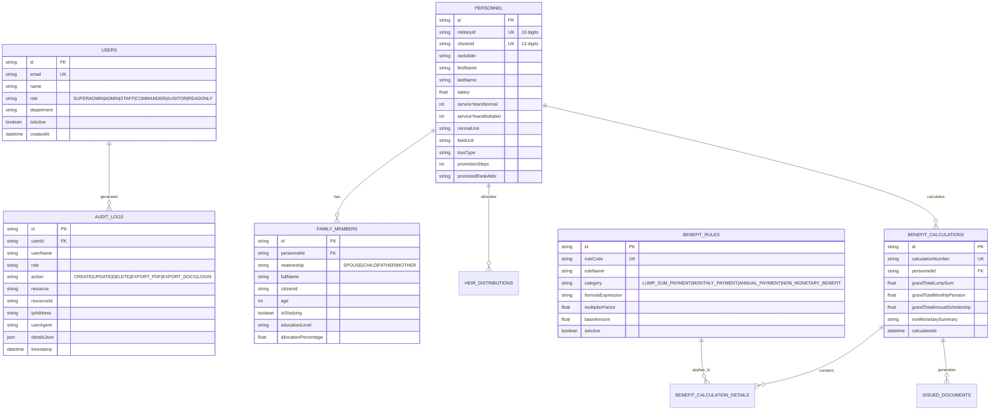

# 🏛️ สถาปัตยกรรมระบบและแผนงานการพัฒนา (Enterprise Solution Architecture & Roadmap)
## ระบบสารสนเทศประมาณการสิทธิประโยชน์และเงินสงเคราะห์กำลังพล (sittidop-benefit-system)

---

## 📑 สารบัญ (Table of Contents)
1. [บทนำและภาพรวมโครงการ (Executive Summary)](#1-บทนำและภาพรวมโครงการ)
2. [เอปิคหลักของระบบ (Core Epics)](#2-เอปิคหลักของระบบ-core-epics)
3. [เรื่องราวผู้ใช้งานและเกณฑ์การยอมรับ (User Stories & Acceptance Criteria)](#3-เรื่องราวผู้ใช้งานและเกณฑ์การยอมรับ)
4. [การออกแบบฐานข้อมูล (Database Architecture & ERD)](#4-การออกแบบฐานข้อมูล-database-architecture--erd)
5. [Prisma Data Models (`schema.prisma`)](#5-prisma-data-models-schemaprisma)
6. [การออกแบบ RESTful API (API Design & Specifications)](#6-การออกแบบ-restful-api-api-design--specifications)
7. [การออกแบบส่วนติดต่อผู้ใช้ (UI/UX Design System)](#7-การออกแบบส่วนติดต่อผู้ใช้-uiux-design-system)
8. [โครงสร้าง Docker และ Containerization (Docker Architecture)](#8-โครงสร้าง-docker-และ-containerization)
9. [แผนงานการพัฒนาและตารางงาน (Implementation Tasks & Gantt Schedule)](#9-แผนงานการพัฒนาและตารางงาน)

---

## 1. บทนำและภาพรวมโครงการ

ระบบ **sittidop-benefit-system** เป็นแพลตฟอร์มระดับองค์กร (Enterprise Application) สำหรับคำนวณ ประมาณการ จัดสรร และออกหนังสือรับรองสิทธิประโยชน์และเงินสงเคราะห์แก่กำลังพลกองทัพบกและทายาทตามกฎหมาย รองรับการคำนวณสิทธิประโยชน์ 4 หมวดหมู่หลักตามระเบียบกระทรวงกลาโหม และ พ.ร.บ. สงเคราะห์ผู้ประสบภัยจากการปฏิบัติราชการ พ.ศ. 2543

```
┌─────────────────────────────────────────────────────────────────────────────────────────────────┐
│                                 HIGH-LEVEL SYSTEM ARCHITECTURE                                  │
├─────────────────────────────────────────────────────────────────────────────────────────────────┤
│  [Client Layer]         Next.js 15 (App Router) + TypeScript + Tailwind CSS + Lucide Icons      │
│  [Security Layer]       NextAuth.js (JWT) + RBAC Engine (6 Roles) + Rate Limiter + Audit Logger │
│  [Business Core]        Rule Engine (4 Categories) + Expression Evaluator + Checksum Validator  │
│  [Document & I/O]       SheetJS (Excel Multi-Sheet) + DOCX Packer + QRCode + Native PDF Print   │
│  [Data Layer]           Prisma ORM + PostgreSQL 15 (Foreign Keys, Indexing, Transactions)     │
│  [Infrastructure]       Docker Compose Multi-Container + Healthchecks + Volume Persistence      │
└─────────────────────────────────────────────────────────────────────────────────────────────────┘
```

---

## 2. เอปิคหลักของระบบ (Core Epics)

```
┌────────────┬─────────────────────────────────────────────────────────────┬──────────────────────┐
│ Epic ID    │ Epic Name                                                   │ Target Milestone     │
├────────────┼─────────────────────────────────────────────────────────────┼──────────────────────┤
│ EPIC-01    │ ทะเบียนประวัติกำลังพลและโครงสร้างครอบครัว (Registry Engine)  │ Sprint 1             │
│ EPIC-02    │ กฎเกณฑ์และเครื่องมือประมาณการสิทธิ 4 หมวด (Benefit Engine)  │ Sprint 2             │
│ EPIC-03    │ ระบบออกหนังสือรับรองและเอกสารทางการ (Document Studio)       │ Sprint 3             │
│ EPIC-04    │ ระบบนำเข้าและตรวจสอบความถูกต้องไฟล์ Excel (Excel Import)    │ Sprint 4             │
│ EPIC-05    │ ระบบควบคุมสิทธิ์การเข้าถึง 6 ระดับ (Enterprise RBAC)        │ Sprint 5             │
│ EPIC-06    │ บันทึกประวัติความปลอดภัยและการตรวจสอบ (Audit Trail / ISO)   │ Sprint 6             │
└────────────┴─────────────────────────────────────────────────────────────┴──────────────────────┘
```

### รายละเอียดเอปิค (Epic Breakdown)
- **EPIC-01: Military Personnel & Family Registry**: บริหารจัดการข้อมูลกำลังพล เลขทหาร 10 หลัก บัตรประชาชน 13 หลัก เงินเดือน เวลาราชการทวีคูณ ความสูญเสีย คู่สมรส บุตร ทายาท และสัดส่วนการจัดสรร %
- **EPIC-02: Multi-Category Benefit Rule Engine**: เครื่องมือคำนวณสิทธิ 4 หมวดหมู่ (1. รับเงินครั้งเดียว, 2. รับเงินรายเดือน, 3. รับเงินรายปี, 4. สิทธิมิใช่ตัวเงิน) พร้อม Live Sandbox ทดสอบสูตร
- **EPIC-03: Official Document & Certificate Studio**: ออกเอกสารทางการ 4 รูปแบบ (Benefit Summary, Benefit Certificate, Heir Report, Claim Form) รองรับ Word DOCX, PDF, ตราสัญลักษณ์กลาโหม, QR Code e-Verification, และ e-Signature
- **EPIC-04: Multi-Sheet Excel Import Module**: นำเข้าไฟล์ Excel 3 แผ่นงาน (Personnel, Family, Benefits) ตรวจสอบความถูกต้องก่อนบันทึก (Dry-run validation) และสร้าง Error Report
- **EPIC-05: Enterprise RBAC & Multi-Role Access Control**: ระบบจัดการผู้ใช้งานและสิทธิ์ 6 ระดับ (SUPERADMIN, ADMIN, STAFF, COMMANDER, AUDITOR, READONLY) พร้อม API Route Guards
- **EPIC-06: Audit Trail & Compliance Management**: ติดตามและบันทึก Log กิจกรรม 6 ด้าน (Create, Update, Delete, Export PDF, Export DOCX, Login) พร้อมบันทึก User และ Client IP Address

---

## 3. เรื่องราวผู้ใช้งานและเกณฑ์การยอมรับ (User Stories & Acceptance Criteria)

### US-01: การคำนวณประมาณการสิทธิ 4 หมวดหมู่
> **ในฐานะ**: นายทหารฝ่ายกำลังพล (Staff / Officer)  
> **ฉันต้องการ**: เลือกกำลังพลและคำนวณสิทธิประโยชน์ทั้ง 4 หมวดหมู่แบบอัตโนมัติ  
> **เพื่อที่**: จะได้สรุปยอดเงินสงเคราะห์ที่ทายาทจะได้รับอย่างถูกต้องและรวดเร็ว  

**Acceptance Criteria (Gherkin format):**
```gherkin
Scenario: คำนวณสิทธิประโยชน์กรณีเสียชีวิตในการปฏิบัติหน้าที่ราชการสนาม
  Given กำลังพล "ร้อยเอก ภาคิน รักษ์ชาติ" เงินเดือน 32,880 บาท เวลาราชการรวมทวีคูณ 28 ปี ปูนบำเหน็จ 7 ชั้นยศ
  When เจ้าหน้าที่กดปุ่ม "คำนวณประมาณการสิทธิประโยชน์"
  Then ระบบต้องคำนวณหมวดที่ 1 (รับเงินครั้งเดียว) รวม 7,491,500 บาท
  And ระบบต้องคำนวณหมวดที่ 2 (รับเงินรายเดือน) บำนาญพิเศษ 32,880 บาท/เดือน
  And ระบบต้องคำนวณหมวดที่ 3 (รับเงินรายปี) ทุนการศึกษาบุตร 47,000 บาท/ปี
  And ระบบต้องแสดงหมวดที่ 4 (สิทธิมิใช่ตัวเงิน) เช่น สิทธิบรรจุทายาททดแทน 1 อัตรา
  And ระบบต้องจัดสรรยอดเงินให้ทายาทตามสัดส่วน (คู่สมรส 50%, บุตร 25%, บิดามารดา 25%)
```

---

### US-02: การส่งออกหนังสือรับรองทางการพร้อม e-Signature และ QR Code
> **ในฐานะ**: ผู้บังคับบัญชา / เจ้ากรมกำลังพลทหารบก (Commander)  
> **ฉันต้องการ**: ออกหนังสือรับรองสิทธิประโยชน์ทางการในรูปแบบ Word (`.docx`) และพิมพ์เป็น PDF  
> **เพื่อที่**: นำไปใช้เป็นหลักฐานประกอบการเบิกจ่ายงบประมาณและมอบให้แก่ทายาท  

**Acceptance Criteria:**
- ระบบต้องแสดงตราสัญลักษณ์กระทรวงกลาโหม / กองทัพบก ที่หัวเอกสาร
- ระบบต้องฝัง QR Code ดิจิทัลสำหรับสแกนตรวจสอบความถูกต้อง (e-Verification)
- ระบบต้องมีบล็อกลายมือชื่ออิเล็กทรอนิกส์ (e-Signature) พร้อมรหัสยืนยัน SHA-256 Token
- ไฟล์ Word (`.docx`) ต้องดาวน์โหลดได้และคงโครงสร้างตาราง 4 หมวดหมู่ตามมาตรฐานราชการ

---

### US-03: การนำเข้าข้อมูล Excel พร้อมระบบตรวจสอบความถูกต้อง (Pre-save Validation)
> **ในฐานะ**: เจ้าหน้าที่ธุรการกำลังพล (Staff)  
> **ฉันต้องการ**: อัพโหลดไฟล์ Excel ทะเบียนกำลังพล ครอบครัว และกฎเกณฑ์สิทธิ  
> **เพื่อที่**: นำเข้าข้อมูลจำนวนมากพร้อมกันโดยระบบต้องตรวจสอบความผิดพลาดก่อนบันทึกลงฐานข้อมูล  

**Acceptance Criteria:**
- รองรับไฟล์ Excel ที่มี 3 Sheet: `Personnel`, `Family`, `Benefits`
- ตรวจสอบเลขประจำตัวประชาชน 13 หลักด้วยอัลกอริทึม Checksum ตามมาตรฐานราชการ
- หากพบข้อผิดพลาด ระบบต้องไม่อนุญาตให้บันทึก และสร้างตารางแสดงข้อผิดพลาดระบุแถว คอลัมน์ และคำแนะนำแก้ไข
- มีปุ่มดาวน์โหลดรายงานข้อผิดพลาด (Download Error Report) เป็นไฟล์ `.xlsx`

---

## 4. การออกแบบฐานข้อมูล (Database Architecture & ERD)



---

## 5. Prisma Data Models (`schema.prisma`)

```prisma
datasource db {
  provider = "postgresql"
  url      = env("DATABASE_URL")
}

generator client {
  provider = "prisma-client-js"
}

enum Role {
  SUPERADMIN
  ADMIN
  STAFF
  COMMANDER
  AUDITOR
  READONLY
}

enum BenefitCategoryCode {
  LUMP_SUM_PAYMENT
  MONTHLY_PAYMENT
  ANNUAL_PAYMENT
  NON_MONETARY_BENEFIT
}

enum AuditAction {
  CREATE
  UPDATE
  DELETE
  EXPORT_PDF
  EXPORT_DOCX
  LOGIN
}

model User {
  id           String     @id @default(cuid())
  name         String
  email        String     @unique
  passwordHash String
  role         Role       @default(STAFF)
  department   String?
  phone        String?
  avatarUrl    String?
  isActive     Boolean    @default(true)
  createdAt    DateTime   @default(now())
  updatedAt    DateTime   @updatedAt
  auditLogs    AuditLog[]

  @@index([email])
  @@index([role])
}

model MilitaryPersonnel {
  id                     String               @id @default(cuid())
  militaryId             String               @unique // เลขประจำตัวทหาร 10 หลัก
  citizenId              String?              @unique // เลขบัตรประชาชน 13 หลัก
  rank                   String
  rankAbbr               String
  firstName              String
  lastName               String
  abbreviatedPosition    String?
  normalUnit             String
  fieldPosition          String?
  fieldUnit              String?
  salary                 Float
  salaryLevel            String?
  salaryStep             String?
  compensationAmount     Float                @default(0)
  additionalPay          Float                @default(0)
  serviceYearsNormal     Int                  @default(0)
  serviceYearsMultiplier Int                  @default(0)
  missionType            String?
  actionType             String?
  incidentType           String?
  incidentDate           DateTime?
  lossType               String
  promotionSteps         Int                  @default(0)
  promotedRank           String?
  promotedRankAbbr       String?
  promotedSalary         Float?
  createdAt              DateTime             @default(now())
  updatedAt              DateTime             @updatedAt

  familyMembers          FamilyMember[]
  heirAllocations        HeirAllocation[]
  benefitCalculations    BenefitCalculation[]

  @@index([militaryId])
  @@index([citizenId])
  @@index([lossType])
}

model FamilyMember {
  id                   String            @id @default(cuid())
  personnelId          String
  personnel            MilitaryPersonnel @relation(fields: [personnelId], references: [id], onDelete: Cascade)
  relationship         String            // SPOUSE, CHILD, FATHER, MOTHER
  fullName             String
  nationalId           String?
  age                  Int?
  isAlive              Boolean           @default(true)
  isStudying           Boolean           @default(false)
  educationLevel       String?           // PRIMARY, SECONDARY, BACHELOR
  allocationPercentage Float             @default(0)
  createdAt            DateTime          @default(now())
  updatedAt            DateTime          @updatedAt

  @@index([personnelId])
}

model HeirAllocation {
  id                      String            @id @default(cuid())
  personnelId             String
  personnel               MilitaryPersonnel @relation(fields: [personnelId], references: [id], onDelete: Cascade)
  heirName                String
  relationship            String
  sharePercentage         Float
  allocatedLumpSum        Float             @default(0)
  allocatedMonthlyPension Float             @default(0)
  bankAccount             String?
  bankName                String?
  createdAt               DateTime          @default(now())

  @@index([personnelId])
}

model MilitaryBenefitRule {
  id                String              @id @default(cuid())
  ruleCode          String              @unique
  ruleName          String
  category          BenefitCategoryCode
  categoryName      String
  categoryThaiName  String
  description       String?             @db.Text
  legalBasis        String?             @db.Text
  paymentType       String
  formulaType       String              @default("EXPRESSION")
  formulaExpression String              @db.Text
  multiplierFactor  Float               @default(1.0)
  baseAmount        Float               @default(0)
  minAmount         Float?
  maxAmount         Float?
  isActive          Boolean             @default(true)
  priorityOrder     Int                 @default(10)
  createdAt         DateTime            @default(now())
  updatedAt         DateTime            @updatedAt

  @@index([category])
  @@index([isActive])
}

model BenefitCalculation {
  id                          String            @id @default(cuid())
  calculationNumber           String            @unique
  personnelId                 String
  personnel                   MilitaryPersonnel @relation(fields: [personnelId], references: [id], onDelete: Cascade)
  grandTotalLumpSum           Float             @default(0)
  grandTotalMonthlyPension    Float             @default(0)
  grandTotalAnnualScholarship Float             @default(0)
  nonMonetarySummary          String?           @db.Text
  calculationSnapshotJson     String            @db.LongText
  calculatedBy                String?
  calculatedAt                DateTime          @default(now())

  @@index([personnelId])
  @@index([calculationNumber])
}

model AuditLog {
  id          String   @id @default(cuid())
  userId      String?
  user        User?    @relation(fields: [userId], references: [id], onDelete: SetNull)
  userName    String?
  role        String?
  action      String   // CREATE, UPDATE, DELETE, EXPORT_PDF, EXPORT_DOCX, LOGIN
  resource    String
  resourceId  String?
  detailsJson String?  @db.Text
  ipAddress   String?
  userAgent   String?  @db.Text
  timestamp   DateTime @default(now())

  @@index([action])
  @@index([userId])
  @@index([resource])
  @@index([timestamp])
}
```

---

## 6. การออกแบบ RESTful API (API Design & Specifications)

```
┌──────────────────────────────────────┬────────┬─────────────────────────────┬──────────────────────────┐
│ API Endpoint                         │ Method │ Description                 │ RBAC Guard (Allowed)     │
├──────────────────────────────────────┼────────┼─────────────────────────────┼──────────────────────────┤
│ /api/auth/[...nextauth]              │ POST   │ User Login & JWT Session    │ Public                   │
│ /api/personnel                       │ GET    │ ดึงรายการกำลังพล            │ ทุกสิทธิ์                │
│ /api/personnel                       │ POST   │ เพิ่มข้อมูลกำลังพลใหม่      │ SUPERADMIN, ADMIN, STAFF │
│ /api/personnel/[id]                  │ PUT    │ แก้ไขข้อมูลกำลังพล          │ SUPERADMIN, ADMIN, STAFF │
│ /api/personnel/[id]                  │ DELETE │ ลบข้อมูลกำลังพล             │ SUPERADMIN, ADMIN, STAFF │
│ /api/rules                           │ GET    │ ดึงรายการกฎเกณฑ์ 4 หมวด     │ ทุกสิทธิ์                │
│ /api/rules                           │ POST   │ สร้างกฎเกณฑ์สิทธิใหม่       │ SUPERADMIN, ADMIN        │
│ /api/rules/[id]                      │ PUT    │ แก้ไขสูตรคำนวณสิทธิ         │ SUPERADMIN, ADMIN        │
│ /api/rules/[id]                      │ DELETE │ ลบกฎเกณฑ์สิทธิ              │ SUPERADMIN, ADMIN        │
│ /api/rules/calculate                 │ POST   │ คำนวณสิทธิ Live Sandbox     │ ทุกสิทธิ์                │
│ /api/calculator/estimate             │ POST   │ คำนวณสิทธิ 4 หมวดเต็มรูปแบบ │ ทุกสิทธิ์                │
│ /api/documents/export                │ GET    │ ส่งออก Word (.docx) / PDF   │ ทุกสิทธิ์                │
│ /api/import/excel                    │ GET    │ ดาวน์โหลด Template (.xlsx)  │ ทุกสิทธิ์                │
│ /api/import/excel                    │ POST   │ ตรวจสอบ & นำเข้า Excel      │ SUPERADMIN, ADMIN, STAFF │
│ /api/users                           │ GET    │ ดึงรายชื่อผู้ใช้งาน         │ SUPERADMIN, ADMIN        │
│ /api/users                           │ POST   │ สร้างผู้ใช้งานใหม่          │ SUPERADMIN, ADMIN        │
│ /api/audit-logs                      │ GET    │ ดึงประวัติการทำงาน          │ SUPERADMIN, AUDITOR      │
│ /api/audit-logs                      │ POST   │ บันทึก Log จาก Client       │ ทุกสิทธิ์                │
│ /api/reports                         │ GET    │ รายงานสถิติภาพรวม           │ ยกเว้น READONLY          │
└──────────────────────────────────────┴────────┴─────────────────────────────┴──────────────────────────┘
```

---

## 7. การออกแบบส่วนติดต่อผู้ใช้ (UI/UX Design System)

### Design System & Typography
- **Core Font**: `TH Sarabun New`, `Noto Sans Thai`, `Inter`, `JetBrains Mono` (สำหรับตัวเลขและรหัส)
- **Design Tokens**:
  - `Primary / Brand`: Emerald `#059669` / `#10b981` (ความมั่นคง ปลอดภัย มีเกียรติ)
  - `Surface / Background`: Slate Dark `#020617` / `#0f172a` / Light `#f8fafc`
  - `Accent / Highlight`: Purple `#8b5cf6`, Amber `#d97706`, Blue `#2563eb`
  - `Feedback`: Success `#16a34a`, Warning `#f59e0b`, Error `#dc2626`

### Information Architecture (Navigation Map)
```
[App Shell]
 ├── 📊 /dashboard          - สรุปสถิติ KPI 4 หมวดหมู่, กราฟสัดส่วนงบประมาณ, และทางลัดด่วน
 ├── 🛡️ /personnel          - ทะเบียนกำลังพล, การค้นหา, ตัวกรองความสูญเสีย, บัตรประชาชน
 ├── 👥 /family             - ข้อมูลคู่สมรส, บุตร, บิดามารดา, สถานภาพการศึกษา
 ├── 🤝 /heirs              - บัญชีการจัดสรรสิทธิประโยชน์ทายาทตามกฎหมาย (50% / 25% / 25%)
 ├── 🧮 /calculator         - เครื่องมือคำนวณประมาณการสิทธิ 4 หมวดหมู่ (5-Step Wizard)
 ├── ⚙️ /rules              - จัดการกฎเกณฑ์และสูตรคำนวณ 4 หมวด พร้อม Sandbox ทดสอบสูตร
 ├── 📄 /documents          - Document Generator Studio (4 แม่แบบ, DOCX, PDF, QR, e-Signature)
 ├── 📥 /import             - ระบบนำเข้าข้อมูล Excel 3 Sheet พร้อมระบบตรวจสอบก่อนบันทึก
 ├── 📈 /reports            - รายงานสถิติภาพรวมและส่งออก Excel / CSV
 ├── 👤 /users              - บริหารจัดการผู้ใช้งานและระดับสิทธิ์ 6 ระดับ (RBAC)
 └── 📜 /audit-logs         - บันทึกประวัติการทำงาน (Audit Trail / ISO 27001 & PDPA)
```

---

## 8. โครงสร้าง Docker และ Containerization

### Multi-Container `docker-compose.yml` Architecture
```yaml
version: "3.8"

services:
  # PostgreSQL 15 Database
  db:
    image: postgres:15-alpine
    container_name: sittidop_postgres
    restart: always
    environment:
      POSTGRES_USER: sitti
      POSTGRES_PASSWORD: V@radorn7887
      POSTGRES_DB: sittidop
    ports:
      - "5432:5432"
    volumes:
      - postgres_data:/var/lib/postgresql/data
      - ./prisma/seed.sql:/docker-entrypoint-initdb.d/init.sql
    healthcheck:
      test: ["CMD-SHELL", "pg_isready -U sitti -d sittidop"]
      interval: 10s
      timeout: 5s
      retries: 5

  # Next.js 15 Enterprise Application
  app:
    build:
      context: .
      dockerfile: Dockerfile
    container_name: sittidop_app
    restart: always
    environment:
      DATABASE_URL: "postgresql://sitti:V@radorn7887@db:5432/sittidop"
      NEXTAUTH_URL: "http://localhost:3000"
      NEXTAUTH_SECRET: "sittidop_enterprise_secret_key_2026_super_secure_mod"
      NODE_ENV: "production"
    ports:
      - "3000:3000"
    depends_on:
      db:
        condition: service_healthy

volumes:
  postgres_data:
    driver: local
```

---

## 9. แผนงานการพัฒนาและตารางงาน (Implementation Tasks & Gantt Schedule)

```
┌────────────────────────────────────────────────────────────────────────────────────────────────────────┐
│                                   DEVELOPMENT ROADMAP (6 SPRINTS)                                      │
├────────────────────────────────────────────────────────────────────────────────────────────────────────┤
│ Sprint 1: Foundation & Registry Engine ───► [Done] Architecture, Next.js 15, Prisma, Personnel, Family │
│ Sprint 2: 4 Payout Categories Engine  ───► [Done] Lump Sum, Monthly, Annual, Non-Monetary, Sandbox    │
│ Sprint 3: Document Studio & Security  ───► [Done] 4 Templates, DOCX Export, PDF Print, QR, e-Signature│
│ Sprint 4: Multi-Sheet Excel Engine    ───► [Done] 3-Sheet Parser, Pre-save Validator, Error Report     │
│ Sprint 5: Enterprise RBAC & Security  ───► [Done] 6 Roles, API Route Guards, Page Protection           │
│ Sprint 6: ISO 27001 Audit Trail & QA  ───► [Done] 6 Actions Tracking, Client IP Detection, CI/CD Push  │
└────────────────────────────────────────────────────────────────────────────────────────────────────────┘
```

### รายละเอียดงานตาม Sprint (Work Breakdown Structure)

#### 🚀 Sprint 1: Core Foundation & Registry Engine
- [x] Initializing Next.js 15 App Router + TypeScript + Tailwind CSS + Shadcn UI
- [x] Setup Docker Compose with PostgreSQL 15 & Prisma ORM
- [x] Create Military Personnel Management Table & Details Dialog
- [x] Create Family & Legal Heir Information Pages

#### 🚀 Sprint 2: Multi-Category Benefit Engine (4 Payout Categories)
- [x] Refactor architecture into 4 Payout Categories:
  - 1. One-Time Lump Sum (รับเงินครั้งเดียว)
  - 2. Monthly Payment (รับเงินรายเดือน)
  - 3. Annual Payment (รับเงินรายปี)
  - 4. Non-Monetary Benefit (สิทธิมิใช่ตัวเงิน)
- [x] Develop Live Expression Parser and Dynamic Multiplier Engine
- [x] Implement Benefit Rule Manager with Interactive Sandbox

#### 🚀 Sprint 3: Official Document Generator Studio
- [x] Develop 4 Official Templates:
  - Benefit Summary (หนังสือสรุปรายการประมาณการสิทธิ 4 หมวด)
  - Benefit Certificate (หนังสือรับรองสิทธิประโยชน์ทางการ)
  - Heir Report (รายงานบัญชีจัดสรรสิทธิประโยชน์ทายาท)
  - Claim Form (แบบคำขอรับเงินสงเคราะห์)
- [x] Implement Word DOCX Export via `docx` library
- [x] Implement High-Resolution PDF Print CSS
- [x] Implement Dynamic QR Code e-Verification & Digital e-Signature

#### 🚀 Sprint 4: Multi-Sheet Excel Import Module
- [x] Multi-sheet parser supporting `Personnel`, `Family`, and `Benefits`
- [x] 13-digit Thai ID Checksum validation
- [x] Pre-save dry-run validation with error highlighting
- [x] Downloadable Error Report (`.xlsx`) & Template Generator

#### 🚀 Sprint 5: Enterprise RBAC & Security
- [x] Define 6 RBAC Roles: `SUPERADMIN`, `ADMIN`, `STAFF`, `COMMANDER`, `AUDITOR`, `READONLY`
- [x] Implement API Route Guards (`rbac-guard.ts`)
- [x] Implement Server-side Page Route Protection with `AccessDenied.tsx`
- [x] Implement 6-Role Switcher dropdown in `UserNav.tsx`

#### 🚀 Sprint 6: Audit Trail & Quality Assurance
- [x] Track 6 core actions: `CREATE`, `UPDATE`, `DELETE`, `EXPORT_PDF`, `EXPORT_DOCX`, `LOGIN`
- [x] Capture Real Client IP Address (`x-forwarded-for` / `x-real-ip`) and User metadata
- [x] Interactive Audit Log Viewer with Action filter chips and JSON dialog
- [x] Production Build verification (29 routes) and GitHub repository push
