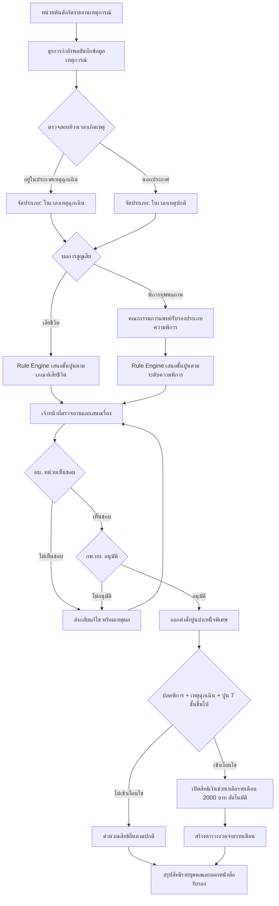
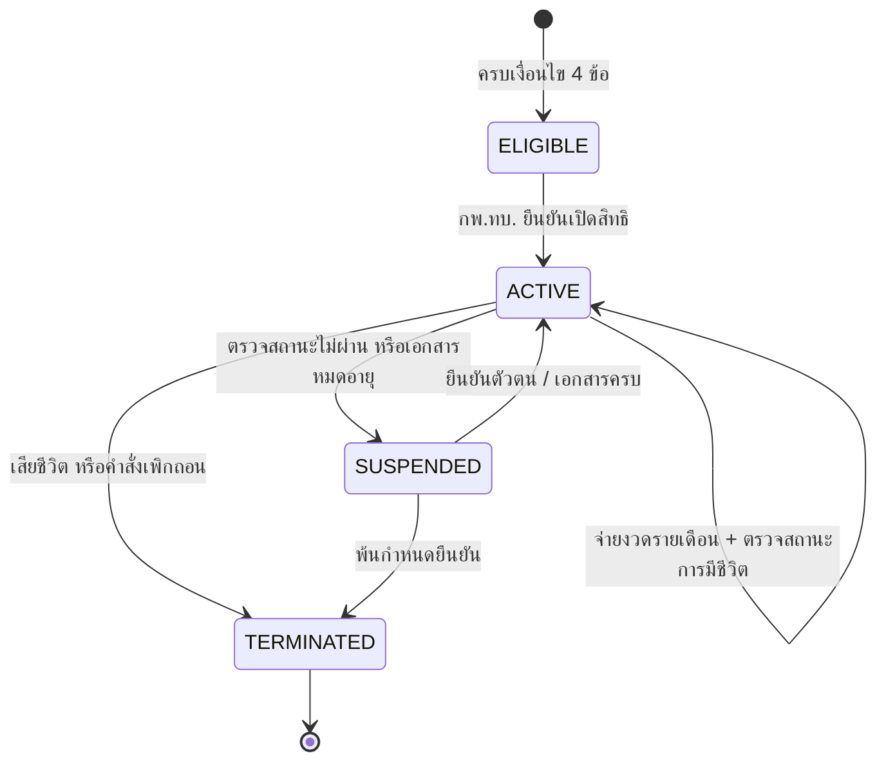
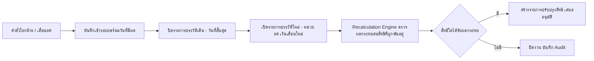
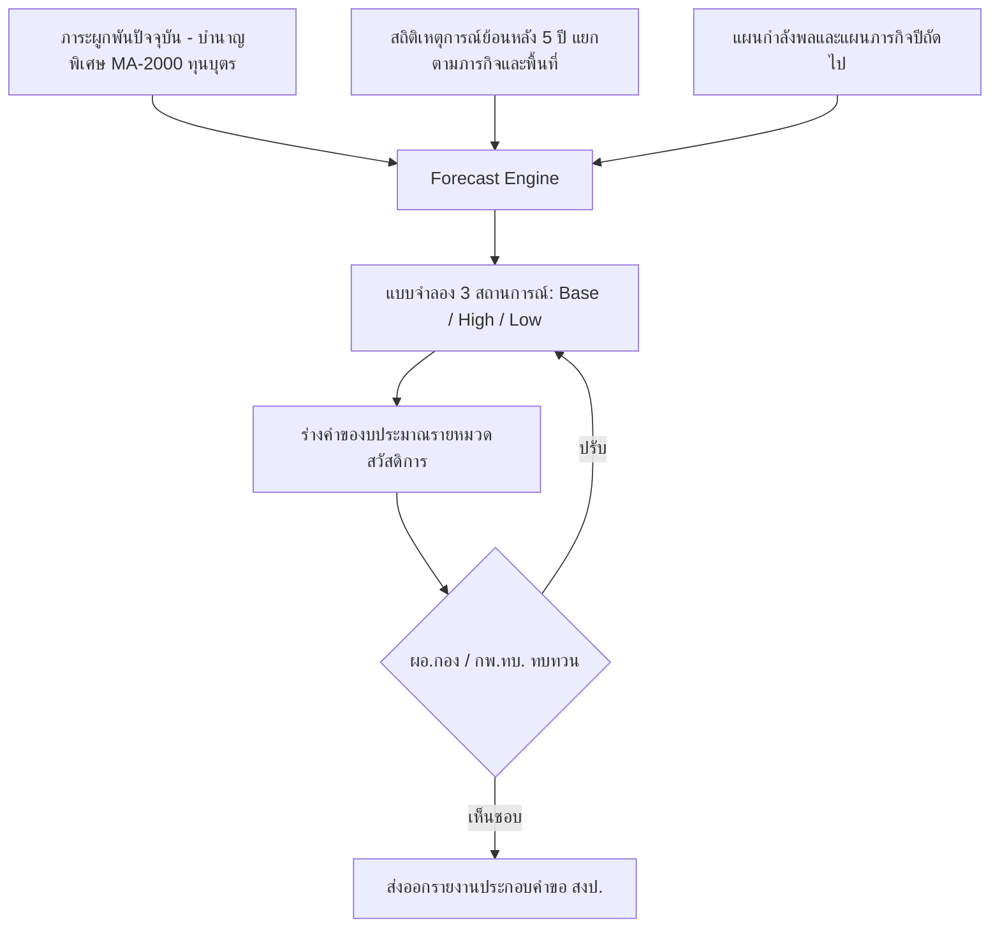
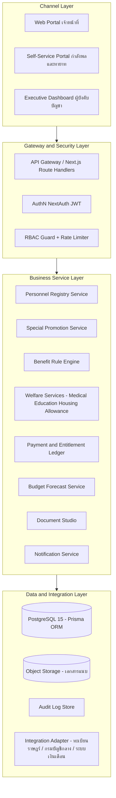
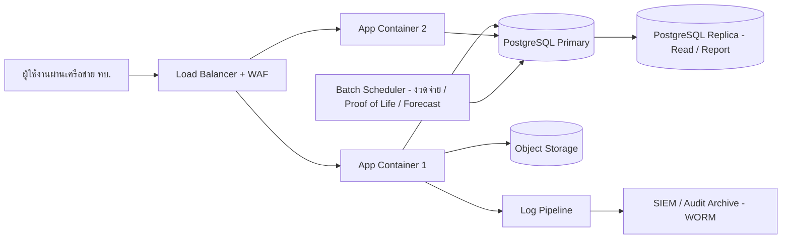
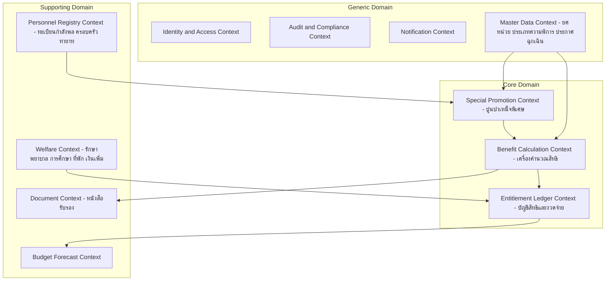
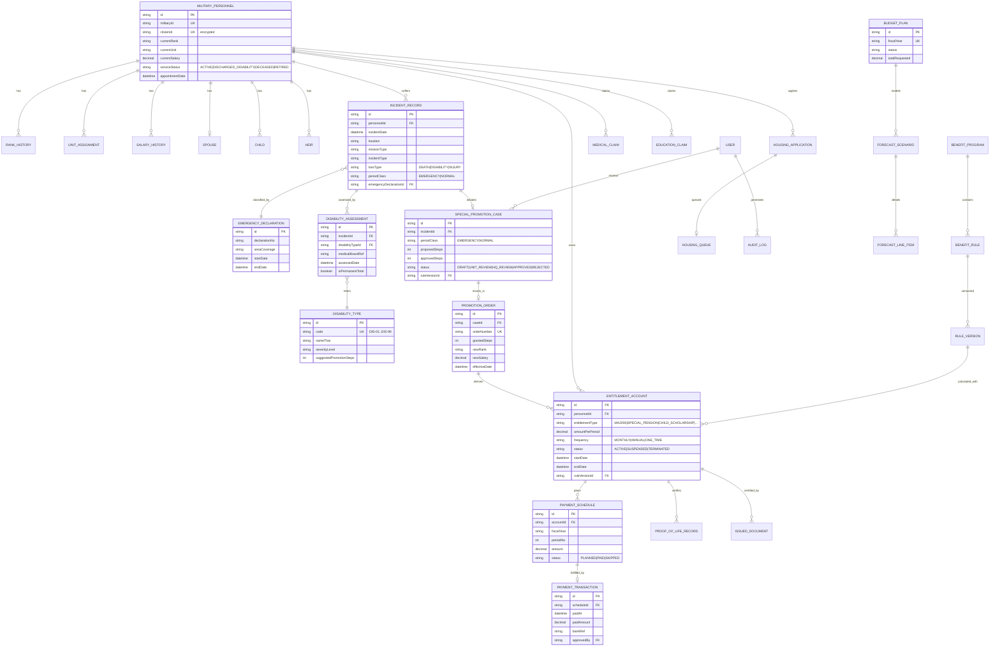
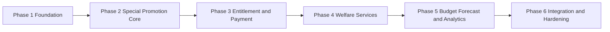

# 🏛️ เอกสารออกแบบระบบระดับองค์กร (Enterprise System Design Document)
## ระบบประมาณสิทธิและสวัสดิการกำลังพลกองทัพบก
### Army Personnel Benefit & Welfare Estimation System (ABWES)

| รายการ | รายละเอียด |
|---|---|
| ชื่อระบบ | ระบบประมาณสิทธิและสวัสดิการกำลังพลกองทัพบก (sittidop-benefit-system) |
| ประเภทเอกสาร | System Design Specification (SDS) ระดับ Enterprise |
| ผู้จัดทำ | Senior Enterprise Solution Architect & Business Analyst |
| สถานะ | ฉบับร่างเพื่อขออนุมัติ (Draft for Approval) |
| ขอบเขตอ้างอิงกฎหมาย | ข้อบังคับ กห. ว่าด้วยการปูนบำเหน็จพิเศษ, พ.ร.บ.บำเหน็จบำนาญข้าราชการ, พ.ร.บ.สงเคราะห์ผู้ประสบภัยเนื่องจากการช่วยเหลือราชการ พ.ศ. 2543, ระเบียบ ทบ. ว่าด้วยสวัสดิการที่พักอาศัย/การศึกษา/ค่ารักษาพยาบาล |

---

## 📑 สารบัญ

1. [ภาพรวมและวัตถุประสงค์ (Executive Summary)](#1-ภาพรวมและวัตถุประสงค์)
2. [กระบวนการทางธุรกิจ (Business Process)](#2-กระบวนการทางธุรกิจ-business-process)
3. [สถาปัตยกรรมระบบ (System Architecture)](#3-สถาปัตยกรรมระบบ-system-architecture)
4. [การออกแบบโมดูล / Microservices (Modular Design)](#4-การออกแบบโมดูล--microservices)
5. [การออกแบบฐานข้อมูล (Database Design)](#5-การออกแบบฐานข้อมูล-database-design)
6. [แผนภาพความสัมพันธ์ข้อมูล (ER Diagram)](#6-er-diagram)
7. [บทบาทผู้ใช้งาน (User Roles & RBAC)](#7-บทบาทผู้ใช้งาน-user-roles--rbac)
8. [การออกแบบ API (API Design)](#8-การออกแบบ-api)
9. [การออกแบบความมั่นคงปลอดภัย (Security Design)](#9-การออกแบบความมั่นคงปลอดภัย-security-design)
10. [การออกแบบบันทึกตรวจสอบ (Audit Log Design)](#10-การออกแบบบันทึกตรวจสอบ-audit-log-design)
11. [แผนงานการพัฒนา (Development Roadmap)](#11-แผนงานการพัฒนา-development-roadmap)

---

## 1. ภาพรวมและวัตถุประสงค์

### 1.1 วัตถุประสงค์ของระบบ (Business Objectives)

| # | วัตถุประสงค์ | ผลลัพธ์ที่คาดหวัง (Business Outcome) |
|---|---|---|
| O-1 | พิจารณาและคำนวณ **การปูนบำเหน็จพิเศษ** กรณีเสียชีวิต/พิการทุพพลภาพ แยกตามห้วงเวลา **เหตุฉุกเฉิน** และ **เหตุปกติ** | ลดเวลาพิจารณาจากรายสัปดาห์เหลือรายนาที ถูกต้องตามข้อบังคับ กห. 100% |
| O-2 | บริหารสิทธิ **เงินช่วยเหลือรายเดือน 2,000 บาท** สำหรับกำลังพลปลดพิการทุพพลภาพในเวลาเหตุฉุกเฉินที่ได้รับปูนบำเหน็จ **ตั้งแต่ 7 ชั้นขึ้นไป** | จ่ายเงินตรงตามสิทธิ ตรวจสอบย้อนหลังได้ทุกงวด |
| O-3 | ขึ้นทะเบียน **ประเภทความพิการทุพพลภาพ** เช่น สมองเสื่อม/บาดเจ็บถาวร, อัมพาตทั้งตัว, ตาบอด 2 ข้าง ฯลฯ | มีทะเบียนความพิการมาตรฐานเดียวกันทั้งกองทัพ |
| O-4 | คำนวณสิทธิและสวัสดิการ **รายบุคคล** รองรับกำลังพล **ทุกชั้นยศ** | เจ้าหน้าที่และกำลังพลเห็นสิทธิของตนแบบ Self-Service |
| O-5 | รองรับ **การโยกย้ายหน่วย** และ **การเลื่อนยศ** โดยเก็บประวัติครบถ้วน | สิทธิถูกคำนวณจากข้อมูล ณ เวลาเกิดเหตุ (Point-in-Time) เสมอ |
| O-6 | รองรับสิทธิ **ค่ารักษาพยาบาล / การศึกษา / ที่พักอาศัย / เงินเพิ่มและค่าตอบแทน** | รวมสวัสดิการทุกด้านในแพลตฟอร์มเดียว |
| O-7 | **คาดการณ์งบประมาณประจำปี** จากภาระสิทธิที่ผูกพันและแนวโน้มเหตุการณ์ | ตัวเลขงบประมาณเสนอ สม./สงป. ได้ทันรอบปีงบประมาณ |

### 1.2 กติกาธุรกิจหลัก — การปูนบำเหน็จพิเศษ (Core Business Rules)

> ค่าจำนวนชั้นในตารางกำหนดเป็น **Rule Parameter ที่ปรับแก้ได้** ผ่านโมดูล Rule Engine โดยไม่ต้องแก้ไขระบบ เพื่อรองรับการแก้ไขข้อบังคับในอนาคต

| รหัสกฎ | สถานการณ์ (ห้วงเวลา × ผลการสูญเสีย) | ชั้นปูนบำเหน็จ (ค่าตั้งต้น) | สิทธิพ่วง (Derived Entitlement) |
|---|---|---|---|
| PR-EM-DEATH | **เหตุฉุกเฉิน** — เสียชีวิตจากการรบ/ปฏิบัติหน้าที่ | 7–8 ชั้น | บำนาญพิเศษตกทอดทายาท, เงินช่วยพิเศษ, ทุนการศึกษาบุตร |
| PR-EM-DISAB | **เหตุฉุกเฉิน** — พิการทุพพลภาพจนต้องปลดจากราชการ | 5–8 ชั้น ตามระดับความพิการ | ถ้า **≥ 7 ชั้น** → **เงินช่วยเหลือรายเดือน 2,000 บาท** ตลอดชีพ + บำนาญพิเศษเหตุทุพพลภาพ |
| PR-NM-DEATH | **เหตุปกติ** — เสียชีวิตเนื่องจากการปฏิบัติหน้าที่ราชการ | 1–5 ชั้น | บำนาญพิเศษตกทอด, เงินช่วยเหลือครั้งเดียว |
| PR-NM-DISAB | **เหตุปกติ** — พิการทุพพลภาพเนื่องจากการปฏิบัติหน้าที่ | 1–5 ชั้น ตามระดับความพิการ | บำนาญพิเศษเหตุทุพพลภาพ (ไม่เข้าเงื่อนไข 2,000 บาท/เดือน) |

**เงื่อนไขสิทธิเงินช่วยเหลือรายเดือน 2,000 บาท (MA-2000):**
1. เป็นกำลังพลที่ **ปลดพิการทุพพลภาพ** (ปลดออกจากราชการเพราะเหตุทุพพลภาพ)
2. เหตุเกิด **ในเวลาเหตุฉุกเฉิน** (ประกาศสถานการณ์ฉุกเฉิน/กฎอัยการศึก/ภารกิจสู้รบตามประกาศ)
3. ได้รับการปูนบำเหน็จพิเศษ **ตั้งแต่ 7 ชั้นขึ้นไป**
4. ต้องมีการรับรองประเภทความพิการจากคณะกรรมการแพทย์ (Medical Board) เช่น สมองเสื่อมหรือบาดเจ็บถาวร, อัมพาตทั้งตัว, ตาบอด 2 ข้าง, สูญเสียแขนขา 2 ข้างขึ้นไป, จิตเวชถาวรจากการปฏิบัติหน้าที่
5. สิทธิเริ่มตั้งแต่วันที่คำสั่งปลดมีผล และสิ้นสุดเมื่อเสียชีวิตหรือมีคำสั่งเพิกถอน

### 1.3 ทะเบียนประเภทความพิการทุพพลภาพ (Disability Type Master)

| รหัส | ประเภทความพิการ | ระดับความรุนแรง | ชั้นปูนแนะนำ (เหตุฉุกเฉิน) |
|---|---|---|---|
| DIS-01 | สมองเสื่อมหรือได้รับบาดเจ็บทางสมองถาวร | วิกฤต (Critical) | 8 |
| DIS-02 | อัมพาตทั้งตัว (Quadriplegia) | วิกฤต (Critical) | 8 |
| DIS-03 | ตาบอด 2 ข้าง | วิกฤต (Critical) | 7–8 |
| DIS-04 | สูญเสียแขน/ขา ตั้งแต่ 2 ข้างขึ้นไป | วิกฤต (Critical) | 7–8 |
| DIS-05 | อัมพาตครึ่งท่อน (Paraplegia) | รุนแรง (Severe) | 7 |
| DIS-06 | สูญเสียแขนหรือขา 1 ข้าง | รุนแรง (Severe) | 5–6 |
| DIS-07 | สูญเสียการได้ยินถาวร 2 ข้าง | รุนแรง (Severe) | 5–6 |
| DIS-08 | จิตเวชถาวรจากการปฏิบัติหน้าที่ (PTSD ระดับทุพพลภาพ) | รุนแรง (Severe) | 5–7 |
| DIS-99 | อื่น ๆ ตามการรับรองของคณะกรรมการแพทย์ | ตามวินิจฉัย | ตามมติคณะกรรมการ |

> ทะเบียนนี้เป็น Master Data ที่ผู้ดูแลระบบ (ADMIN) เพิ่ม/แก้ไขได้ พร้อม Version Control และ Audit Trail

---

## 2. กระบวนการทางธุรกิจ (Business Process)

### 2.1 ภาพรวมกระบวนการหลัก (Value Chain)

### 2.2 BP-01: กระบวนการพิจารณาปูนบำเหน็จพิเศษ (Special Promotion Adjudication)

**จุดควบคุมสำคัญ (Control Points):**
- CP-1: การจัดประเภทห้วงเวลา ต้องอ้างอิง **ทะเบียนประกาศเหตุฉุกเฉิน (Emergency Declaration Registry)** ที่ระบุพื้นที่และช่วงวันที่ ระบบตรวจอัตโนมัติจากวันที่และพิกัดเหตุการณ์
- CP-2: ชั้นปูนที่ Rule Engine เสนอเป็น **ค่าเสนอแนะ** เจ้าหน้าที่ปรับได้ภายในกรอบ Min–Max ของกฎ หากเกินกรอบต้องแนบเหตุผลและผ่านการอนุมัติเพิ่มอีกระดับ
- CP-3: สิทธิ MA-2000 เปิดโดยระบบอัตโนมัติเมื่อครบ 4 เงื่อนไข ห้ามเจ้าหน้าที่เปิดเองโดยตรง (System-Derived Entitlement)

### 2.3 BP-02: การจ่ายเงินช่วยเหลือรายเดือน 2,000 บาท (Monthly Allowance Lifecycle)

- ตรวจสถานะการมีชีวิต (Proof of Life) ทุก 6 เดือน ผ่านการเชื่อมโยงทะเบียนราษฎร์หรือการรายงานตัว
- ทุกงวดจ่ายบันทึกลง `PaymentTransaction` พร้อมอ้างอิงงบประมาณและผู้อนุมัติ

### 2.4 BP-03: การโยกย้ายหน่วยและการเลื่อนยศ (Transfer & Promotion)

**หลักการสำคัญ:** ประวัติหน่วย/ยศ/เงินเดือน เก็บแบบ **Temporal Data (effectiveFrom – effectiveTo)** การคำนวณสิทธิทุกครั้งใช้ข้อมูล ณ **วันที่เกิดเหตุ** ไม่ใช่ข้อมูลปัจจุบัน

### 2.5 BP-04: สวัสดิการ 4 ด้าน (Welfare Services)

| กระบวนการ | ขั้นตอนหลัก | เงื่อนไขสิทธิโดยสรุป |
|---|---|---|
| **ค่ารักษาพยาบาล** | ยื่นคำขอ → แนบใบเสร็จ/ใบรับรองแพทย์ → ตรวจเพดานสิทธิ → อนุมัติ → เบิกจ่าย | ตนเอง + คู่สมรส + บุตร + บิดามารดา ตามเพดานต่อปีของแต่ละชั้นยศ/สถานพยาบาลรัฐ-เอกชน |
| **การศึกษา** | ยื่นคำขอทุน/เบิกค่าเล่าเรียนบุตร → ตรวจสถานะการศึกษาบุตร → อนุมัติ → จ่ายรายปี | บุตรอายุไม่เกินเกณฑ์และกำลังศึกษา อัตราตามระดับชั้น; บุตรผู้เสียชีวิต/ทุพพลภาพได้อัตราพิเศษ |
| **ที่พักอาศัย** | ยื่นคำขอบ้านพัก/ค่าเช่าบ้าน → ตรวจคะแนนสิทธิและบัญชีรอ → จัดสรร/อนุมัติค่าเช่า → ทบทวนรายปี | คะแนนจากชั้นยศ อายุราชการ สถานภาพครอบครัว ระยะทาง; ค่าเช่าบ้านตามสิทธิ พ.ร.ฎ. ค่าเช่าบ้าน |
| **เงินเพิ่ม/ค่าตอบแทน** | ผูกสิทธิจากตำแหน่ง/ภารกิจ → คำนวณอัตโนมัติรายเดือน → ตรวจสอบ → รวมยอดจ่าย | เช่น พ.ช.ท., พ.ส.ร., ค่าเสี่ยงภัยสนาม, เงินเพิ่มพิเศษรายเดือนต่าง ๆ ตามตารางอัตรา |

### 2.6 BP-05: การคาดการณ์งบประมาณประจำปี (Annual Budget Forecasting)

องค์ประกอบการพยากรณ์: (1) ภาระ Recurring ที่ผูกพันแล้วคำนวณตรง 100% (2) ภาระใหม่ประมาณจากค่าเฉลี่ยถ่วงน้ำหนักอัตราการเกิดเหตุต่อกำลังพลตามประเภทภารกิจ (3) ปัจจัยปรับ เช่น การปรับฐานเงินเดือน อัตราเงินเฟ้อค่ารักษาพยาบาล

---

## 3. สถาปัตยกรรมระบบ (System Architecture)

### 3.1 หลักการออกแบบ (Architecture Principles)

| หลักการ | คำอธิบาย |
|---|---|
| **Modular Monolith → Microservices-Ready** | เริ่มจาก Modular Monolith บน Next.js ที่มีอยู่ แบ่ง Module Boundary ชัดเจนตาม Domain (Clean Architecture ซึ่งโครงการมีอยู่แล้วใน `src/core`, `src/infrastructure`, `src/presentation`) พร้อมแตกเป็น Microservices เมื่อปริมาณงานถึงเกณฑ์ |
| **Rule as Data** | กฎการคำนวณทุกตัว (ชั้นปูน, อัตราเงิน, เพดานสิทธิ) เป็นข้อมูลใน Rule Engine มี Version และวันที่มีผล ไม่ฝังในตรรกะระบบ |
| **Temporal Integrity** | ข้อมูลยศ หน่วย เงินเดือน เก็บเป็นประวัติตามช่วงเวลา คำนวณสิทธิแบบ Point-in-Time ได้เสมอ |
| **Zero Trust & Least Privilege** | ทุก API ตรวจ AuthN/AuthZ, RBAC ระดับ Route + Field, ข้อมูลส่วนบุคคลเข้ารหัส |
| **Full Auditability** | ทุกธุรกรรมที่กระทบสิทธิ/เงิน ต้องตรวจย้อนได้ว่า ใคร ทำอะไร เมื่อไร ด้วยกฎเวอร์ชันใด |

### 3.2 สถาปัตยกรรมเชิงชั้น (Layered Architecture)

### 3.3 สถาปัตยกรรมการติดตั้ง (Deployment Architecture)

- Docker Compose (ปัจจุบัน) → Kubernetes/Container Platform ในระยะ Production Scale
- ฐานข้อมูลรายงาน/พยากรณ์แยกอ่านจาก Replica เพื่อไม่กระทบธุรกรรมหลัก
- งาน Batch: สร้างงวดจ่ายรายเดือน, ตรวจ Proof of Life, ประมวลผล Forecast รายไตรมาส

---

## 4. การออกแบบโมดูล / Microservices

### 4.1 แผนผัง Bounded Context

### 4.2 รายละเอียดโมดูล

| โมดูล | ความรับผิดชอบหลัก | ตารางข้อมูลหลักที่ถือครอง | Event ที่เผยแพร่ |
|---|---|---|---|
| **M1 Personnel Registry** | ทะเบียนกำลังพลทุกชั้นยศ, ประวัติยศ/หน่วย/เงินเดือนแบบ Temporal, ครอบครัว, ทายาท, การโยกย้าย, การเลื่อนยศ | MilitaryPersonnel, RankHistory, UnitAssignment, SalaryHistory, Spouse, Child, Heir | PersonnelTransferred, PersonnelPromoted, PersonnelDischarged |
| **M2 Special Promotion** | บันทึกเหตุการณ์สูญเสีย, จัดประเภทเหตุฉุกเฉิน/ปกติอัตโนมัติ, เสนอชั้นปูน, Workflow อนุมัติ, ออกคำสั่งปูนบำเหน็จ, เปิดสิทธิ MA-2000 อัตโนมัติ | IncidentRecord, EmergencyDeclaration, DisabilityAssessment, SpecialPromotionCase, PromotionOrder | PromotionOrderIssued, MonthlyAllowanceActivated |
| **M3 Benefit Rule Engine** | คลังกฎ 4 หมวด (ครั้งเดียว/รายเดือน/รายปี/มิใช่ตัวเงิน), สูตรคำนวณ, เวอร์ชันกฎพร้อมวันที่มีผล, Sandbox ทดสอบสูตร | BenefitProgram, BenefitRule, RuleVersion, RuleParameter | RuleVersionPublished |
| **M4 Welfare Services** | คำขอเบิกค่ารักษาพยาบาล, ทุน/ค่าเล่าเรียนบุตร, บ้านพัก/ค่าเช่าบ้านพร้อมระบบคะแนนและบัญชีรอ, ตารางอัตราเงินเพิ่ม | MedicalClaim, EducationClaim, HousingApplication, HousingQueue, AllowanceEntitlement | ClaimApproved, HousingAllocated |
| **M5 Entitlement Ledger** | บัญชีสิทธิผูกพันรายบุคคล, ตารางงวดจ่าย (บำนาญพิเศษ, MA-2000, ทุนรายปี), สถานะจ่าย, Proof of Life, กระทบยอดกับระบบการเงิน | EntitlementAccount, PaymentSchedule, PaymentTransaction, ProofOfLifeRecord | PaymentDisbursed, EntitlementSuspended |
| **M6 Budget Forecast** | รวมภาระผูกพัน, โมเดลพยากรณ์ 3 สถานการณ์, รายงานคำขอ งปม. รายหมวด | BudgetPlan, ForecastScenario, ForecastLineItem | ForecastPublished |
| **M7 Document Studio** | หนังสือรับรองสิทธิ, คำสั่งปูนบำเหน็จ, รายงานทายาท, QR e-Verification, e-Signature | IssuedDocument, DocumentTemplate | DocumentIssued |
| **M8 Identity & Access** | ผู้ใช้, บทบาท, สิทธิ์, Session, MFA | User, RolePermission | UserLoggedIn |
| **M9 Audit & Compliance** | Audit Trail กลาง, รายงานตรวจสอบ, การเก็บถาวรแบบแก้ไขไม่ได้ | AuditLog | — |
| **M10 Notification** | แจ้งเตือนสถานะคำขอ, งวดจ่าย, นัดตรวจ Proof of Life ผ่าน Email/SMS/LINE OA | NotificationOutbox | — |

**แนวทางการสื่อสารระหว่างโมดูล:** ภายใน Monolith ใช้ In-Process Domain Event + Outbox Pattern; เมื่อแตกเป็น Microservices ให้เปลี่ยน Transport เป็น Message Broker โดยไม่แก้สัญญา Event

---

## 5. การออกแบบฐานข้อมูล (Database Design)

### 5.1 กลุ่มตารางและตารางใหม่ที่ต้องเพิ่มจาก Schema ปัจจุบัน

Schema ปัจจุบัน ([`prisma/schema.prisma`](../prisma/schema.prisma)) มีรากฐานที่ดีแล้ว (User, MilitaryPersonnel, Spouse, Child, Heir, BenefitProgram, BenefitRule, AuditLog) การออกแบบนี้ **ต่อยอด** ด้วยตารางใหม่ดังนี้

| กลุ่ม | ตาราง | สถานะ | คำอธิบาย |
|---|---|---|---|
| ทะเบียนกำลังพล | MilitaryPersonnel | ปรับปรุง | คงไว้เป็นข้อมูลหลัก แยกข้อมูลเหตุการณ์ออกไปตาราง IncidentRecord |
| ประวัติ Temporal | **RankHistory** | ใหม่ | ประวัติยศ: ยศ, วันที่มีผล, คำสั่งอ้างอิง, ประเภท (ปกติ/ปูนพิเศษ) |
| ประวัติ Temporal | **UnitAssignment** | ใหม่ | ประวัติสังกัด: หน่วย, ตำแหน่ง, วันที่เริ่ม–สิ้นสุด, คำสั่งโยกย้าย |
| ประวัติ Temporal | **SalaryHistory** | ใหม่ | ประวัติเงินเดือน/ระดับ/ขั้น พร้อมช่วงวันที่มีผล |
| เหตุการณ์ | **IncidentRecord** | ใหม่ | เหตุการณ์สูญเสีย: วันเวลา สถานที่ ภารกิจ ประเภทเหตุ ผลการสูญเสีย |
| เหตุการณ์ | **EmergencyDeclaration** | ใหม่ | ทะเบียนประกาศเหตุฉุกเฉิน: พื้นที่, วันเริ่ม–สิ้นสุด, อ้างอิงประกาศ |
| การแพทย์ | **DisabilityType** | ใหม่ | Master ประเภทความพิการ (DIS-01…DIS-99) + ระดับความรุนแรง |
| การแพทย์ | **DisabilityAssessment** | ใหม่ | ผลรับรองของคณะกรรมการแพทย์ ผูกกับ IncidentRecord |
| ปูนบำเหน็จ | **SpecialPromotionCase** | ใหม่ | สำนวนพิจารณา: ประเภทห้วงเวลา, ชั้นเสนอ/อนุมัติ, สถานะ Workflow |
| ปูนบำเหน็จ | **PromotionOrder** | ใหม่ | คำสั่งปูนบำเหน็จ: เลขคำสั่ง, ชั้นที่ได้, ยศ/เงินเดือนใหม่, วันที่มีผล |
| กฎ | BenefitRule + **RuleVersion** | ปรับปรุง/ใหม่ | เพิ่มเวอร์ชันกฎ, effectiveFrom/To, ผู้อนุมัติกฎ |
| บัญชีสิทธิ | **EntitlementAccount** | ใหม่ | สิทธิผูกพันรายบุคคล เช่น MA-2000, บำนาญพิเศษ ระบุสถานะ ACTIVE/SUSPENDED/TERMINATED |
| บัญชีสิทธิ | **PaymentSchedule** | ใหม่ | งวดจ่ายล่วงหน้า: งวด, เดือน, จำนวนเงิน, ปีงบประมาณ |
| บัญชีสิทธิ | **PaymentTransaction** | ใหม่ | รายการจ่ายจริง + ผลการโอน + ผู้อนุมัติ |
| บัญชีสิทธิ | **ProofOfLifeRecord** | ใหม่ | ผลตรวจสถานะการมีชีวิตรอบ 6 เดือน |
| สวัสดิการ | **MedicalClaim / EducationClaim / HousingApplication / HousingQueue / AllowanceEntitlement** | ใหม่ | คำขอและสิทธิสวัสดิการ 4 ด้าน |
| งบประมาณ | **BudgetPlan / ForecastScenario / ForecastLineItem** | ใหม่ | แผนและผลพยากรณ์งบประมาณรายปี รายหมวด |
| เอกสาร/ตรวจสอบ | IssuedDocument, AuditLog | คงเดิม/ปรับปรุง | เพิ่ม hash-chain ใน AuditLog (ดูข้อ 10) |

### 5.2 ข้อกำหนดเชิงเทคนิคของฐานข้อมูล

- **เงินทุกฟิลด์ใช้ DECIMAL(15,2)** ห้ามใช้ Float ในตารางการเงินใหม่ (ของเดิมที่เป็น Float ให้ Migrate)
- ทุกตาราง Temporal มี `effectiveFrom`, `effectiveTo (nullable)` + Unique Constraint ป้องกันช่วงเวลาซ้อน
- Soft Delete (`deletedAt`) สำหรับข้อมูลทะเบียน ห้ามลบจริง
- ดัชนีหลัก: `(personnelId, effectiveFrom)`, `(status, fiscalYear)`, `(incidentDate)`, `(unitCode)`
- ข้อมูลอ่อนไหว (เลขบัตรประชาชน, เลขบัญชีธนาคาร, ข้อมูลการแพทย์) เข้ารหัสระดับคอลัมน์ (AES-256) + ทำ Masking ในชั้นแสดงผล

---

## 6. ER Diagram

---

## 7. บทบาทผู้ใช้งาน (User Roles & RBAC)

### 7.1 นิยามบทบาท (8 บทบาท)

| บทบาท | ผู้ใช้ตัวอย่าง | ขอบเขตข้อมูล (Data Scope) |
|---|---|---|
| **SUPERADMIN** | ผู้ดูแลระบบ กพ.ทบ. | ทั้งระบบ + จัดการผู้ใช้/กฎ/Master Data |
| **ADMIN** | ผู้ดูแลระบบประจำหน่วยเทคโนโลยี | จัดการ Master Data, ผู้ใช้ในหน่วย |
| **HQ_OFFICER** | นายทหารกำลังพล กพ.ทบ. | ทุกหน่วย — พิจารณา/อนุมัติขั้นสุดท้าย, ออกคำสั่ง |
| **UNIT_OFFICER** | นายทหารฝ่ายกำลังพลหน่วย | เฉพาะกำลังพลในหน่วยตนและหน่วยรอง |
| **MEDICAL_BOARD** | กรรมการแพทย์ | บันทึก/รับรอง DisabilityAssessment เท่านั้น |
| **FINANCE_OFFICER** | เจ้าหน้าที่การเงิน | งวดจ่าย, PaymentTransaction, กระทบยอด |
| **AUDITOR** | จเร / สตน. | อ่านทุกอย่าง + Audit Log, ไม่มีสิทธิแก้ไข |
| **BENEFICIARY** | กำลังพล / ทายาท | เฉพาะข้อมูลและสิทธิของตนเอง (Self-Service) |

### 7.2 ตารางสิทธิ์ (Permission Matrix — สรุประดับฟังก์ชัน)

| ฟังก์ชัน | SUPERADMIN | ADMIN | HQ_OFFICER | UNIT_OFFICER | MEDICAL_BOARD | FINANCE | AUDITOR | BENEFICIARY |
|---|---|---|---|---|---|---|---|---|
| ทะเบียนกำลังพล | CRUD | CRUD | CRUD | CRU (หน่วยตน) | R | R | R | R (ตนเอง) |
| บันทึกเหตุการณ์สูญเสีย | CRUD | – | CRUD | CRU (หน่วยตน) | R | – | R | R (ตนเอง) |
| รับรองความพิการ | R | – | R | R | **CRU** | – | R | R (ตนเอง) |
| สำนวนปูนบำเหน็จ | CRUD | – | อนุมัติขั้นสุดท้าย | เสนอเรื่อง | – | – | R | R (ตนเอง) |
| จัดการกฎ / อัตรา | CRUD | R | เสนอแก้ | R | – | – | R | – |
| งวดจ่าย / การจ่ายเงิน | R | – | อนุมัติ | R | – | **CRU** | R | R (ตนเอง) |
| คำขอสวัสดิการ 4 ด้าน | CRUD | – | อนุมัติ | ตรวจ/เสนอ | – | เบิกจ่าย | R | ยื่นคำขอ |
| พยากรณ์งบประมาณ | CRUD | – | CRUD | R | – | R | R | – |
| Audit Log | R | – | – | – | – | – | **R+Export** | – |
| จัดการผู้ใช้ | CRUD | CRU (หน่วยตน) | – | – | – | – | R | – |

**หลักการเพิ่มเติม:**
- **Segregation of Duties (SoD):** ผู้เสนอสำนวน ≠ ผู้อนุมัติ, ผู้อนุมัติสิทธิ ≠ ผู้อนุมัติจ่ายเงิน — บังคับที่ระดับ Workflow Engine
- **Data Scope Filter:** UNIT_OFFICER ถูกกรองข้อมูลด้วยผังหน่วย (Unit Hierarchy) อัตโนมัติทุก Query
- **Four-Eyes Principle:** การแก้ชั้นปูนเกินกรอบกฎ และการเพิกถอนสิทธิ ต้องมีผู้อนุมัติ 2 คน

---

## 8. การออกแบบ API

### 8.1 มาตรฐาน API

- รูปแบบ REST + JSON, Version ผ่าน Path: `/api/v1/...`
- การยืนยันตัวตน: Bearer JWT (NextAuth) + ตรวจ RBAC ทุก Route
- Idempotency-Key บังคับสำหรับ API ที่สร้างธุรกรรมการเงิน
- มาตรฐานผลลัพธ์: `{ success, data, error: { code, messageThai, details }, meta: { page, total } }`
- Pagination แบบ Cursor สำหรับรายการขนาดใหญ่, Rate Limit ต่อผู้ใช้/บทบาท

### 8.2 กลุ่ม Endpoint หลัก

#### 8.2.1 ทะเบียนกำลังพล (Personnel Registry)

| Method | Endpoint | คำอธิบาย | บทบาทหลัก |
|---|---|---|---|
| GET | `/api/v1/personnel` | ค้นหากำลังพล (กรองตาม Data Scope) | ทุกเจ้าหน้าที่ |
| POST | `/api/v1/personnel` | ขึ้นทะเบียนกำลังพลใหม่ | UNIT/HQ_OFFICER |
| GET | `/api/v1/personnel/{id}/profile-at?date=` | ข้อมูล ณ วันที่ระบุ (Point-in-Time) | เจ้าหน้าที่ |
| POST | `/api/v1/personnel/{id}/transfers` | บันทึกคำสั่งโยกย้ายหน่วย | UNIT/HQ_OFFICER |
| POST | `/api/v1/personnel/{id}/promotions` | บันทึกการเลื่อนยศตามวาระ | HQ_OFFICER |
| GET | `/api/v1/personnel/{id}/history` | ประวัติยศ/หน่วย/เงินเดือนทั้งหมด | เจ้าหน้าที่, AUDITOR |

#### 8.2.2 เหตุการณ์และปูนบำเหน็จพิเศษ (Incident & Special Promotion)

| Method | Endpoint | คำอธิบาย | บทบาทหลัก |
|---|---|---|---|
| POST | `/api/v1/incidents` | บันทึกเหตุการณ์สูญเสีย (ระบบจัดประเภทเหตุฉุกเฉิน/ปกติอัตโนมัติ) | UNIT_OFFICER |
| GET | `/api/v1/emergency-declarations` | ทะเบียนประกาศเหตุฉุกเฉิน | เจ้าหน้าที่ |
| POST | `/api/v1/incidents/{id}/disability-assessments` | บันทึกผลรับรองความพิการ | MEDICAL_BOARD |
| POST | `/api/v1/promotion-cases` | เปิดสำนวนพิจารณาปูนบำเหน็จ | UNIT_OFFICER |
| GET | `/api/v1/promotion-cases/{id}/recommendation` | ขอชั้นปูนที่ Rule Engine เสนอ พร้อมเหตุผลรายข้อ | เจ้าหน้าที่ |
| POST | `/api/v1/promotion-cases/{id}/submit` | เสนอเรื่องเข้าลำดับอนุมัติ | UNIT_OFFICER |
| POST | `/api/v1/promotion-cases/{id}/decision` | อนุมัติ/ตีกลับ/ไม่อนุมัติ พร้อมเหตุผล | HQ_OFFICER |
| POST | `/api/v1/promotion-orders` | ออกคำสั่งปูนบำเหน็จ (ทริกเกอร์เปิดสิทธิ MA-2000 อัตโนมัติหากเข้าเงื่อนไข) | HQ_OFFICER |

#### 8.2.3 การคำนวณสิทธิและบัญชีสิทธิ (Calculation & Entitlement)

| Method | Endpoint | คำอธิบาย | บทบาทหลัก |
|---|---|---|---|
| POST | `/api/v1/benefits/estimate` | คำนวณประมาณการสิทธิรายบุคคล 4 หมวด (ระบุวันที่เหตุการณ์และเวอร์ชันกฎได้) | เจ้าหน้าที่, BENEFICIARY (ตนเอง) |
| GET | `/api/v1/entitlements?personnelId=` | บัญชีสิทธิผูกพันของกำลังพล | เจ้าหน้าที่, BENEFICIARY |
| GET | `/api/v1/entitlements/{id}/schedules` | ตารางงวดจ่าย | FINANCE, BENEFICIARY |
| POST | `/api/v1/entitlements/{id}/suspend` | ระงับสิทธิ (ต้องแนบเหตุผล + Four-Eyes) | HQ_OFFICER |
| POST | `/api/v1/payments/batch-run` | ประมวลผลงวดจ่ายรายเดือน (Idempotent) | FINANCE |
| POST | `/api/v1/proof-of-life/{accountId}` | บันทึกผลตรวจสถานะการมีชีวิต | UNIT_OFFICER |

#### 8.2.4 สวัสดิการ 4 ด้าน (Welfare)

| Method | Endpoint | คำอธิบาย |
|---|---|---|
| POST | `/api/v1/welfare/medical-claims` | ยื่นเบิกค่ารักษาพยาบาล |
| POST | `/api/v1/welfare/education-claims` | ยื่นเบิกการศึกษาบุตร/ทุน |
| POST | `/api/v1/welfare/housing-applications` | ยื่นขอบ้านพัก/ค่าเช่าบ้าน |
| GET | `/api/v1/welfare/housing-queue?unit=` | บัญชีรอบ้านพักพร้อมคะแนน |
| GET | `/api/v1/welfare/allowances?personnelId=` | เงินเพิ่มและค่าตอบแทนที่ได้รับ |
| POST | `/api/v1/welfare/claims/{id}/decision` | อนุมัติ/ปฏิเสธคำขอสวัสดิการ |

#### 8.2.5 กฎ งบประมาณ เอกสาร และตรวจสอบ

| Method | Endpoint | คำอธิบาย |
|---|---|---|
| GET/POST | `/api/v1/rules` , `/api/v1/rules/{id}/versions` | จัดการกฎและเวอร์ชันกฎพร้อมวันที่มีผล |
| POST | `/api/v1/rules/sandbox` | ทดสอบสูตรกับข้อมูลจำลอง (ไม่บันทึก) |
| POST | `/api/v1/budget/forecasts` | สั่งประมวลผลพยากรณ์งบประมาณ 3 สถานการณ์ |
| GET | `/api/v1/budget/forecasts/{fiscalYear}` | ผลพยากรณ์รายหมวด/รายหน่วย |
| POST | `/api/v1/documents/certificates` | ออกหนังสือรับรองสิทธิ (DOCX/PDF + QR) |
| GET | `/api/v1/verify/{qrToken}` | e-Verification สาธารณะ (ข้อมูลจำกัด) |
| GET | `/api/v1/audit-logs` | สืบค้น Audit Log (AUDITOR) |

---

## 9. การออกแบบความมั่นคงปลอดภัย (Security Design)

### 9.1 สถาปัตยกรรมความปลอดภัยหลายชั้น (Defense in Depth)

| ชั้น | มาตรการ |
|---|---|
| **Network** | ใช้งานในเครือข่ายภายใน ทบ. เป็นหลัก, WAF + TLS 1.3 ทุกช่องทาง, แยก Zone: DMZ / App / DB, ปิดพอร์ต DB จากภายนอกทั้งหมด |
| **Identity** | NextAuth JWT อายุสั้น (≤ 60 นาที) + Refresh Token Rotation, **MFA บังคับ** สำหรับบทบาทอนุมัติและการเงิน, นโยบายรหัสผ่านตามมาตรฐานราชการ, ล็อกบัญชีเมื่อผิด 5 ครั้ง |
| **Authorization** | RBAC 8 บทบาท + Data Scope ตามผังหน่วย + SoD/Four-Eyes ใน Workflow, ตรวจสิทธิ์ซ้ำที่ Service Layer (ไม่พึ่ง UI) |
| **Application** | Input Validation ทุก Endpoint (Zod Schema), ป้องกัน OWASP Top 10, Rate Limiting ต่อผู้ใช้, Idempotency-Key สำหรับธุรกรรมเงิน, CSP + Security Headers |
| **Data at Rest** | เข้ารหัสคอลัมน์อ่อนไหว (เลขบัตร ปชช., บัญชีธนาคาร, ข้อมูลแพทย์) AES-256-GCM, กุญแจแยกเก็บใน KMS/Secret Manager, สำรองข้อมูลเข้ารหัส |
| **Data in Use** | Masking เลขบัตรประชาชน (x-xxxx-xxxx9-xx-x) ตามบทบาท, Export ข้อมูลจำนวนมากต้องขออนุมัติและถูกบันทึก Log |
| **PDPA/ธรรมาภิบาลข้อมูล** | จำแนกชั้นความลับข้อมูล (ลับ/ลับมาก), บันทึกฐานการประมวลผล, กระบวนการใช้สิทธิเจ้าของข้อมูล, นโยบายเก็บรักษา–ทำลายข้อมูล |
| **Availability** | HA 2 App Nodes + DB Replica, RPO ≤ 15 นาที / RTO ≤ 4 ชั่วโมง, ทดสอบ DR ปีละครั้ง |

### 9.2 การควบคุมธุรกรรมการเงิน (Financial Controls)

1. ทุกคำสั่งจ่ายอ้างอิง `PaymentSchedule` ที่ระบบสร้าง — ห้ามสร้างรายการจ่ายลอย
2. Batch จ่ายรายเดือนเป็น Idempotent: รันซ้ำไม่จ่ายซ้ำ
3. กระทบยอด (Reconciliation) กับระบบการเงิน/ธนาคารทุกสิ้นเดือน พร้อมรายงานส่วนต่าง
4. การแก้ไขเลขบัญชีผู้รับเงิน ต้อง Four-Eyes + แจ้งเตือนเจ้าของสิทธิ

---

## 10. การออกแบบบันทึกตรวจสอบ (Audit Log Design)

### 10.1 หลักการ

- **Append-Only + Tamper-Evident:** บันทึกเพิ่มได้อย่างเดียว แต่ละรายการเก็บ `prevHash` และ `recordHash (SHA-256)` ต่อเป็นลูกโซ่ ตรวจจับการแก้ไขย้อนหลังได้
- **Who–What–When–Where–Why–With:** ระบุผู้กระทำ, การกระทำ, เวลา (UTC+7), IP/Device, เหตุผล (สำหรับการอนุมัติ/ปฏิเสธ), และ **เวอร์ชันกฎ** ที่ใช้คำนวณ
- เก็บใน DB หลักเพื่อสืบค้นเร็ว และส่งสำเนาเข้า Archive แบบ WORM เก็บ **ไม่น้อยกว่า 10 ปี** สำหรับธุรกรรมการเงินและคำสั่งปูนบำเหน็จ

### 10.2 โครงสร้างรายการ Audit

| ฟิลด์ | คำอธิบาย |
|---|---|
| id, timestamp | รหัสรายการ, เวลาเหตุการณ์ |
| actorId, actorRole, actorUnit | ผู้กระทำ + บทบาท + หน่วย ณ ขณะนั้น |
| action | รหัสการกระทำ เช่น PROMOTION_CASE_APPROVED, MA2000_ACTIVATED, PAYMENT_DISBURSED, RULE_VERSION_PUBLISHED, EXPORT_PDF, LOGIN_FAILED |
| entityType, entityId | ประเภท/รหัสข้อมูลที่ถูกกระทำ |
| beforeState, afterState | สแนปช็อตค่าก่อน–หลัง (JSON, ปิดบังฟิลด์อ่อนไหว) |
| reason | เหตุผลประกอบ (บังคับสำหรับ อนุมัติ/ปฏิเสธ/ระงับสิทธิ/แก้เกินกรอบกฎ) |
| ruleVersionId | เวอร์ชันกฎที่ใช้ (สำหรับธุรกรรมคำนวณสิทธิ) |
| ipAddress, userAgent, sessionId | ข้อมูลช่องทาง |
| prevHash, recordHash | ลูกโซ่แฮชป้องกันการแก้ไข |

### 10.3 เหตุการณ์ที่ต้องบันทึก (Audit Event Catalog)

| กลุ่ม | เหตุการณ์ |
|---|---|
| Identity | Login สำเร็จ/ล้มเหลว, เปลี่ยนรหัสผ่าน, เปลี่ยนบทบาท, MFA Reset |
| ทะเบียน | สร้าง/แก้/ลบ (Soft) กำลังพล ครอบครัว ทายาท, โยกย้าย, เลื่อนยศ |
| ปูนบำเหน็จ | เปิดสำนวน, ผล Rule Engine, การแก้ชั้นเสนอ, ทุกการอนุมัติ/ตีกลับ, ออกคำสั่ง |
| สิทธิ/การเงิน | เปิด/ระงับ/เพิกถอนสิทธิ, สร้างงวด, จ่ายเงิน, แก้บัญชีธนาคาร, Proof of Life |
| กฎ | สร้าง/แก้/เผยแพร่เวอร์ชันกฎ, ทดสอบ Sandbox |
| เอกสาร | ออกหนังสือรับรอง, Export PDF/DOCX/Excel, การสแกน e-Verification |
| ระบบ | เปลี่ยนค่า Master Data, การรัน Batch, การเข้าถึงข้อมูลจำนวนมาก |

### 10.4 การใช้งานฝั่งผู้ตรวจสอบ

- หน้าจอสืบค้นตาม ผู้กระทำ / ช่วงเวลา / ประเภทเหตุการณ์ / กำลังพลที่เกี่ยวข้อง
- รายงานสำเร็จรูป: รายการอนุมัติเกินกรอบกฎ, การแก้ไขบัญชีธนาคาร, การ Export ข้อมูล, ความพยายาม Login ผิดปกติ
- ปุ่มตรวจสอบความสมบูรณ์ลูกโซ่แฮช (Chain Integrity Check) รายเดือน

---

## 11. แผนงานการพัฒนา (Development Roadmap)

> แผนแบ่งเป็น 6 ระยะตามลำดับคุณค่าทางธุรกิจและการพึ่งพากันของโมดูล (ไม่ระบุระยะเวลา — กำหนดร่วมกับทีมพัฒนาในขั้น Sprint Planning)

### Phase 1 — Foundation (ต่อยอดของเดิม)
- ปรับ Schema: เพิ่มตาราง Temporal (RankHistory, UnitAssignment, SalaryHistory) + Migrate เงินจาก Float → Decimal
- Master Data: ทะเบียนประกาศเหตุฉุกเฉิน, ทะเบียนประเภทความพิการ DIS-01…DIS-99, ผังหน่วย
- ปรับ RBAC จาก 6 → 8 บทบาท + Data Scope ตามผังหน่วย
- กระบวนการโยกย้ายหน่วย/เลื่อนยศ พร้อม Point-in-Time Query

### Phase 2 — Special Promotion Core (หัวใจของระบบ)
- โมดูลบันทึกเหตุการณ์สูญเสีย + จัดประเภทเหตุฉุกเฉิน/ปกติอัตโนมัติ
- โมดูลรับรองความพิการโดยคณะกรรมการแพทย์
- Rule Engine ปูนบำเหน็จ (Rule as Data + Version) + หน้าจอเสนอชั้นปูนพร้อมเหตุผล
- Workflow อนุมัติหลายระดับ (หน่วย → กพ.ทบ.) + SoD
- ออกคำสั่งปูนบำเหน็จ + ทริกเกอร์เปิดสิทธิ MA-2000 อัตโนมัติ

### Phase 3 — Entitlement & Payment
- บัญชีสิทธิผูกพัน (EntitlementAccount) + ตารางงวดจ่าย + Batch จ่ายรายเดือน (Idempotent)
- วงจร MA-2000: ACTIVE/SUSPENDED/TERMINATED + Proof of Life รอบ 6 เดือน
- การกระทบยอดการเงิน + รายงานการจ่าย
- หนังสือรับรองสิทธิ + QR e-Verification (ต่อยอด Document Studio เดิม)

### Phase 4 — Welfare Services
- ค่ารักษาพยาบาล: คำขอ เพดานสิทธิ อนุมัติ เบิกจ่าย
- การศึกษา: ทุน/ค่าเล่าเรียนบุตร อัตราปกติและอัตราพิเศษบุตรผู้เสียสละ
- ที่พักอาศัย: ระบบคะแนน บัญชีรอ จัดสรร ค่าเช่าบ้าน
- เงินเพิ่ม/ค่าตอบแทน: ตารางอัตรา + คำนวณอัตโนมัติรายเดือน
- Self-Service Portal สำหรับกำลังพลและทายาท

### Phase 5 — Budget Forecast & Analytics
- Forecast Engine: ภาระผูกพัน + โมเดลสถิติ 3 สถานการณ์
- Executive Dashboard: ภาระสิทธิรายหน่วย/รายหมวด, แนวโน้มเหตุการณ์
- รายงานประกอบคำของบประมาณ (Export มาตรฐาน สงป.)

### Phase 6 — Integration & Hardening
- เชื่อมโยงภายนอก: ทะเบียนราษฎร์ (สถานะการมีชีวิต), ระบบเงินเดือน, กรมบัญชีกลาง
- Penetration Test + แก้ไขช่องโหว่, ทดสอบ DR, Load Test
- ฝึกอบรมผู้ใช้ 8 บทบาท + คู่มือ + UAT + Go-Live

### เกณฑ์ความสำเร็จ (Definition of Done ระดับโครงการ)
1. คำนวณชั้นปูนถูกต้อง 100% เทียบกับชุดกรณีทดสอบที่ กพ.ทบ. รับรอง (Golden Test Cases)
2. สิทธิ MA-2000 เปิดอัตโนมัติทุกกรณีที่เข้าเงื่อนไข และไม่เปิดเลยในกรณีไม่เข้าเงื่อนไข (ทดสอบ Boundary: 6 ชั้น vs 7 ชั้น, เหตุปกติ vs ฉุกเฉิน)
3. คำนวณสิทธิย้อนหลังด้วยกฎเวอร์ชันเดิมได้ผลตรงกับที่เคยอนุมัติ (Reproducibility)
4. Audit Chain Integrity ผ่านการตรวจ 100%
5. ผลพยากรณ์งบประมาณคลาดเคลื่อนจากการเบิกจ่ายจริงไม่เกินเกณฑ์ที่ผู้บริหารกำหนดหลังปีแรก

---

*เอกสารนี้เป็นฉบับร่างเพื่อการพิจารณา ค่าตัวเลขเชิงกฎระเบียบ (จำนวนชั้นปูน, อัตราเงิน, เพดานสิทธิ) ต้องได้รับการยืนยันจากกรมกำลังพลทหารบกและฝ่ายกฎหมายก่อนเข้าสู่การพัฒนา — ทั้งหมดออกแบบให้ปรับแก้ได้ผ่าน Rule Engine โดยไม่ต้องแก้ไขระบบ*
